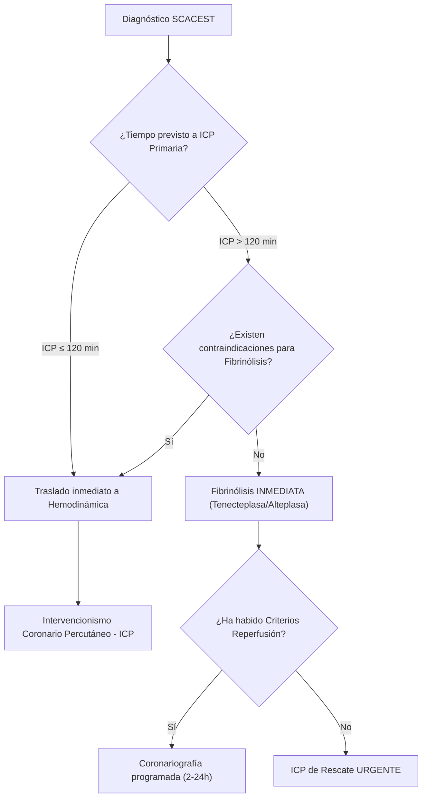

# Cardiopatía Isquémica

**Fuente:** Manual 12 de Octubre, Cap. 17.
**Concepto clave:** Desequilibrio entre el aporte y la demanda de oxígeno en el miocardio, casi siempre originado por enfermedad arterial coronaria (Aterosclerosis). 

La evolución de la enfermedad puede presentarse como un cuadro estable **(Síndrome Coronario Crónico)** o desestabilizarse por rotura de placa/trombosis **(Síndrome Coronario Agudo)**.

## 1. Síndrome Coronario Crónico (SCC)
Clínicamente se presenta como **Angina Estable** (dolor presivo retroesternal que irradia a mandíbula/brazos, desencadenado por esfuerzo/estrés, dura 2-5 min, y cede con reposo o nitroglicerina).
- **Abordaje Diagnóstico:** 
  Determinación de la *Probabilidad Pretest (PPT)*.
  - **PPT Baja (< 5%):** Vigilancia y estudio de otras causas.
  - **PPT Intermedia (5-15%):** Prueba no invasiva anatómica (TC Coronario) o funcional (Ecocardiografía de estrés, SPECT).
  - **PPT Alta (> 15%) o refractaria:** Tratamiento médico y Coronariografía invasiva directa.
- **Tratamiento Específico:**
  1. **Prevención de Eventos:** Antiagregación simple sistemática (AAS 100 mg o Clopidogrel 75 si alergia). Estatinas a dosis altas.
  2. **Tratamiento Sintomático (Antiisquémicos):**
      - **1ª Línea:** Betabloqueantes (de elección en FEVI baja/infarto previo). Alternativa: Antagonistas del Calcio (Amlodipino se asocia bien con BB. Diltiazem/Verapamilo si no hay FEVI deprimida, nunca juntar con BB).
      - **2ª Línea:** Nitratos de acción prolongada, Ivabradina o Ranolazina.
  3. **Revascularización (ICP o Cirugía CABG):** Indicada para mejorar pronóstico en estenosis de tronco, descendente anterior proximal, o fallo al tratamiento médico.

---

## 2. Síndrome Coronario Agudo (SCA)

> [!warning] Signos de Gravedad y Abordaje Inicial
> Monitorización, oxígeno (solo si SpO2 < 90%), vía venosa. Tratar la ansiedad/dolor severos con opiáceos (riesgo de retrasar acción antiagregante). Determinar la presencia de SCASEST o SCACEST en un **ECG en < 10 minutos**.

### A. SCASEST (Sin Elevación del ST)
Incluye la *Angina Inestable* (Troponinas negativas) y el *Infarto Agudo sin elevación ST - IAMSEST* (Troponinas ultrasensibles dinámicamente elevadas). Presenta descenso del ST o T negativas.
- **Estratificación y Tiempos de Coronariografía:**
  - **Muy alto riesgo — Invasiva < 2 h:** Inestabilidad hemodinámica/[[Shock]], dolor recurrente/refractario, insuficiencia cardíaca aguda grave o [[Arritmias]] ventriculares letales.
  - **Alto riesgo — Invasiva < 24 h:** Elevación troponinas compatible con IAM, cambios ECG dinámicos (ST/T), GRACE > 140.
  - **Riesgo intermedio — Invasiva durante hospitalización:** Diabetes, ERC (TFGe 30-59), FEVI < 40%/ICC, angina post-IAM precoz, angioplastia/CABG previos, GRACE 109-140.
  - **Bajo riesgo — Estrategia invasiva o selectiva no invasiva** según evolución y test de provocación.
- **Tratamiento Pre-Cateterismo:**
  1. **Doble Antiagregación:** **AAS 162-325 mg masticada (no entérica)** seguida de 75-100 mg/día (ACC/AHA 2025). Inhibidor P2Y12 (Ticagrelor o Prasugrel preferible a Clopidogrel): en NSTEMI con cateterismo precoz (<24 h) se difiere el P2Y12 hasta conocer la anatomía coronaria; si la angiografía se anticipa >24 h, puede considerarse pretratamiento (COR 2b).
  2. **Anticoagulación:** Fondaparinux 2.5 mg de elección (o Enoxaparina si no disponible) mantenida hasta el cateterismo.
  3. **Estatinas dosis máximas.**
  4. **Nitratos i.v.** para alivio del dolor y control HTA (contraindicados en hipotensión o IAM VD). 

### B. SCACEST (Con Elevación del ST)
Presencia de dolor anginoso prolongado junto con **elevación persistente del ST > 20 min en ≥ 2 derivaciones contiguas** o equivalentes STEMI. **Exige Reperfusión Inmediata**.

> [!info] Equivalentes STEMI (ACC/AHA 2025)
> - **Descenso ST V1-V3 con R dominante** → sospecha IAM posterior (hacer V7-V9).
> - **Patrón De Winter** (descenso ascendente + T hiperagudas en precordiales).
> - **Ondas T hiperagudas** en fase precoz.
> - **BRI nuevo o presumiblemente nuevo con clínica isquémica compatible** (BRI nuevo aislado en asintomático NO es equivalente STEMI).
> *El patrón de Wellens es SCASEST de alto riesgo con estenosis crítica de DA, no equivalente STEMI.*

- **Farmacología Asociada al SCACEST:** **AAS 162-325 mg masticada** (no entérica) al diagnóstico + Prasugrel/Ticagrelor, seguida de 75-100 mg/día (ACC/AHA 2025). La anticoagulación (Heparina no fraccionada) se administra durante el propio intervencionismo, **NO** iniciar fondaparinux periprocedimiento primario.

### 🚨 Complicaciones Graves del SCA
1. **Complicaciones Mecánicas (Suponen Shock o Edema Agudo):** Se diagnostican con ecocardiograma a pie de cama y derivan a Cirugía Urgente (con soporte inotrópico o BCIAo previo).
    - **Rotura Músculo Papilar:** IAM inferior. Produce Insuficiencia Mitral Aguda masiva y soplo nuevo.
    - **Comunicación Interventricular (CIV):** IAM anterior profundo. Soplo aspero y "salto oximétrico" en VD.
    - **Rotura Pared Libre:** Produce taponamiento cardíaco súbito y muerte secundaria o pseudoaneurisma.
2. **Shock Cardiogénico / IAM Ventrículo Derecho:** Especialmente en infartos inferiores (afectación de aVR). Jamás dar nitratos, dar fluidos con inotropos si hace falta.
3. **Arritmias:** Pericarditis Post-IAM precoz vs Dressler tardío (se trata con AAS altas dosis, no ibuprofeno ni colchicina en aguda). TV o FV precisan CVE o desfibrilación inmediata.

---

## 📑 Guía Completa de SCA (ACC/AHA 2025)

*Para el abordaje actualizado según la guía ACC/AHA 2025, navega por las notas:*

1. [[SCA - Evaluacion Inicial y Clasificacion (ACC-AHA 2025)]]
2. [[SCA - Tratamiento Medico (ACC-AHA 2025)]]
3. [[SCA - Reperfusion y Revascularizacion (ACC-AHA 2025)]]
4. [[SCA - Complicaciones y Shock Cardiogenico (ACC-AHA 2025)]]
5. [[SCA - Manejo Hospitalario y Prevencion Secundaria (ACC-AHA 2025)]]

---

### 🔗 Enlaces / Bibliografía
- [[Insuficiencia cardiaca aguda]]
- [[Arritmias]]
- [[MOC - CARDIOLOGIA]]
- *Manual de diagnóstico y terapéutica médica Hospital 12 de Octubre, 9º ed. 2022. Cap. 17.*
- [Guía ACS 2025 (ACC/AHA)](<obsidian://open?vault=MIR&file=Libros%20y%20referencias/rao-et-al-2025-2025-acc-aha-acep-naemsp-scai-guideline-for-the-management-of-patients-with-acute-coronary-syndromes-a-1.pdf>)
