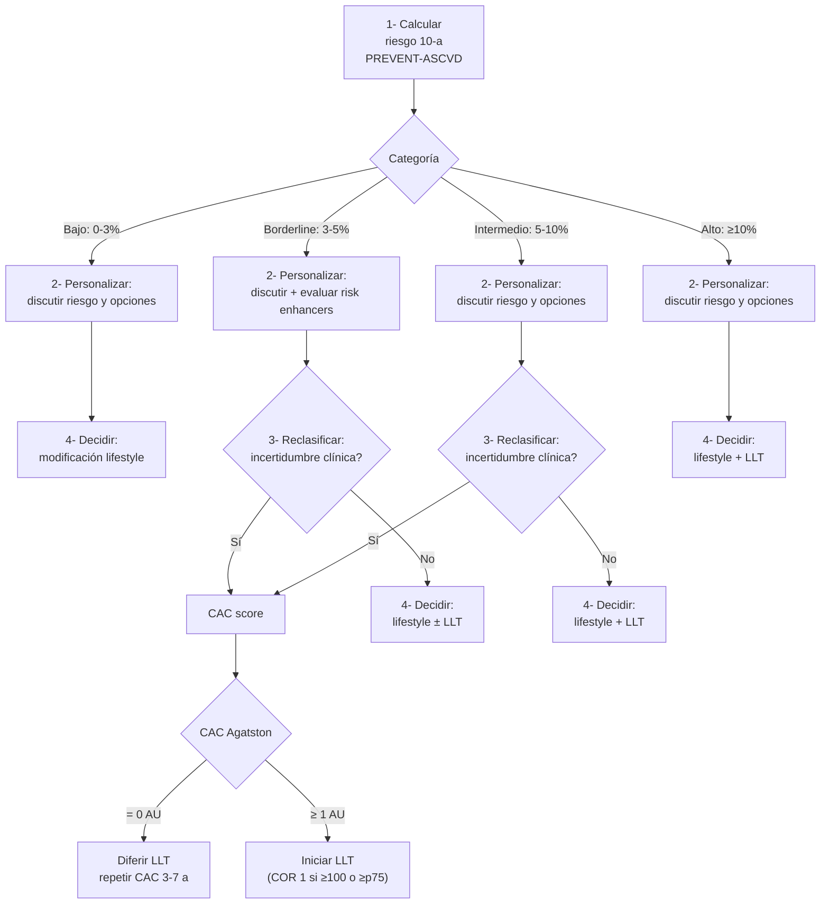

# Estratificación de Riesgo Cardiovascular (PREVENT-ASCVD)

**Concepto clave:** la estratificación del riesgo CV en prevención primaria se basa en una **estimación cuantitativa absoluta** del riesgo a 10 años (y 30 años) que orienta la decisión de iniciar terapia hipolipemiante (LLT). En la guía **AHA/ACC 2026** las **PREVENT-ASCVD equations** sustituyen a las **Pooled Cohort Equations (PCE)** del 2018; en Europa se usa **SCORE2 / SCORE2-OP** (ESC 2021). La decisión final integra la estimación cuantitativa con **risk enhancers**, **marcadores reproductivos**, **polygenic risk scores** y, cuando hay incertidumbre, **CAC scoring** — modelo conocido como **CPR Framework (Calculate–Personalize–Reclassify)**.

---

## Discusión riesgo-beneficio individualizada (§4.2.3.1)

> [!info] COR 1, B-NR
> En adultos con dislipemia, clínicos y pacientes deben **dialogar sobre el riesgo ASCVD**, **estilo de vida como base del tratamiento**, **beneficio neto esperado de la LLT**, **posibles efectos adversos / interacciones / coste** y **preferencias del paciente** para individualizar la decisión.

### Tabla 10 — Checklist para la discusión riesgo-beneficio (AHA/ACC 2026)

| Elemento | Componentes |
|---|---|
| **Evaluación del riesgo** | PREVENT-ASCVD Calculator → riesgo absoluto y relativo · CAC si dudoso · risk enhancers · marcadores reproductivos |
| **Estilo de vida** | Dieta, actividad física, peso, tabaco — cardioSmart, AHA Life's Essential 8, NLA Patient Tear Sheets, PCNA Heart Healthy Toolbox |
| **Beneficio neto de la farmacoterapia** | Estatina como primera línea · combinación con no-estatina si seleccionado · explicar reducción de riesgo, AAdv, DDI |
| **Coste y conveniencia** | Cobertura, copago, vía oral diaria vs SC c/2 sem o c/6 m |
| **Decisión compartida** | Verbalizar valores, preguntas, capacidad de adherir a cambios y medicación; remitir a materiales fiables |

> Calculadora oficial: `professional.heart.org/guidelines-and-statements/prevent-calculator`

---

## PREVENT-ASCVD Equations (§4.2.3.2)

> [!info] COR 1, B-NR ⭐ Novedad 2026
> En adultos **30-79 años sin ASCVD ni aterosclerosis subclínica** y con **LDL-C 70-189 mg/dL (1,8-4,9 mmol/L)** las ecuaciones **PREVENT-ASCVD** deben usarse para estimar el **riesgo a 10 años**, categorizándolo como:
> - **Bajo:** <3%
> - **Borderline:** 3% a <5%
> - **Intermedio:** 5% a <10%
> - **Alto:** ≥10%

### Tabla 11 — Características de las ecuaciones PREVENT (AHA/ACC 2026 p 31)

| # | Característica |
|---|---|
| 1 | Derivadas en muestra contemporánea representativa (~3,3 millones US adults) y validadas externamente (~3,3 M) |
| 2 | Rango de edad: **30 a 79 años** |
| 3 | **Sexo-específicas**; raza/etnia **NO** es variable; ajustadas a riesgo competente de muerte no-CV |
| 4 | **Modelo base:** edad, sexo, PA, **TC y HDL-C** (no LDL-C), DM, tabaco, función renal (eGFR), uso de estatina, antiHTA (y BMI para predicción de IC) |
| 5 | **Inputs opcionales:** HbA1c (control glucémico), cociente albúmina/creatinina urinaria (CKM), código postal (índice de privación social) |
| 6 | Predice riesgo **a 10 y 30 años** |
| 7 | Predice **hard ASCVD** (IM no fatal, ictus no fatal, muerte CHD), **IC** y **CVD total** (ASCVD + IC; útil para decisiones de antiHTA) |
| 8 | Discriminación (C-statistics) similar a las PCE |
| 9 | **Calibración mejorada:** estimaciones **40-50% más bajas** que las PCE — porque las PCE sobreestimaban riesgo en muchos individuos |

> [!warning] Para decisiones de LLT
> Usar la **versión hard ASCVD** del PREVENT-ASCVD (no la versión total CVD que incluye IC). Hard ASCVD = nonfatal stroke, nonfatal MI, CHD death.

### Tabla 12 — Crosswalk PCE → PREVENT-ASCVD (AHA/ACC 2026 p 33)

| Categoría | Equivalente PCE | Equivalente PREVENT-ASCVD |
|---|---|---|
| **Bajo** | <5% | **<3%** |
| **Borderline** | 5% a <7,5% | **3% a <5%** |
| **Intermedio** | 7,5% a <20% | **5% a <10%** |
| **Alto** | ≥20% | **≥10%** |

> Las estimaciones del PREVENT son ~40-50% más bajas que las del PCE para el mismo perfil. **Manteniendo el net benefit clínico equivalente** (≥3% de eventos en 10 años en RCT de prevención primaria), el threshold se ajusta de **PCE ≥5% → PREVENT ≥3%**. Resultado: número similar de adultos US identificados (≈25-26 millones de los ~70 M elegibles tras excluir ASCVD/LDL ≥190 ya cubiertos) — pero con mejor calibración.

### Por qué el threshold se fijó en ≥3% (Figura 4 AHA 2026 p 32)

> [!info] Lógica número-necesario-tratar (NNT) vs número-necesario-dañar (NND)
> Con **estatina de moderada intensidad** (RRR 35%, NND-diabetes ≈ 100 a 10 años):
> - A **riesgo 10-a ≥3%** → NNT-prevenir ASCVD < NND-causar diabetes → **net benefit positivo**.
>
> Con **estatina de alta intensidad** (RRR 45%, NND-diabetes ≈ 33):
> - A **riesgo 10-a ≥7%** → NNT < NND → **net benefit positivo**.
>
> Por debajo de esos umbrales el balance riesgo-beneficio se vuelve marginal y la decisión depende de discusión compartida.

### Estimación a 30 años — para adultos jóvenes

> [!info] Riesgo a largo plazo
> En adultos jóvenes con riesgo 10-a bajo pero **LDL-C ≥160 mg/dL (4,1 mmol/L)** o **riesgo 30-a ≥10%**, considerar inicio de LLT temprano para reducir la exposición acumulada a lipoproteínas aterogénicas (concepto de "cumulative LDL-years"). El PREVENT-ASCVD permite ese cálculo a 30 años.

---

## Risk Enhancers (§4.2.3.3)

> [!info] COR 2a, B-NR ⭐ Novedad 2026 (era COR 2b en 2018)
> En adultos sin ASCVD con **riesgo borderline (3% a <5%)** por PREVENT-ASCVD, **considerar risk enhancers** es razonable para personalizar la evaluación y decidir el inicio de LLT como adjunto al estilo de vida.

> [!info] COR 2a, B-R ⭐ Novedad 2026
> En adultos sin ASCVD con **riesgo borderline (3% a <5%)** por PREVENT-ASCVD, **si hsCRP ≥2 mg/L en 2 ocasiones consecutivas** sin causa identificable subyacente, **estatina de alta intensidad** puede ser útil para reducir eventos ASCVD (basado en JUPITER: RRR 44% MACE).

### Tabla 13 — Risk Enhancers (AHA/ACC 2026 p 35)

| Categoría | Risk enhancer |
|---|---|
| **Antecedentes** | ASCVD prematura en padre/madre o hermano (♂ <55 a, ♀ <65 a) |
| **Etnia** | Ascendencia de mayor riesgo (Sur de Asia, Filipinas) |
| **Genética** | High polygenic risk (si medido) — § 4.2.3.5 |
| **Inflamación crónica** | Lupus sistémico, AR, psoriasis avanzada, artritis inflamatoria |
| **Lp(a)** | **≥125 nmol/L o ≥50 mg/dL** |
| **hsCRP** | **≥2 mg/L** en >1 ocasión |
| **Triglicéridos** | Persistentemente ≥175 mg/dL no en ayunas (≥2 mmol/L) o ≥150 mg/dL en ayunas (≥1,7 mmol/L) |
| **Síndrome CKM** | Cardiovascular-Kidney-Metabolic — ver [[Síndrome Cardiovascular-Renal-Metabólico]] |
| **Lipoproteínas aterogénicas** | LDL-C 160-189 mg/dL (4,1-4,9 mmol/L), no-HDL-C 190-219 mg/dL o **ApoB ≥120 mg/dL** |
| **Reproductivos** | Ver §4.2.3.4 — menopausia precoz, preeclampsia, etc. |

> [!info] Información adicional ya capturada en el PREVENT-ASCVD
> Albuminuria, HbA1c y zip code (índice de privación social) **ya pueden incorporarse al cálculo PREVENT-ASCVD** como inputs opcionales — su utilidad como "enhancer adicional" sobre PREVENT está por establecerse.
>
> El **LDL-C no es variable de PREVENT-ASCVD** (TC y HDL-C sí lo son), pero un LDL-C persistentemente elevado se considera enhancer porque informa la magnitud de la reducción esperable con LLT.

### Cómo aplicar los risk enhancers

- En **borderline (3-5%)** → su presencia **inclina** hacia iniciar LLT.
- En **bajo (<3%)** → si hay AHF prematuro fuerte y/o **Lp(a) muy alta**, puede ser razonable considerar LLT.
- En **intermedio (5-<10%)** → ya tienen indicación de moderada intensidad; los enhancers pueden inclinar a alta intensidad.
- **Su ausencia NO debe usarse para descartar LLT** si el riesgo PREVENT lo indica.

---

## Marcadores reproductivos (§4.2.3.4)

> [!info] COR 2a, B-NR ⭐ Novedad 2026
> En adultos sin ASCVD, **considerar marcadores reproductivos** (menopausia precoz <45 a, antecedentes de eventos adversos en embarazo) es razonable como adjunto a la evaluación del riesgo y al manejo del estilo de vida en prevención primaria.

### Tabla 14 — Marcadores reproductivos asociados a eventos ASCVD (AHA/ACC 2026 p 36)

| Categoría | Marcador |
|---|---|
| **Eventos adversos en embarazo** | Trastornos hipertensivos (preeclampsia, HTA gestacional) · DM gestacional · Pequeño para edad gestacional (<p10) · Parto pretérmino (<37 sem) · Pérdidas espontáneas recurrentes |
| **Otros marcadores reproductivos** | Menarquia precoz (<10 años) · Menopausia precoz (<45 a; **especialmente prematura <40 a**) · SOP e irregularidad menstrual |

> [!info] Ventana clínica
> Estos eventos, frecuentemente registrados en historia obstétrica/ginecológica, son **fácilmente recogibles en consulta** y permiten una estratificación más fina en mujeres jóvenes/perimenopáusicas en quienes el PREVENT-ASCVD a 10 años puede subestimar el riesgo a largo plazo.

---

## Polygenic Risk Scores (§4.2.3.5) — uso emergente

- Múltiples PRS de CAD desarrollados; los **multi-ancestry** mejoran rendimiento entre grupos.
- Magnitud máxima de incremento de riesgo en **adultos <55 años**.
- **PRS alto + AHF prematuro** → efectos aditivos.
- Un PRS validado con incremento de riesgo relativo 2× es comparable a otros risk enhancers.
- **No todos los PRS son equivalentes**; un PRS "bajo" por una sola escala **no garantiza** bajo riesgo genético ni clínico real.

---

## CAC scoring — Imagen selectiva de aterosclerosis subclínica (§4.2.3.6)

> Indicación poblacional: **♂ ≥40 años o ♀ ≥45 años** sin ASCVD conocida.

### Recomendaciones AHA/ACC 2026 (pp 36-38)

| # | Recomendación | COR/LOE |
|---|---|---|
| 1 | En riesgo **intermedio** (y borderline seleccionados), si hay **incertidumbre sobre LLT**, el **CAC score** debe usarse para reestratificar y guiar la decisión de iniciar/diferir/posponer | **COR 1, B-R** ⭐ Novedad 2026 |
| 2 | Si CAC = **0 AU**, sin preferencia de evitar LLT, sin condiciones de alto riesgo (FH, hipercolesterolemia >190, DM, edad >40, tabaquismo activo, AHF fuerte de ASCVD prematura) → **diferir LLT** y reevaluar con CAC en **3-7 años** | **COR 2a, B-NR** |
| 3 | Si CAC **>0 AU**, se recomienda iniciar LLT, **especialmente si CAC ≥100 AU o ≥p75 estandarizado** | **COR 1, B-NR** |
| 4 | En riesgo intermedio/alto sin ASCVD, si hay incertidumbre sobre la **intensidad de LLT**, el CAC puede ser útil para refinar objetivos | **COR 2a, B-NR** |
| 5 | **CAC incidental en TC no cardíaco** (visual, IA): debe considerarse en la decisión de iniciar/intensificar LLT | **COR 1, B-NR** ⭐ Novedad 2026 |
| 6 | En riesgo intermedio/alto con probabilidad de placa no calcificada (inflamatorios, VIH, DM): **CCTA** selectivo puede ser útil | **COR 2b, B-NR** |

### Categorías de Agatston Units (AU)

| Carga | Agatston |
|---|---|
| Ausente | **0** |
| Mínima | 1-9 |
| Leve | 10-99 |
| Moderada | 100-299 |
| Severa | 300-999 |
| Extensa | **≥1000** |

### CAC en grupos especiales

> [!warning] Cuándo CAC = 0 NO debe usarse para "de-riskear"
> - **HF (hipercolesterolemia familiar)** — siguen siendo de alto riesgo aunque CAC=0.
> - **Hipercolesterolemia severa (LDL-C ≥190 mg/dL)**
> - **Diabetes**
> - **Tabaquismo activo**
> - **AHF fuerte de ASCVD prematura**
>
> En estos pacientes la recomendación de estatina de alta intensidad **es independiente** del CAC. Un CAC=0 no debe diferir la terapia.

> [!info] Datos de eventos según CAC
> - **CAC ≥100** → tasa eventos ASCVD >7,5% (umbral antiguo PCE para estatina) — comparable a alto riesgo.
> - **CAC ≥1000** → mortalidad CV similar al brazo placebo de FOURIER (alto riesgo en LLT óptimo).
> - **CAC=0 + AHF prematuro 1.er grado** → tasa de eventos baja a 10 años, pero la ausencia de calcio **no es definitivamente reaseguradora** con múltiples familiares afectos.
> - **DM tipo 2 + CAC ≥400 + >10 años de duración** → tasa de eventos especialmente alta.
> - **DM tipo 1 + CAC ≥100** → riesgo 4× respecto a CAC=0.

> [!info] CAC repetido
> - Si LLT iniciada → **NO** repetir CAC (las estatinas pueden aumentar el score por estabilización de placa).
> - En no tratados, intervalo según riesgo basal: 3-5 años en intermedio, 5-7 años en bajo riesgo (datos MESA).
> - 25% de intermedios desarrollan CAC ≥100 a 3-5 años.

### CAC en TC no cardíaco (incidental)

- Cuantificación visual (mínima/leve/moderada/severa) o por algoritmo de IA.
- Importante: la **falsa-negativa** del scoring no-gated puede llegar al 24% — la **ausencia de CAC en un TC no cardíaco no debe usarse para descartar** terapia.
- En NLST (cribado de Ca pulmón): mortalidad total casi 5× mayor en sujetos con CAC severo incidental vs sin CAC.

### CCTA — Información complementaria

- Aporta info sobre **placa no calcificada**, low-attenuation plaque, positive remodeling, spotty calcifications.
- En SCAPIS (Suecia, 50-64 a, n=25.182 asintomáticos): placa en 42%, **5,5% con CAC=0 tenían aterosclerosis no calcificada**.
- En MiHeart (Miami): 49% con placa, **16% con CAC=0 tenían placa no calcificada**.

---

## Algoritmo CPR Framework (Figura 5 AHA/ACC 2026 p 34)

> **C**alcular → **P**ersonalizar → **R**eclasificar → Decidir y tratar.

> Manejo concreto por categoría (§4.2.3.7) → ver [[Prevención Primaria de ASCVD]].

---

## SCORE2 / SCORE2-OP — perspectiva europea (ESC 2021 §3.2)

En Europa, la guía **ESC 2021 sobre prevención CV en la práctica clínica** recomienda usar las charts **SCORE2** (40-69 a) y **SCORE2-OP** (≥70 a) en personas aparentemente sanas sin ASCVD/DM/ERC/dislipemia genética. Predice **CVD total a 10 años (fatal + no fatal)** — outcome distinto al hard ASCVD del PREVENT.

### Categorías de riesgo CV (ESC 2021 p 11) en personas aparentemente sanas

| Riesgo | <50 años (SCORE2) | 50-69 años (SCORE2) | ≥70 años (SCORE2-OP) |
|---|---|---|---|
| **Bajo / moderado** | <2,5% | <5% | <7,5% |
| **Alto** | 2,5% a <7,5% | 5% a <10% | 7,5% a <15% |
| **Muy alto** | ≥7,5% | ≥10% | ≥15% |

> [!info] Riesgo automático ALTO o MUY ALTO (sin necesidad de SCORE2)
> - **ASCVD establecida**
> - **DM con LOD o ≥3 FRCV o ≥20 años de evolución (DM1)**
> - **ERC moderada-severa**
> - **Trastornos lipídicos genéticos** (HF) o HTA grave/secundaria.

> [!warning] España
> España está clasificada en la **región de bajo riesgo** según la cartografía OMS de la guía ESC 2021. Las charts a usar son las **SCORE2 low-risk countries**.
>
> **Charts y calculadora oficial:** `score2-low-risk.eu` o app **ESC CVD Risk Calculator** (también disponible en `escardio.org`).

> Diferencia con PREVENT-ASCVD: SCORE2 es **CVD fatal + no fatal** (outcome más amplio), está calibrado por región europea, y los thresholds son numéricamente distintos. Para un mismo paciente las dos calculadoras pueden dar categorías ligeramente distintas — no son intercambiables. Usar la que corresponda al contexto clínico (España → ESC 2021).

---

## Aplicación práctica: cuándo y cómo

> [!info] Adultos 30-79 a sin ASCVD, LDL-C 70-189
> 1. Calcular **PREVENT-ASCVD** (10-a y 30-a).
> 2. Categorizar: bajo / borderline / intermedio / alto.
> 3. Discutir con el paciente — **lifestyle siempre como base**.
> 4. Si **borderline o intermedio con incertidumbre** → considerar **CAC** y/o **risk enhancers** / **PRS**.
> 5. Si mujer en edad reproductiva → integrar **marcadores reproductivos**.
> 6. Aplicar el algoritmo terapéutico de **§4.2.3.7** (ver [[Prevención Primaria de ASCVD]]).

> [!warning] Cuándo NO aplicar PREVENT-ASCVD para estimar riesgo
> - **ASCVD ya establecida** → ir directamente a **prevención secundaria** ([[Prevención Secundaria de ASCVD]]).
> - **LDL-C ≥190 mg/dL** → tratamiento independiente del riesgo (hipercolesterolemia severa).
> - **DM 40-75 años** → ver §4.2.5.
> - **HF (hipercolesterolemia familiar)** → riesgo siempre alto; ecuaciones generales **infraestiman** ASCVD en HF (verdadero riesgo 2-4× mayor; hasta 17× si <35 a).
> - **Edad <30 o >79** → fuera del rango de validación.
> - **ERC estadio 3-4** o **VIH** → ver secciones específicas (§4.2.8.8 y §4.2.8.9).

---

## Notas hermanas

- [[Dislipemia - Concepto y Cribado]] — definición, cribado, perfil lipídico, ApoB, Lp(a).
- [[Prevención Primaria de ASCVD]] — algoritmo §4.2.3.7 por categoría de riesgo.
- [[Prevención Secundaria de ASCVD]] — diana LDL-C <55 mg/dL, very high risk.
- [[Tratamiento de la Dislipemia]] — estatinas, ezetimibe, PCSK9, inclisirán, bempedoico.
- [[Síndrome Cardiovascular-Renal-Metabólico]] — CKM como risk enhancer.
- [[SCA - Manejo Hospitalario y Prevención Secundaria]] — algoritmo post-SCA.
- [[Hipertensión arterial - Concepto y diagnóstico]] — la PA es input clave del PREVENT.
- [[MOC - CARDIOLOGIA]]
