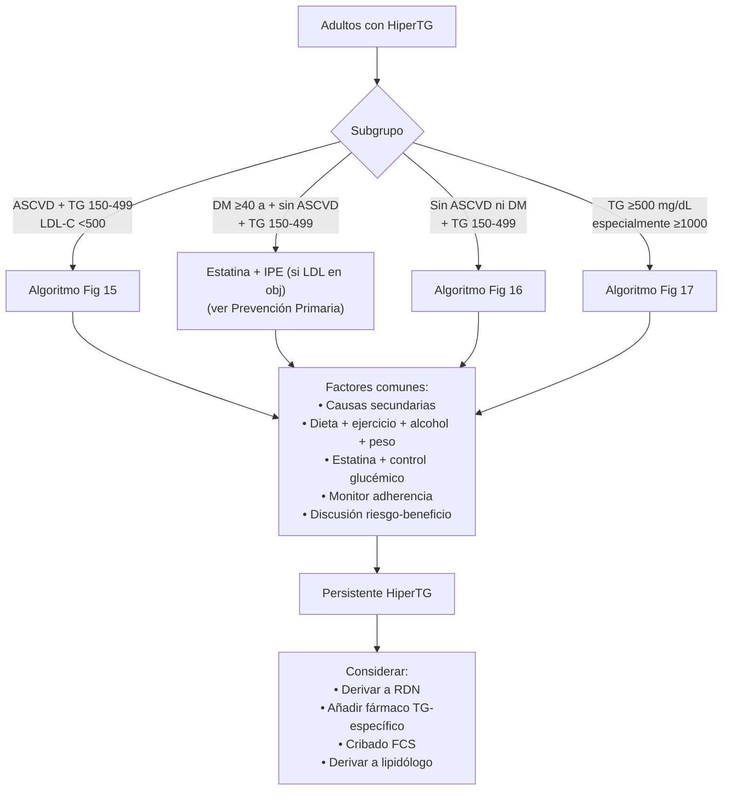
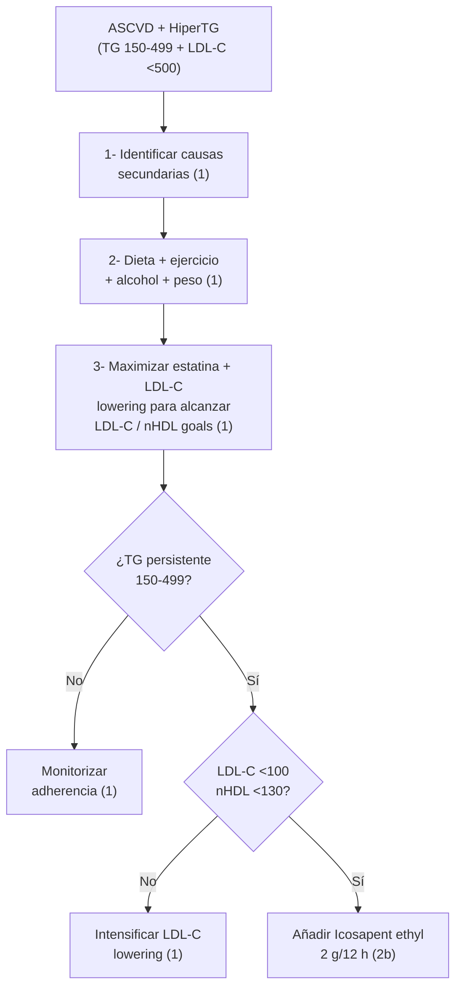
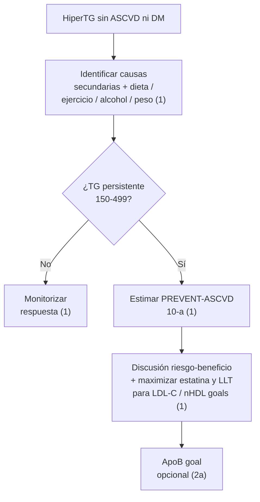
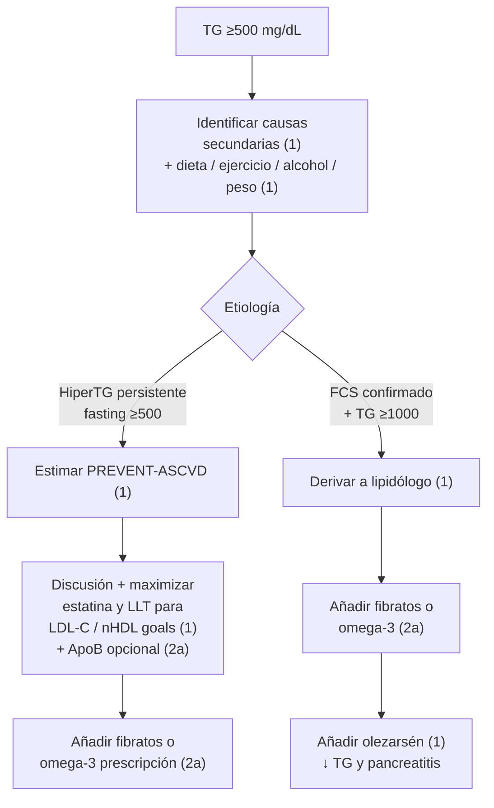

# Hipertrigliceridemia y Lipoproteína(a)

**Concepto clave:** dos trastornos lipídicos con **fisiopatología y manejo diferenciados** del LDL-C convencional. La **hipertrigliceridemia** se estratifica por nivel de TG (moderada 150-499, severa 500-999, muy severa ≥1000) y por contexto clínico (ASCVD, DM, FCS); la principal **prioridad es reducir riesgo CV** en niveles moderados y **prevenir pancreatitis aguda** en severas. La **Lp(a)** es una causa **independiente** y genéticamente determinada de ASCVD y estenosis aórtica calcificada; las estatinas **NO** la reducen, pero **PCSK9 mAb** y **aféresis** sí. Las novedades 2026 son el **olezarsén** (apoC-III ASO) para FCS y la priorización de **PCSK9 mAb** en pacientes con ASCVD + Lp(a) elevada que no alcanzan objetivos LDL-C.

---

## Hipertrigliceridemia (§4.2.9)

### Definiciones (TG en ayunas)

| Categoría | TG mg/dL (mmol/L) | Riesgo principal |
|---|---|---|
| **Normal** | <150 (<1,7) | — |
| **Moderada** | **150-499** (1,7-5,7) | **ASCVD** (lipoproteínas TG-rich aterogénicas) |
| **Severa** | **500-999** (5,7-11,3) | **Pancreatitis** + ASCVD (especialmente si LDL-C también alto) |
| **Muy severa** | **≥1000** (≥11,3) | **Pancreatitis aguda** (riesgo dominante) |

> En no-ayunas, los puntos de corte equivalentes son **≥175 mg/dL** (moderada) y los mismos a partir de 500.

### Recomendaciones AHA/ACC 2026 (§4.2.9)

| # | Recomendación | COR/LOE |
|---|---|---|
| 1 | TG ≥150 persistente: **lifestyle management** — dieta baja en azúcares y grasa saturada, eliminar/reducir alcohol, actividad física, **pérdida de peso 5-10%** si sobrepeso/obesidad | **COR 1, B-NR** |
| 2 | **ASCVD + LDL-C ≥55 + non-HDL ≥85 + TG 150-999 mg/dL en estatina máxima** → **intensificar LDL-C-lowering** (ezetimibe, PCSK9 mAb, bempedoico) | **COR 1, B-R** |
| 3 | **FCS + TG ≥1000** → **olezarsén** como adjunto a dieta para reducir TG y prevenir pancreatitis | **COR 1, B-R** ⭐ Novedad 2026 |
| 4 | **≥50 a con ASCVD o DM + ≥1 FRCV + TG persistente 150-499 + LDL-C <100 en estatina máxima**: añadir **icosapent ethyl (IPE)** puede ser razonable | **COR 2b, B-R** |
| 5 | **40-75 a sin ASCVD ni DM + TG persistente 150-499**: estimar **PREVENT-ASCVD** para guiar la decisión sobre dieta y estatina | **COR 1, A** |
| 6 | **TG severa (500-999, especialmente ≥1000) pese a lifestyle**: **fibrato o prescription omega-3** para ↓TG y prevenir pancreatitis | **COR 2a, B-NR** |
| 7 | HiperTG (TG ≥150): preferir **non-HDL-C o ApoB** sobre LDL-C para guiar decisiones (LDL-C calculado con Friedewald se infraestima) | **COR 2a, B-NR** |

### Tabla 23 — Causas secundarias de hipertrigliceridemia (siempre descartar)

| Categoría | Causas |
|---|---|
| **Enfermedades** | **DM mal controlada**, ERC, síndrome nefrótico, lipodistrofia, **hipotiroidismo**, Cushing, glucogenosis, hepatitis aguda, AR, psoriasis, LES, mieloma múltiple, **sepsis** (repetir lipidograma, no fiarse del medido durante sepsis) |
| **Dieta y estilo de vida** | Alcohol (excesivo o cualquiera en TG severa), dieta alta en saturadas/azúcares/IG-alto, sedentarismo, NPT con emulsiones lipídicas |
| **Fármacos: anestesia** | **Propofol** |
| **Fármacos: cardio** | β-bloqueantes, **tiazidas y diuréticos de asa**, resinas (colestiramina, colestipol, colesevelam) |
| **Fármacos: endocrino** | **Glucocorticoides**, anabolizantes, **estrógenos orales**, raloxifeno, clomifeno, estradiol, etinilestradiol, conjugados, tamoxifeno |
| **Fármacos: dermato** | **Isotretinoína** |
| **Fármacos: infecciosas** | **IP-VIH** |
| **Fármacos: onco** | Tamoxifeno, L-asparaginasa, bexaroteno, ciclofosfamida |
| **Fármacos: psiquiátrico** | APs atípicos (**olanzapina, mirtazapina, clozapina**) |
| **Fármacos: inmunosupresores** | **Tacrolimus, sirolimus, ciclosporina**, interferones |
| **Trastornos metabólicos** | Sobrepeso/obesidad, síndrome metabólico/insulinorresistencia, ganancia de peso |
| **Fisiológicas** | **Embarazo** (especialmente 3.er trimestre, pico fisiológico) |

### Algoritmo general (Fig 14)

### Algoritmo HiperTG + ASCVD (Fig 15)

### Algoritmo HiperTG sin ASCVD ni DM (Fig 16)

### Algoritmo HiperTG severa ≥500 (Fig 17)

### Síndrome de Quilomicronemia Familiar (FCS)

> **FCS:** trastorno **monogénico raro** por variantes patogénicas en LPL (lipoprotein lipase) o cofactores (apoC-II, GPIHBP1, LMF1, apoA-V). Resultado: **deficiencia funcional de LPL** → quilomicrones no aclarados → TG ≥1000-2000 mg/dL crónica + episodios recurrentes de pancreatitis aguda.

| Característica | Detalle |
|---|---|
| Prevalencia | ~1-2/1.000.000 |
| Presentación | Pancreatitis recurrente, xantomas eruptivos, hepatosplenomegalia, lipemia retinalis |
| Diagnóstico | TG ≥1000 persistente + cribado de variantes monogénicas (panel genético) |
| Diferencial | **Síndrome de quilomicronemia multifactorial (MCS)** — TG ≥1000 con causas combinadas (poligénico + secundarias). Más común que FCS. Test genético para distinguir |
| Manejo | **Dieta muy baja en grasa (<10-15% calorías)** desde adopción precoz, MCT como alternativa, suplementos vitamina liposoluble · **fibratos/omega-3 son ineficaces** (LPL-dependientes) · **Olezarsén 80 mg SC/mes** (ASO anti-apoC-III) — única terapia FDA-aprobada |

> Olezarsén en FCS — **dos cifras del mismo source**:
> - **Tabla 5 AHA**: TG ↓ **30%** absoluto (placebo-corrected estimado **42,5%**).
> - **Ensayo pivotal de fase 3 a 6 meses** (§4.2.9 supportive text 3): diferencia con placebo **−43,5% (IC 95% −69,1 a −17,9; P<0,001)**.
> - ↓ pancreatitis **rate ratio 0,12 vs placebo** (eventos pooled).

> [!info] Tool útil para diferencial FCS vs MCS
> **North American Familial Chylomicronemia Syndrome scoring tool** — orienta probabilidad y necesidad de test genético.

### Manejo en embarazo (resumen)

> Las estatinas son **contraindicadas en embarazo y lactancia** (categoría X). El manejo de HiperTG severa en embarazo:
> - **Lifestyle:** dieta muy baja en grasa, MCT, suplementación nutricional.
> - **Fenofibrato u omega-3 ethyl esters** tras 1.er trimestre: COR 2a (AHA/ACC 2026 §4.2.8.4).
> - **Icosapent ethyl, niacina y olezarsén:** datos limitados en embarazo — derivar a lipidólogo.

---

## Lipoproteína(a) — Lp(a) (§4.2.10)

### Concepto

> [!info] ¿Qué es Lp(a)?
> Partícula tipo LDL con **apo(a) unida covalentemente a apoB-100**. Características clave:
> - **Genéticamente determinada** (gen LPA, herencia codominante) — niveles **estables a lo largo de la vida**.
> - **Causa independiente** y **causal** de ASCVD (estudios de aleatorización mendeliana) y de **estenosis aórtica calcificada**.
> - Excepciones a la estabilidad: ↑ en menopausia, ERC, hepatopatía descompensada, embarazo.
> - **No requiere ayunas** para su medición.
> - **Test genético no recomendado** — la concentración medida es suficiente.

### Puntos de corte y traducción de riesgo

> Reference Table AHA/ACC 2026 §3.4 — datos derivados del UK Biobank Study; los percentiles son aproximados para población general.

| Lp(a) (nmol/L) | Lp(a) (mg/dL) | Percentil | ↑ riesgo ASCVD vs mediana |
|---|---|---|---|
| **<75** | **<30** | Reference | Riesgo basal (referencia) |
| **75-124** | **30-49** | — | **1,2×** |
| **125** | **50** | ~p80 | **1,4×** (~40% más) |
| **250** | **100** | ~p95 | **~2×** (duplica) |
| **430** | **180** | ~p99 | **~4×** (≈ HeFH) |

> La equivalencia entre nmol/L y mg/dL es **aproximada**. Niveles más altos descritos en personas no-hispanic black. La asociación poblacional para IAM es muy alta en el cuartil superior.

### Recomendaciones AHA/ACC 2026 (§4.2.10)

| # | Recomendación | COR/LOE |
|---|---|---|
| 1 | **Todos los adultos con Lp(a) elevada** (≥125 nmol/L o ≥50 mg/dL): **control óptimo de FRCV modificables** (HTA, DM, tabaco, peso, dieta, actividad física) — **AHA Life's Essential 8** | **COR 1, B-NR** |
| 2 | **ASCVD clínica + Lp(a) elevada + LDL-C / non-HDL no en obj con estatina máxima**: añadir **PCSK9 mAb** con beneficio CV demostrado | **COR 1, B-R** ⭐ Novedad 2026 |

### Cribado en cascada — recordatorio

> En familiares de primer grado de un caso con Lp(a) elevada, ASCVD prematura o HF: **cribado familiar** (Lp(a) en cascada). Ver [[Dislipemia - Concepto y Cribado]] §3.4.

### Manejo — qué reduce Lp(a) y qué NO

| Intervención | Efecto sobre Lp(a) |
|---|---|
| **Estatinas** | **NO reducen** Lp(a). Pueden ↑ levemente (~1,1 mg/dL — sin relevancia clínica) |
| **Estilo de vida** | Mínimo impacto (Lp(a) genéticamente determinada). AHA Life's Essential 8 → ↓ 67% riesgo ASCVD en pacientes con Lp(a) elevada (vía control de FRCV) |
| **PCSK9 mAb (evolocumab, alirocumab)** | ↓ Lp(a) **15-30%** + ↓ LDL-C 45-64% |
| **Inclisirán (siRNA)** | ↓ Lp(a) modestamente (similar PCSK9 mAb) |
| **Aféresis de lipoproteínas** | ↓ Lp(a) ~30% por sesión (transitorio) — FDA-aprobada en Lp(a) ≥60 mg/dL (≥130 nmol/L) + EAC o EAP documentada |
| **Aspirin** | Post hoc: ↓ eventos en Lp(a) elevada (datos prospectivos pendientes). NO recomendación formal todavía |
| **Niacina** | ↓ Lp(a) modesto, **NO mejora outcomes** — no recomendado |

> [!info] Terapias específicas Lp(a)-lowering en investigación (no FDA-aprobadas a 2026)
> - **Pelacarsen** (apo(a) ASO) — ensayo HORIZON (CV outcomes) en curso.
> - **Olpasiran** (siRNA anti-apo(a)) — fase 3.
> - **Muvalaplin** (small-molecule oral) — bloquea ensamblaje Lp(a) en hepatocito.
>
> Resultados clínicos de outcome esperados 2026-2028.

### Recomendación post hoc: PCSK9 mAb en ASCVD + Lp(a) elevada

> [!info] Datos clave AHA 2026 §4.2.10
> - **FOURIER post hoc**: pacientes con Lp(a) ≥50 mg/dL en evolocumab → mayor beneficio CV.
> - **ODYSSEY post hoc** (alirocumab): ↓ eventos CV asociado a ↓ Lp(a) **solo en pacientes con Lp(a) ≥50 mg/dL** (P interacción 0,05).
> - Implicación: **PCSK9 mAb prefieren a otras opciones** en pacientes ASCVD con Lp(a) elevada, incluso si LDL-C ya en objetivo, para alcanzar metas (vía LDL-C) y obtener el beneficio adicional Lp(a).
> - PCSK9i **NO** está FDA-aprobado **para Lp(a) lowering** específicamente (a 2026).

### Estenosis aórtica calcificada y Lp(a)

> Lp(a) elevada se asocia con progresión más rápida de **estenosis aórtica calcificada** y mayor incidencia de eventos valvulares. La 2026 menciona el dato sin recomendación específica de tratamiento valvular guiado por Lp(a) — esperar Pelacarsen y similares para esta indicación.

---

## Notas de seguridad y disponibilidad en España

> [!warning] Disponibilidad SNS (2026-04)
> - **Olezarsén** (apoC3 ASO, comercial Tryngolza®): aprobado FDA 2024 para FCS; **EMA evaluando**, no comercializado en España al 2026-Q1. Considerar pacientes con FCS confirmado para ensayo o programa de uso compasivo.
> - **Icosapent ethyl** (Vazkepa®): comercializado en España; financiación SNS limitada.
> - **Inclisirán** (Leqvio®): financiado SNS para hipercolesterolemia primaria + ASCVD/HeFH con LDL no en objetivo.
> - **Pelacarsen, olpasiran, muvalaplin**: en investigación, no comercializados.

---

## Notas hermanas

- [[Dislipemia - Concepto y Cribado]] — definición, cribado, perfil lipídico, ApoB, Lp(a) screening.
- [[Estratificación de Riesgo Cardiovascular (PREVENT-ASCVD)]] — Lp(a) como risk enhancer.
- [[Tratamiento de la Dislipemia]] — fármacos, dosis, escalado.
- [[Prevención Primaria de ASCVD]] — algoritmo §4.2.3.7.
- [[Prevención Secundaria de ASCVD]] — diana LDL-C <55 + ApoB <55 + LP(a) prioriza PCSK9 mAb.
- [[Síntomas Musculares por Estatinas (SAMS)]] — algoritmo de intolerancia.
- [[Pancreatitis aguda]] — manejo de pancreatitis hipertrigliceridémica.
- [[MOC - CARDIOLOGIA]]
