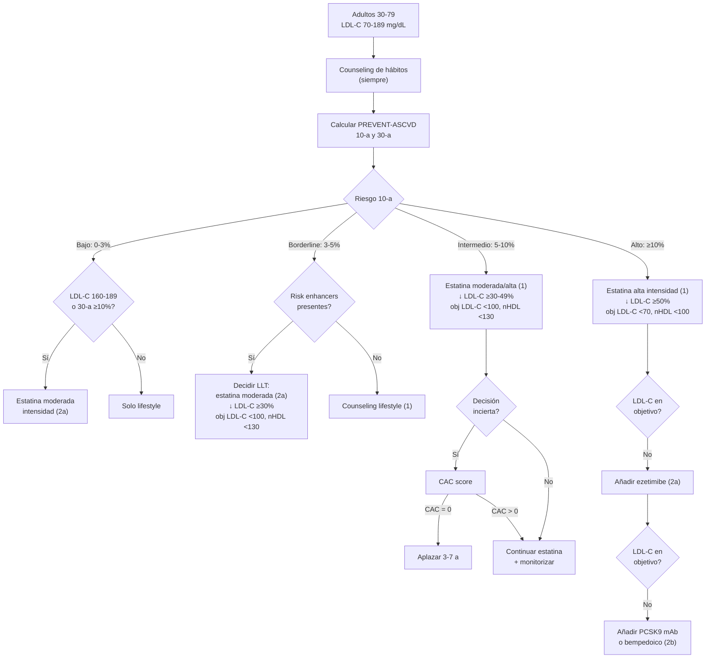
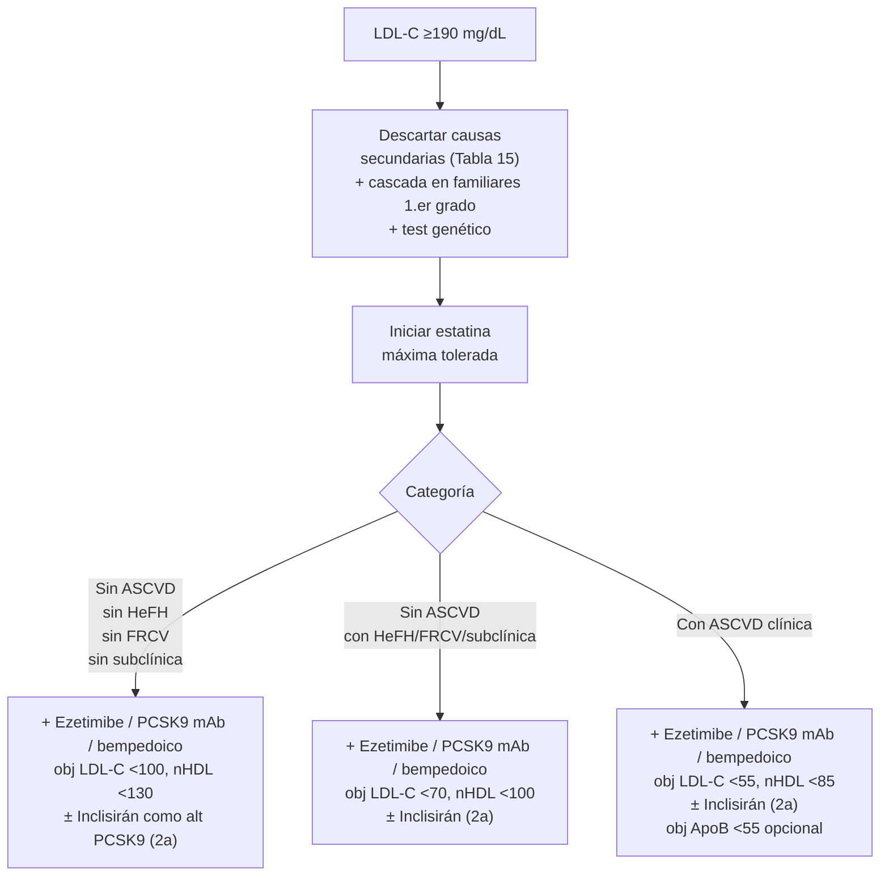
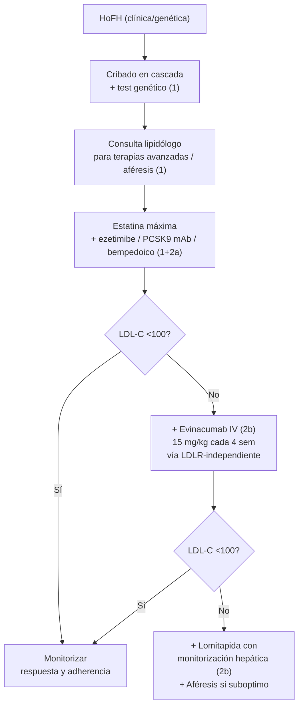
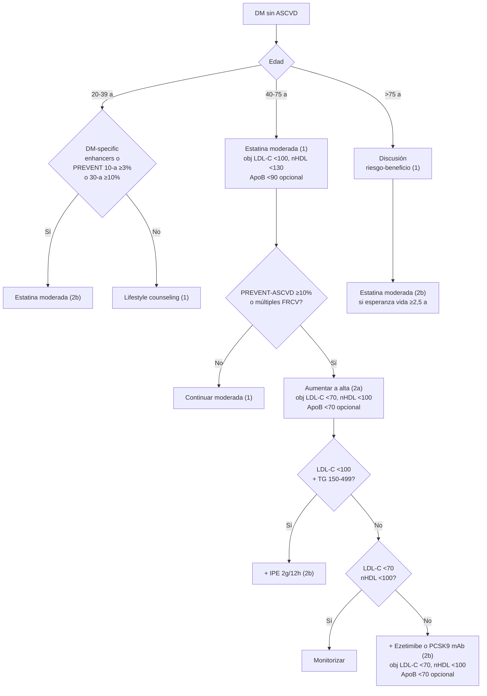

# Prevención Primaria de ASCVD

**Concepto clave:** la **prevención primaria** se aborda con **4 algoritmos paralelos** según el subgrupo del paciente: (1) adulto general 30-79 años con LDL-C 70-189 mg/dL — guiado por **PREVENT-ASCVD** (Fig 6); (2) **hipercolesterolemia severa LDL-C ≥190** — independiente del cálculo de riesgo (Fig 7); (3) **HoFH** — siempre alto riesgo, requiere lipidólogo y a menudo evinacumab/lomitapida (Fig 8); (4) **diabetes en adultos sin ASCVD** — flujo según edad y enhancers (Fig 9). El **estilo de vida es la base permanente** en todos los flujos. La intensidad de LLT y el objetivo LDL-C / no-HDL-C / ApoB se ajustan al grupo.

> Para la teoría general (PREVENT-ASCVD, risk enhancers, CAC, CPR Framework) → [[Estratificación de Riesgo Cardiovascular (PREVENT-ASCVD)]].
> Para los fármacos (estatinas, ezetimibe, PCSK9, inclisirán, bempedoico) → [[Tratamiento de la Dislipemia]].

---

## Algoritmo 1 — Adultos 30-79 a sin ASCVD con LDL-C 70-189 mg/dL (§4.2.3.7, Fig 6)

> **Punto de partida:** estilo de vida en todos los pacientes (§4.1.2 dieta cardiosaludable; ver [[Tratamiento de la Dislipemia]] §4.1).

### Recomendaciones por categoría de riesgo PREVENT-ASCVD

| # | Categoría | Recomendación | COR/LOE |
|---|---|---|---|
| 1 | **Cualquier riesgo** | Counseling de estilo de vida saludable + discusión riesgo-beneficio sobre LLT | **COR 1, A** |
| 2 | **Bajo (<3%)** + LDL-C **<160 mg/dL** + 30-a <10% | Counseling de hábitos | **COR 1, A** |
| 3 | **Bajo (<3%)** + **LDL-C 160-189** o **30-a ≥10%** (en adultos 30-59 a) | **Estatina moderada-intensidad** razonable para reducir exposición acumulada a lipoproteínas aterogénicas | **COR 2a, C-LD** |
| 4 | **Borderline (3-5%)** | **Estatina moderada-intensidad** razonable: ↓ LDL-C ≥30-49% | **COR 2a, A** |
| 5 | **Intermedio (5-10%)** | **Estatina moderada** (↓ ≥30-49%); **alta intensidad** (↓ ≥50%) razonable en el extremo alto del rango | **COR 1, A** |
| 6 | **Borderline (3-5%) o intermedio (5-10%)**, en estatina | Razonable LDL-C **<100 mg/dL** y no-HDL-C **<130 mg/dL** | **COR 2a, B-NR** |
| 7 | **Alto (≥10%)** | **Estatina alta intensidad** (↓ LDL-C ≥50%) | **COR 1, A** |
| 8 | **Alto (≥10%)** al iniciar estatina | Razonable LDL-C **<70** y no-HDL-C **<100** | **COR 2a, B-R** |
| 9 | **Alto (≥10%)**, en estatina máxima sin alcanzar LDL-C <70 | Añadir **PCSK9 mAb o ácido bempedoico** razonable | **COR 2a, B-R** |
| 10 | **Alto (≥10%)**, en estatina máxima ± ezetimibe sin alcanzar LDL-C <70 | Razonable añadir PCSK9 mAb o bempedoico | **COR 2b, B-NR** |
| 11 | **Expectativa de vida <1 a** | Razonable **discontinuar LLT** preventiva | **COR 2b, B-R** |
| 12 | **LDL-C <70 + no-HDL-C <100 + sin FRCV adicionales** | LLT en prevención primaria **NO es probable que reduzca riesgo** | **COR 3 No Benefit, B-NR** |

> [!info] Mensajes clave del algoritmo Fig 6
> - **Lifestyle siempre primero.** Antes de farmacoterapia, optimizar dieta-actividad-peso-tabaco.
> - **PREVENT-ASCVD a 10 y 30 años** orientan la decisión.
> - **Borderline + risk enhancers** (FH, hsCRP ≥2, Lp(a) elevada, AHF, etnia, PRS, marcadores reproductivos) → inclinarse hacia LLT — ver [[Estratificación de Riesgo Cardiovascular (PREVENT-ASCVD)]].
> - **Borderline/intermedio con incertidumbre** → considerar **CAC** (CPR Framework).
> - **Estatina como primera línea**, después ezetimibe → PCSK9 mAb o inclisirán → bempedoico.

### Algoritmo escalonado por categoría de riesgo

---

## Algoritmo 2 — Hipercolesterolemia severa LDL-C ≥190 mg/dL (§4.2.4, Fig 7)

> **Definición severa:** LDL-C ≥190 mg/dL (4,9 mmol/L), no-HDL-C >220 mg/dL o ApoB >140 mg/dL.

### Recomendaciones (AHA/ACC 2026 §4.2.4.3 + §4.2.4.4)

| # | Recomendación | COR/LOE |
|---|---|---|
| 1 | LDL-C ≥190: **descartar causas secundarias** (Tabla 15) y tratar | **COR 1, B-NR** |
| 2 | LDL-C ≥190: **estatina máxima tolerada** | **COR 1, B-R** |
| 3 | LDL-C ≥190 **sin** ASCVD/FH/FRCV adicionales/aterosclerosis subclínica + estatina máxima → añadir **ezetimibe ± PCSK9 mAb ± bempedoico** para **LDL-C <100 y no-HDL-C <130** | **COR 1, B-NR** |
| 4 | LDL-C ≥190 **con** HeFH (clínica/genética), FRCV adicionales o calcificación coronaria, sin ASCVD + estatina máxima → añadir **ezetimibe ± PCSK9 mAb ± bempedoico** para **LDL-C <70 y no-HDL-C <100** | **COR 1, B-R** |
| 5 | LDL-C ≥190 **con ASCVD clínica** + estatina máxima → añadir **ezetimibe ± PCSK9 mAb ± bempedoico** para **LDL-C <55 y no-HDL-C <85** | **COR 1, B-R** |
| 6 | LDL-C ≥100 **pese a** estatina máxima ± ezetimibe → **inclisirán** razonable (segunda línea PCSK9) | **COR 2a, B-R** |

### Tabla 15 — Causas secundarias de hipercolesterolemia LDL-C (descartar siempre)

| Categoría | Causas |
|---|---|
| **Dietéticas** | Grasa saturada/trans alta, ingesta colesterol alta, ganancia/pérdida rápida peso, cetosis |
| **Metabólicas** | **Hipotiroidismo**, hepatopatía obstructiva, ERC, **síndrome nefrótico**, DM e insulinorresistencia (LDL pequeñas), hiperglucemia descontrolada, Cushing, anorexia, obesidad |
| **Fármacos** | Tiazidas a dosis altas, **glucocorticoides**, estrógenos, andrógenos, antipsicóticos atípicos, ciclosporina |
| **Fisiológicas** | Transición menopáusica, **embarazo** |

### Cribado en cascada y test genético

> [!info] COR 1, B-NR
> En adultos con HF posible/probable/definida, el **test genético panel-based** (LDLR, APOB, PCSK9) es útil para identificar variantes patogénicas — facilita beneficios cardiovasculares y **screening en cascada**.

> [!info] COR 2a, B-NR
> Adultos con LDL-C ≥190 sin causa secundaria: **panel genético razonable** para identificar variantes patogénicas y guiar el manejo.

> [!info] COR 2b, B-NR
> LDL-C 160-189 sin causa secundaria: **panel genético** puede considerarse.

> Aproximadamente el **2,5%** de pacientes con LDL-C ≥190 tienen variante patogénica en LDLR/APOB/PCSK9. La presencia de variante genética se asocia con un riesgo de CAD considerablemente mayor.

### Indicaciones de aféresis de LDL (Liposorber LA-15)

| Grupo | Criterio |
|---|---|
| **A** | HoFH + LDL-C >500 mg/dL |
| **B** | HeFH + LDL-C ≥300 mg/dL |
| **C** | HeFH + LDL-C ≥160 mg/dL + EAC o EAP documentada |
| **D** | HeFH + Lp(a) ≥60 mg/dL (≥130 nmol/L) + EAC o EAP documentada |

---

## Algoritmo 3 — Hipercolesterolemia familiar homocigota (HoFH) (§4.2.4.4, Fig 8)

> **HoFH:** trastorno autosómico dominante por variantes patogénicas en LDLR/APOB/PCSK9 (raramente ARH/LDLRAP1) → LDL-C extrema desde el nacimiento, ASCVD prematura, valvulopatía aórtica.

### Recomendaciones AHA/ACC 2026

| # | Recomendación | COR/LOE |
|---|---|---|
| 1 | Confirmación clínica/genética de HoFH → **consulta con lipidólogo** para considerar terapias avanzadas y/o **aféresis de lipoproteínas** | **COR 1, B-NR** |
| 2 | **Estatina máxima tolerada** | **COR 1, B-R** |
| 3 | Sumar **ezetimibe, PCSK9 mAb y/o ácido bempedoico** | **COR 2a, B-R** |
| 4 | Si LDL-C ≥100 mg/dL pese a las anteriores: **evinacumab** razonable | **COR 2b, B-R** |
| 5 | Si persiste, **lomitapida** con monitorización hepática puede ser razonable | **COR 2b, C-LD** |

> Cribado familiar (cascade) crítico: **ambos padres** suelen ser HeFH (variantes pueden estar en cromosomas distintos: LDLR + APOB).

> [!warning] CAC=0 NO descarta riesgo en FH
> En pacientes con HF (homocigota o heterocigota), el **CAC=0 NO debe usarse para "de-riskear"** o diferir la estatina — siguen siendo de alto riesgo y se benefician de LLT.

---

## Algoritmo 4 — Diabetes en adultos sin ASCVD (§4.2.5, Fig 9)

### Recomendaciones AHA/ACC 2026

| # | Recomendación | COR/LOE |
|---|---|---|
| 1 | DM **40-75 a sin ASCVD**: **estatina moderada-intensidad** (↓ LDL-C 30-49%, obj **<100 / nHDL <130**) | **COR 1, A** |
| 2 | DM con efectos adversos a estatinas: **ezetimibe y/o ácido bempedoico y/o PCSK9 mAb** | **COR 1, B-R** |
| 3 | DM 40-75 + **múltiples FRCV ASCVD** (Tabla 17): **estatina alta intensidad** (↓ ≥50%, obj **<70 / nHDL <100**) razonable | **COR 2a, B-R** |
| 4 | DM sin ASCVD + ≥1 FRCV adicional + estatina + **TG ayuno 150-499 + LDL-C 41-100**: **icosapent ethyl** puede considerarse | **COR 2b, B-R** |
| 5 | DM con riesgo 10-a ≥10% por PREVENT-ASCVD: razonable añadir **ezetimibe o PCSK9 mAb** a estatina máxima para **LDL-C <70 y nHDL <100** | **COR 2b, C-LD** |
| 6 | DM **>75 a** + esperanza de vida ≥2,5 a: estatina moderada razonable tras discusión riesgo-beneficio | **COR 2b, C-LD** |
| 7 | DM 20-39 a + duración larga (DM2 ≥10 a, DM1 ≥20 a) o **albuminuria, eGFR <60, retinopatía, neuropatía, ABI <0,9**: estatina moderada razonable | **COR 2b, C-LD** |

### Tabla 17 — DM-Specific Risk Enhancers (independiente de PREVENT-ASCVD)

| Marcador |
|---|
| Duración larga (DM2 ≥10 a, DM1 ≥20 a) |
| Albuminuria ≥30 µg/mg creatinina |
| eGFR <60 mL/min/1,73 m² |
| Retinopatía |
| Neuropatía |
| **ABI <0,9** (índice tobillo-brazo) |

### Notas prácticas

- **DM 40-75 + ≥1 FRCV + LDL-C 41-100 + TG 150-499 + estatina** → **icosapent ethyl 2 g/12 h** (REDUCE-IT: ↓ MACE 25% en este subgrupo).
- En DM con SAMS / intolerancia a estatinas: **ezetimibe + bempedoico** es alternativa razonable (CLEAR Outcomes en intolerantes: ↓ MACE 13% global, 30% en estrato primaria con DM).
- Beneficio absoluto de la estatina **mayor en DM2 con larga duración** o complicaciones (retinopatía, neuropatía, microalbuminuria, ABI <0,9).

---

## Categorías especiales (resumen — desarrollo en notas separadas)

> Las recomendaciones específicas para HF, ERC estadio 3-4, persons living with HIV, supervivientes de cáncer, embarazo y lactancia están en sus secciones específicas (§4.2.7-9 AHA/ACC 2026, pp 56-83). Notas dedicadas pendientes.

| Población | Concepto clave |
|---|---|
| **HF (heterocigota)** | Riesgo 2-4× ASCVD vs población general; <35 a hasta 17×. Estatina alta + ezetimibe ± PCSK9 mAb desde diagnóstico. PREVENT-ASCVD **infraestima** riesgo en HF. |
| **DM con ASCVD establecida** | Ver [[Prevención Secundaria de ASCVD]]: very high risk → LDL-C <55. |
| **ERC estadio 3-4** | Estatina ± ezetimibe (SHARP, datos sólidos). PCSK9 mAb seguro en ERC. |
| **VIH (personas viviendo con)** | COR 1: 40-75 a en TAR estable → estatina moderada (REPRIEVE: pitavastatina 4 mg ↓ MACE 35% incluso en bajo riesgo). |
| **Supervivientes de cáncer** | COR 1: con esperanza de vida ≥2 a → estatina si indicada por riesgo. |
| **Embarazo / lactancia** | **Estatinas teratogénicas categoría X**: discontinuar antes de concebir y durante embarazo y lactancia. Considerar **fenofibrato u omega-3 ethyl esters** para HiperTG severa tras 1.er trimestre (COR 2a). |

---

## Notas hermanas

- [[Dislipemia - Concepto y Cribado]] — definición, cribado, perfil lipídico, ApoB, Lp(a).
- [[Estratificación de Riesgo Cardiovascular (PREVENT-ASCVD)]] — riesgo 10/30 a, risk enhancers, CAC, CPR Framework.
- [[Tratamiento de la Dislipemia]] — fármacos, dosis, escalado, intensidad estatina.
- [[Prevención Secundaria de ASCVD]] — diana LDL-C <55 en very high risk.
- [[Hipertrigliceridemia y Lipoproteína(a)]] — TG ≥150 / Lp(a) ≥125 nmol/L.
- [[Síntomas Musculares por Estatinas (SAMS)]] — algoritmo de intolerancia.
- [[Síndrome Cardiovascular-Renal-Metabólico]] — FRCV importante en DM/ERC.
- [[Atorvastatina]] · [[Rosuvastatina]] · [[Ezetimibe]] · [[Evolocumab]] · [[Inclisirán]]
- [[MOC - CARDIOLOGIA]]
