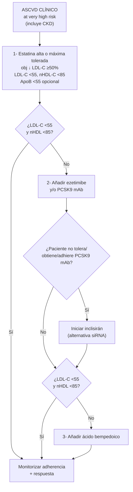
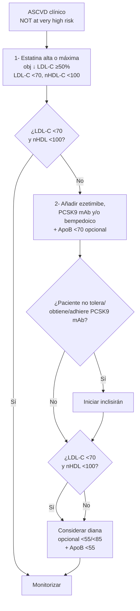
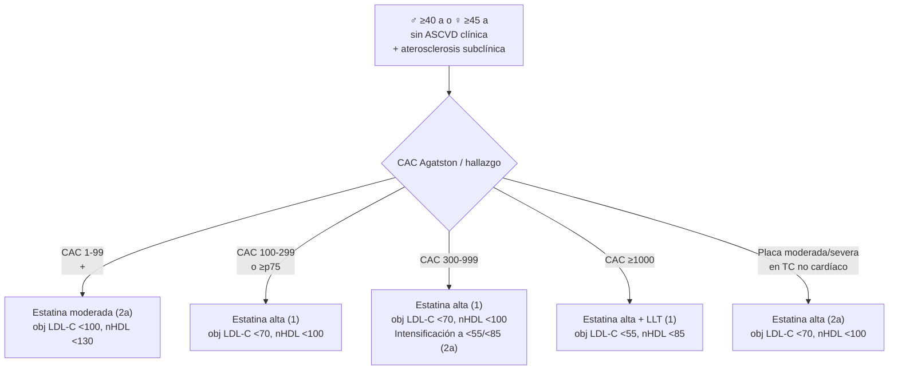

# Prevención Secundaria de ASCVD

**Concepto clave:** la **prevención secundaria** se aplica a todo paciente con **ASCVD clínica** (SCA, IM previo, ictus isquémico, AIT, EAP sintomática, revascularización coronaria/arterial). El **estandar de tratamiento es estatina de alta intensidad** (↓LDL-C ≥50%) — primera línea por eficacia, seguridad, tolerabilidad, accesibilidad y coste. La diana de **LDL-C <55 mg/dL** y **no-HDL-C <85 mg/dL** se aplica a **very high risk** (COR 1, no opcional — novedad 2026 vs 2018). Los pacientes ASCVD **no very high risk** mantienen diana **LDL-C <70** (con LDL-C <55 opcional). El escalado terapéutico es **estatina máxima → ezetimibe + PCSK9 mAb → inclisirán → bempedoico**. La aterosclerosis subclínica detectada por **CAC** (sin ASCVD clínica) se trata según la magnitud del calcio.

> Para algoritmo concreto post-SCA hospitalizado → ver [[SCA - Manejo Hospitalario y Prevención Secundaria]].

---

## Definición — "ASCVD at Very High Risk" (Figura 10 AHA/ACC 2026 p 56)

> Cumple **CUALQUIERA** de los dos criterios:

### A) ≥2 eventos mayores ASCVD

> [!info] Major ASCVD events
> - **SCA en los últimos 12 meses**
> - **Historia de IAM** (distinto al SCA reciente)
> - **Historia de ictus isquémico**
> - **EAP sintomática** (claudicación + ABI <0,85, revascularización previa, amputación)

### B) 1 evento mayor + ≥2 high-risk conditions

> [!info] High-risk conditions
> - **Edad ≥65 años**
> - **Bypass coronario** o **ICP** previa
> - **Tabaquismo activo**
> - **DM**
> - **Hx de insuficiencia cardíaca congestiva**
> - **HTA**
> - **LDL-C ≥100 mg/dL** pese a estatina máxima tolerada + ezetimibe

> La **mayoría** de pacientes con ASCVD clínica son **very high risk**. La categoría "ASCVD not very high risk" cubre un subgrupo minoritario (1 evento aislado, sin condiciones de alto riesgo).

---

## ASCVD AT very high risk (Figura 11)

### Recomendaciones AHA/ACC 2026 (§4.2.6)

| # | Recomendación | COR/LOE |
|---|---|---|
| 4 | **Estatina alta intensidad** (↓ LDL-C ≥50%) → obj **LDL-C <55 / no-HDL-C <85** | **COR 1, A** |
| 5 | En estatina máxima, **añadir ezetimibe y/o PCSK9 mAb** (selección según ↓ LDL-C necesaria y preferencia) → mantener obj LDL-C <55 / no-HDL-C <85 | **COR 1, A** |
| 6 | En estatina máxima, **bempedoico** con/sin ezetimibe o PCSK9 mAb → LDL-C <55 / no-HDL-C <85 | **COR 2a, B-R** |
| 7 | En estatina máxima ± ezetimibe, **inclisirán** razonable como alternativa a evolocumab/alirocumab si preferencia por dosis menos frecuente o **incapacidad de tolerar/obtener/adherir** PCSK9 mAb → LDL-C <55 / no-HDL-C <85 | **COR 2a, B-R** ⭐ Novedad 2026 |

### ApoB como objetivo

> **ApoB <55 mg/dL** se considera diana opcional adicional una vez alcanzados LDL-C y no-HDL-C, para minimizar riesgo residual asociado a partículas aterogénicas pequeñas y densas.

### Algoritmo (Fig 11)

> [!info] Punto clave — escalado en very high risk
> No se requiere "espera" entre ezetimibe y PCSK9 mAb desde la 2026: **la diferencia con 2018** es que ya **NO se exige ezetimibe previo** antes de PCSK9 mAb — ambos pueden añadirse según la magnitud de LDL-C requerida y preferencia del paciente.

---

## ASCVD NOT at very high risk (Figura 12)

### Recomendaciones AHA/ACC 2026

| # | Recomendación | COR/LOE |
|---|---|---|
| 1 | **Estatina alta intensidad** → obj **LDL-C <70 / no-HDL-C <100** | **COR 1, A** |
| 2 | En estatina máxima, **añadir ezetimibe / PCSK9 mAb / bempedoico** → LDL-C <70 / no-HDL-C <100 | **COR 2a, B-R** |
| 3 | En estatina máxima, también razonable alcanzar **LDL-C <55 / no-HDL-C <85** (intensificación opcional) | **COR 2a, B-R** |

### Algoritmo (Fig 12)

---

## Tabla resumen de objetivos (Figura 1, §4.2.6)

| Categoría | LDL-C | Non-HDL-C | ApoB |
|---|---|---|---|
| **ASCVD not very high risk** | **<70** (opcional <55) | <100 (opcional <85) | opcional <70, <55 |
| **ASCVD at very high risk** | **<55** | **<85** | **<55** |
| **ASCVD + ERC** | **<55** | **<85** | **<55** |

---

## ICFEr atribuible a cardiopatía isquémica

> [!info] COR 2b, B-R
> En adultos con **ICFEr** secundaria a cardiopatía isquémica + esperanza de vida 3-5 a + no en estatina por ASCVD → razonable iniciar **estatina moderada-intensidad** para reducir eventos ASCVD.

> **CORONA y GISSI HF**: estatina vs placebo en HF — sin diferencia en endpoint primario en el conjunto, pero análisis post hoc del CORONA mostró reducción de IM en HF menos avanzado. La AHA 2026 recoge esto como recomendación COR 2b — no rutina, pero razonable individualizado.
> Mortalidad por IAM en ICFEr → ver [[Insuficiencia cardíaca con FE reducida]].

---

## Aterosclerosis coronaria subclínica (§4.2.7)

> Aplicable a **♂ ≥40 a o ♀ ≥45 a sin ASCVD clínica previa**, con CAC detectado (gated o incidental no-cardíaco / por IA).

### Recomendaciones AHA/ACC 2026

| # | CAC (Agatston) / hallazgo | Recomendación | COR/LOE |
|---|---|---|---|
| 1 | **CAC ≥1000 AU** | LLT con estatina primera línea → ↓LDL-C ≥50%, obj **LDL-C <55 / no-HDL-C <85** | **COR 1, B-NR** |
| 2 | CAC **300-999 AU** | LLT con estatina primera línea → ↓LDL-C ≥50%, obj **LDL-C <70 / no-HDL-C <100** | **COR 1, B-R** |
| 3 | CAC **100-299 AU o ≥p75 estandarizado** | LLT con estatina primera línea → ↓LDL-C ≥50%, obj **LDL-C <70 / no-HDL-C <100** | **COR 1, B-R** |
| 4 | CAC **1-99 AU + <p75** o CAC incidental no-cardíaco | **Estatina moderada** razonable → ↓ LDL-C ≥30-49%, obj **LDL-C <100 / no-HDL-C <130** | **COR 2a, B-R** |
| 5 | CAC **300-999 AU** | Intensificar (alta intensidad estatina, añadir ezetimibe / PCSK9 mAb / bempedoico) → **LDL-C <55 / no-HDL-C <85** | **COR 2a, B-NR** |
| 6 | Aterosclerosis coronaria **moderada-severa en TC no cardíaco** (visual o IA) sin ASCVD previa | **Estatina alta intensidad** razonable → ↓LDL-C ≥50%, obj LDL-C <70 / no-HDL-C <100; si solo CAC incidental → moderada → LDL-C <100 / no-HDL-C <130 | **COR 2a, B-NR** |

> [!info] Concepto novedoso 2026: aterosclerosis subclínica como "equivalente" a prevención secundaria
> Pacientes con **CAC ≥1000** se manejan con dianas de **prevención secundaria very high risk** (LDL-C <55) aunque no hayan tenido evento clínico — su tasa anual de eventos es comparable a la del placebo de FOURIER (alto riesgo en LLT).

---

## Cuándo aplicar diana <55

> [!info] Resumen — pacientes con diana **LDL-C <55 mg/dL**
> 1. **ASCVD at very high risk** (≥2 mayores OR 1 mayor + ≥2 condiciones) — COR 1.
> 2. **ASCVD + ERC** — COR 1.
> 3. **CAC ≥1000 AU** sin ASCVD clínica — COR 1.
> 4. **Hipercolesterolemia severa LDL-C ≥190 + ASCVD clínica** — COR 1 (ver [[Prevención Primaria de ASCVD]]).
> 5. **HiperTG con ASCVD muy alto riesgo** — diana <55 (ver [[Hipertrigliceridemia y Lipoproteína(a)]]).
> 6. **DM + ASCVD** que cumple very high risk — COR 1.
> 7. **HeFH con ASCVD clínica** — COR 1.

---

## Manejo post-SCA (cross-link)

El algoritmo concreto del SCA agudo y el LDL-C en el ingreso → ver [[SCA - Manejo Hospitalario y Prevención Secundaria]].

> [!info] Resumen post-SCA (ACC/AHA 2025 SCA)
> - Iniciar **estatina alta intensidad** durante el ingreso (atorvastatina 80 mg o rosuvastatina 40 mg).
> - Si LDL-C ≥70 al ingreso → **añadir ezetimibe inmediatamente** (no esperar 4-12 sem).
> - Reevaluar a 4-12 sem: si LDL-C ≥55 → **PCSK9 mAb o inclisirán**.
> - Si LDL-C ≥55 pese a estatina máxima + ezetimibe + PCSK9 mAb → **bempedoico**.

---

## Beneficio incremental — más bajo es mejor

> [!info] Datos clave del 2026
> - **CTT meta-análisis (39 612)**: estatina más intensiva → 15% adicional ↓ eventos vasculares mayores (vs menos intensiva).
> - **IMPROVE-IT** (post-SCA): simva 40 + ezetimibe vs simva 40 → 2% ARR a 6 a, 6,3% ARR si ≥3 high-risk indicators.
> - **FOURIER + ODYSSEY OUTCOMES** (ASCVD high-risk en estatina): evolocumab y alirocumab → 1,4-1,6% ARR a 2,2-2,8 a, 15% ARR placebo en ese plazo.
> - **FOURIER-OLE** (extensión 6635 sujetos): ↓ MACE en participantes que cambiaron de placebo a evolocumab vs los mantenidos en evolocumab desde inicio. **Sin señal de daño con LDL-C <20 mg/dL**.
> - **CLEAR Outcomes** (estatina-intolerantes con ASCVD): bempedoico ↓ LDL-C 20%, ARR 1,6% a >3 a, evento placebo >13%. Combo bempedoico + ezetimibe ↓ LDL-C 38%.
> - **ORION-10/11**: inclisirán → ↓ LDL-C 50%, MACE OR 0,74 (análisis exploratorio).

---

## Ojo a la inercia terapéutica

> [!warning] Mensaje educativo clave
> En registros prospectivos, **>50% de pacientes con ASCVD clínica no alcanzan LDL-C <70** un año post-evento. La causa principal es la **inercia terapéutica** (no intensificación), no la intolerancia. Soluciones:
> - Verificar **adherencia** antes de cambiar (perfil lipídico a las 4-12 sem).
> - **Intensificar** dosis o añadir un agente sin esperar a "que el paciente lo tolere bien" durante meses.
> - **No discontinuar** la estatina ante mialgias inespecíficas — confirmar SAMS por algoritmo (ver [[Síntomas Musculares por Estatinas (SAMS)]]).

---

## Notas hermanas

- [[Dislipemia - Concepto y Cribado]] — definición, cribado, perfil lipídico, ApoB, Lp(a).
- [[Estratificación de Riesgo Cardiovascular (PREVENT-ASCVD)]] — riesgo 10/30 a, risk enhancers, CAC.
- [[Tratamiento de la Dislipemia]] — fármacos, dosis, escalado, intensidad estatina.
- [[Prevención Primaria de ASCVD]] — algoritmo §4.2.3.7, hipercolesterolemia severa, DM.
- [[Hipertrigliceridemia y Lipoproteína(a)]] — TG ≥150 / Lp(a) ≥125 nmol/L.
- [[Síntomas Musculares por Estatinas (SAMS)]] — algoritmo de intolerancia.
- [[SCA - Manejo Hospitalario y Prevención Secundaria]] — algoritmo post-SCA hospitalizado.
- [[Atorvastatina]] · [[Rosuvastatina]] · [[Ezetimibe]] · [[Evolocumab]] · [[Inclisirán]]
- [[MOC - CARDIOLOGIA]]
