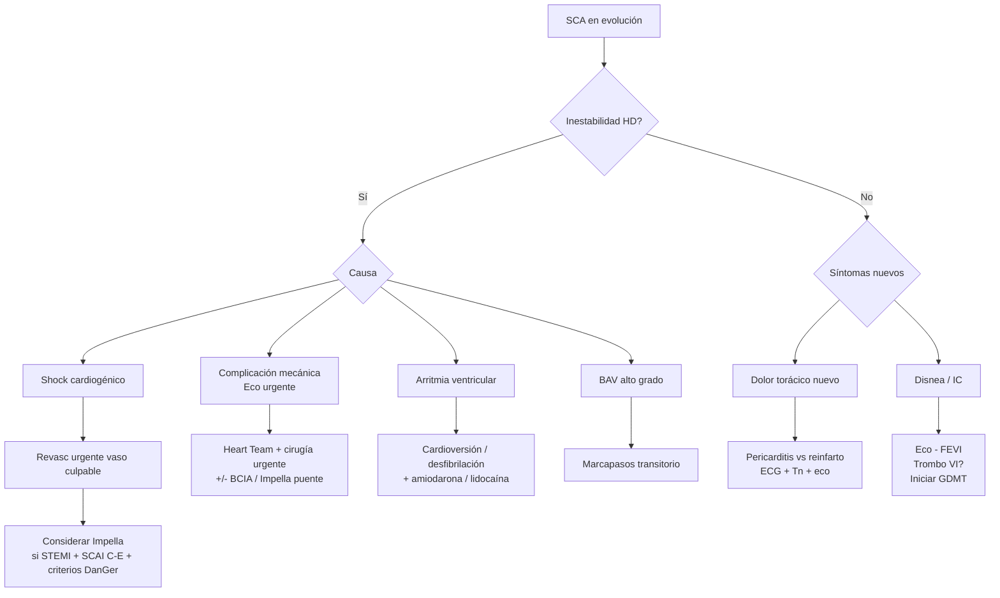

# Síndrome Coronario Agudo — Complicaciones y Shock Cardiogénico

> [!danger] Sospecha clínica obligatoria de complicación
> - **Inestabilidad HD nueva** + dolor torácico recurrente o nuevo soplo cardiaco → **complicación mecánica** hasta demostrar lo contrario.
> - **Persistencia o reaparición** de dolor torácico precoz post-revascularización → trombosis de stent / pericarditis epistenocárdica / reinfarto.
> - **Síncope o arritmia ventricular > 48 h** post-IAM → riesgo aumentado de muerte súbita; valorar [[Desfibrilador Automático Implantable|DAI]] en prevención primaria si FEVI persistentemente baja.

---

## Shock cardiogénico

Incidencia ~ 7-10% de los pacientes con SCA, mortalidad temprana **40-50%** (ACC/AHA 2025 §8). Su reconocimiento precoz por SEM o el médico de Urgencias en el primer contacto médico es crucial para el triage y la planificación de soporte mecánico circulatorio (MCS).

### Definición clínica

> Hipotensión mantenida (TAS < 90 mmHg, o caída > 30 mmHg respecto a basal, o necesidad de vasopresores para mantener TA) **+ hipoperfusión** (oliguria < 0,5 mL/kg/h, frialdad acra, alteración del nivel de consciencia, lactato ≥ 2,5 mmol/L, SvO₂ < 55%).

### Estratificación SCAI A-E (referenciada por ACC/AHA 2025)

| Estadio | Categoría |
|---|---|
| **A** | "At risk" — paciente en riesgo de shock pero sin shock activo |
| **B** | "Beginning" — hipotensión o taquicardia relativa, sin hipoperfusión |
| **C** | "Classic" — hipoperfusión que requiere intervención farmacológica o MCS |
| **D** | "Deteriorating" — falla de respuesta a la intervención inicial |
| **E** | "Extremis" — colapso circulatorio o parada cardíaca refractaria con RCP/eCPR |

> *La clasificación SCAI Shock Stage Update 2021 está endosada por la ACC/AHA 2025 (Tabla 1 del documento) y se utiliza para estandarizar la severidad y dictar la escalada terapéutica.*

### Revascularización del shock cardiogénico (ACC/AHA 2025 §8.1)

| Recomendación | COR/LOE |
|---|---|
| ACS + shock cardiogénico o inestabilidad HD → **revascularización urgente del vaso culpable** (PCI o CABG), **independientemente del tiempo desde inicio de síntomas** | **COR 1, B-R** |
| ACS + shock cardiogénico → **ICP rutinaria de arteria NO culpable en el momento de la ICP índice NO debe realizarse** (mayor mortalidad y necesidad de TRRC) | **COR 3 Harm, B-R** |

> Top Take-Home Message #6 ACC/AHA 2025 — basado en CULPRIT-SHOCK (706 pacientes con IAM y shock cardiogénico, ICP multivaso vs ICP solo culpable: peor outcome a 30 d y 1 año en multivaso). En shock, **menos es más**.

### Soporte mecánico circulatorio (MCS) en shock — ACC/AHA 2025 §8.2

> **Cambio mayor 2025:** la microaxial flow pump (Impella) pasa a COR 2a en STEMI con shock seleccionado, basado en el **ensayo DanGer-SHOCK** (360 pacientes europeos, reducción 26% mortalidad 180 d, ARR 12,7%, NNT 8). En contraste, **BCIA y VA-ECMO NO se recomiendan de rutina**.

| Recomendación | COR/LOE |
|---|---|
| **STEMI seleccionado + shock cardiogénico severo o refractario** → **microaxial flow pump (Impella)** razonable para reducir mortalidad | **COR 2a, B-R** |
| ACS con complicaciones mecánicas → **MCS de corta duración** razonable como puente a cirugía | **COR 2a, B-NR** |
| AMI + shock cardiogénico → **uso rutinario de BCIA (IABP) o VA-ECMO NO recomendado** (sin beneficio en mortalidad — IABP-SHOCK II, ECMO-CS) | **COR 3 No Benefit, B-R** |

#### Criterios de paciente óptimo para microaxial flow pump (perfil DanGer-SHOCK)

- **STEMI** con shock cardiogénico < 24 h.
- Hipotensión (TAS < 100 mmHg) o necesidad de vasopresores.
- Hipoperfusión: lactato ≥ 2,5 mmol/L y/o SvO₂ < 55% con PaO₂ normal.
- **FEVI < 45%**.
- **NO** comatoso (GCS ≥ 8) tras parada cardíaca extrahospitalaria.
- **Sin** fallo VD manifiesto.
- **SCAI estadios C, D o E**.
- Vasculatura periférica adecuada para acceso de gran calibre (femoral).

> [!warning] Vigilar complicaciones del Impella
> Sangrado, isquemia de extremidades, fallo renal y necesidad de TRRC son significativamente más frecuentes que con tratamiento estándar. Atención meticulosa al acceso vascular y al weaning del soporte es esencial para balancear riesgos y beneficios.

---

## Complicaciones mecánicas (ACC/AHA 2025 §9.1; Manual 12 cap. 17 Tabla 17)

> [!danger] Manejo coordinado en centro con cirugía cardiaca
> **COR 1, C-EO**: pacientes con complicación mecánica de SCA deben manejarse en una **UCI cardiaca de Nivel 1** con cirugía cardiaca + Heart Team.
> **COR 2a, B-NR**: **MCS de corta duración** razonable como puente a cirugía.

### Cuatro complicaciones mecánicas (Figura 9 ACC/AHA 2025)

| Complicación | Causa o predisposición | Presentación clínica | Tratamiento |
|---|---|---|---|
| **Rotura de pared libre** | IAM anterior · no reperfusión / reperfusión tardía · primer infarto · > 70 años · uso de corticoides | Dolor torácico súbito · **taponamiento cardíaco** · disociación electromecánica | Pericardiocentesis · RCP · **cirugía urgente** |
| **Pseudoaneurisma (rotura contenida)** | Similar a la rotura de pared libre, pero contenida por adherencias pericárdicas | Asintomático · dolor torácico · IC · pequeña comunicación con flujo bidireccional | **Cirugía** electiva preferentemente |
| **Comunicación interventricular (CIV)** | IAM anterior (CIV apical) · IAM inferoposterior (CIV basal) · no reperfusión / reperfusión tardía | Dolor torácico nuevo + **soplo holosistólico borde esternal izquierdo** · edema agudo de pulmón · shock cardiogénico · **salto oximétrico en VD** | Vasodilatadores · inotrópicos · diuréticos · **BCIA y ECMO** · planear cirugía en Heart Team |
| **Insuficiencia mitral aguda (rotura de músculo papilar posteromedial)** | Rotura papilar posteromedial (irrigación monovasos por CD/Cx) · IAM inferoposterior · no reperfusión / reperfusión tardía | Soplo sistólico foco mitral (puede estar **ausente**) · edema agudo de pulmón fulminante · shock cardiogénico | Vasodilatadores · inotrópicos · **BCIA y ECMO** · **cirugía urgente** |
| **Aneurisma ventricular** | IAM anterolateral · no reperfusión / reperfusión tardía | Arritmias ventriculares · tromboembolismo | Manejo de complicaciones · **IECA** · valorar anticoagulación si trombo intraventricular |
| **Infarto de VD** | IAM inferior con extensión a VD o aislado | Inestabilidad HD · congestión sistémica (PVY ↑) sin congestión pulmonar · bajo gasto · **respuesta paradójica a NTG** | **Volumen** + **inotrópicos**. **Evitar nitratos y diuréticos** |

> Diagnóstico imagen de elección: **ecocardiograma transtorácico urgente** (diagnóstico de complicación mecánica, función VI, presencia de derrame). **POCUS** disponible en Urgencias permite triage inmediato.

---

## Complicaciones eléctricas y prevención de muerte súbita (ACC/AHA 2025 §9.2)

### Arritmias ventriculares

| Recomendación | COR/LOE |
|---|---|
| **Post-IAM con FEVI ≤ 40%** (Tabla 17 — ver más abajo) → **DAI** al menos **40 días post-IAM y 90 días post-revascularización** para prevención primaria de muerte súbita | **COR 1, A** |
| Post-ACS con arritmias ventriculares clínicamente relevantes (TV/FV > 40 d post-IAM) → **DAI razonable** | **COR 2a, C-EO** |
| Precoz (< 40 d) post-IAM con FEVI ≤ 35% → **chaleco desfibrilador externo (LifeVest)** — utilidad incierta | **COR 2b, B-R** |

> [!info] Tabla 17 ACC/AHA 2025 — FEVI y características para DAI profiláctico (cardiopatía isquémica)
>
> | FEVI | Categoría NYHA |
> |---|---|
> | **≤ 30%** | NYHA I, II o III |
> | **31-35%** | NYHA II o III |
> | **≤ 40%** | **TV inducible** (en EEF) |

### Bradiarritmias

| Recomendación | COR/LOE |
|---|---|
| AMI con **BAV de 2.º grado Mobitz II sostenido**, BAV de alto grado, BBB alternante o **BAV de 3.er grado (persistente o infranodal)** → **marcapasos transitorio** | **COR 1, B-NR** |

- **BAV nodal (intra-AV)** en infarto inferior: generalmente reversible, QRS estrecho, escape 45-60 lpm, responde a atropina. Pronóstico bueno.
- **BAV infrahisiano** en infarto anterior extenso: QRS ancho, escape 30-40 lpm, no responde a atropina, mal pronóstico, riesgo de asistolia → marcapasos transitorio inmediato.
- Si **BAV de alto grado persiste > 72 h** post-IAM → **marcapasos definitivo**.

### Taquiarritmias supraventriculares

> [!info] Manejo (Manual 12 cap. 17 Tabla 17)
> - **FA / flutter** post-IAM (descarga adrenérgica, isquemia auricular): **cardioversión eléctrica** si inestabilidad; cardioversión farmacológica con **amiodarona** si HD estable.
> - **Anticoagulación** según riesgo embolígeno ([[Escala CHA2DS2-VASc y HAS-BLED|CHA2DS2-VASc]]).

### Tromboembolismo

> [!info] Tromboembolismo (Manual 12 cap. 17 Tabla 17)
> - **Causas:** FA / flutter, trombo intraventricular, trombosis de stent.
> - **Tratamiento:** anticoagulación (ver siguiente sección [[#Trombo ventricular izquierdo post-IAM]]).

---

## Pericarditis post-IAM (ACC/AHA 2025 §9.3)

Existen dos formas clínicas:

| Forma | Cronología | Mecanismo |
|---|---|---|
| **Pericarditis epistenocárdica (precoz)** | **1-3 días tras un IAM transmural** | Inflamatoria, por irritación pericárdica adyacente a la necrosis miocárdica. Autolimitada (días). Tratamiento sintomático con **paracetamol** habitualmente suficiente |
| **Síndrome de Dressler (tardío)** | **Semanas tras el IAM** | **Inmunomediada**. Respuesta a la irritación o daño pericárdico (incluido cualquier grado de hemopericardio). Suele requerir tratamiento específico |

### Tabla 18 ACC/AHA 2025 — Criterios diagnósticos de pericarditis (post-MI)

> [!info] Diagnóstico = dolor torácico pleurítico + ≥ 1 de:
> - **Roce pericárdico** en la auscultación
> - **ECG: depresión PR** o elevación cóncava difusa del ST. En el contexto de IAM, **persistencia de elevación ST** o **cambios dinámicos T**
> - **Derrame pericárdico nuevo o creciente** en ecocardiografía

### Tratamiento (Tabla 19 ACC/AHA 2025)

| Fármaco | Pauta |
|---|---|
| **AAS dosis altas** | **500-1000 mg cada 6-8 h** hasta mejoría sintomática |
| **Colchicina** | **0,5-0,6 mg cada 24 h** (si > 70 kg, 0,5-0,6 mg cada 12 h) durante **3 meses** |

> [!danger] CONTRAINDICADOS en pericarditis post-IAM
> - **AINE distintos del AAS**: aumentan el riesgo de reinfarto y dificultan la cicatrización miocárdica → **mayor riesgo de rotura cardiaca**.
> - **Glucocorticoides**: mismo motivo.

> [!info] No tratar derrames pericárdicos asintomáticos
> El uso rutinario de AAS dosis altas o colchicina **NO está indicado** para el manejo de derrames pericárdicos asintomáticos.

---

## Trombo ventricular izquierdo post-IAM (ACC/AHA 2025 §9.4)

### Pacientes de mayor riesgo

- **STEMI anterior** con afectación de DA.
- **FEVI < 30%** (especialmente con aneurisma del VI).
- **Tiempo prolongado a la reperfusión**.

### Diagnóstico

- **Ecocardiograma** = imagen recomendada (amplia disponibilidad, bajo coste).
- **RM cardíaca** = más sensible; considerar cuando hay **alta sospecha clínica + ecocardiografía no concluyente**.
- El trombo VI puede formarse durante el ingreso o tras el alta → repetir imagen en pacientes de alto riesgo.

### Anticoagulación

- **Anticoagulación oral durante 3 meses** generalmente está indicada.
- **Reevaluar con imagen** a los 3 meses para decidir si prolongar.
- **DOAC** (apixabán, rivaroxabán) **no inferior** a antagonistas de vitamina K (AVK) en estudios observacionales y RCT pequeños, con **mejor perfil de sangrado** — son alternativa razonable al AVK.
- En pacientes con DAPT post-SCA, el riesgo de sangrado triple terapia debe valorarse contra el riesgo embólico.

---

## Resumen — flujo de actuación

---

## Notas hermanas

- [[SCA - Evaluación Inicial y Clasificación]] — diagnóstico inicial, GRACE, TIMI, Killip-Kimball.
- [[SCA - Tratamiento Médico]] — antiagregación, anticoagulación, BB, IECA, MRA.
- [[SCA - Reperfusión y Revascularización]] — reperfusión STEMI, NSTE-ACS invasivo.
- [[SCA - Manejo Hospitalario y Prevención Secundaria]] — UCIC, GDMT al alta, DAPT, rehabilitación cardíaca.
- [[Insuficiencia cardiaca aguda]] · [[Pericarditis Aguda]] · [[Taponamiento Cardiaco]] · [[Arritmias]] · [[Fibrilación Auricular (FA)]]
- [[MOC - CARDIOLOGIA]] · [[MOC - Urgencias]]
