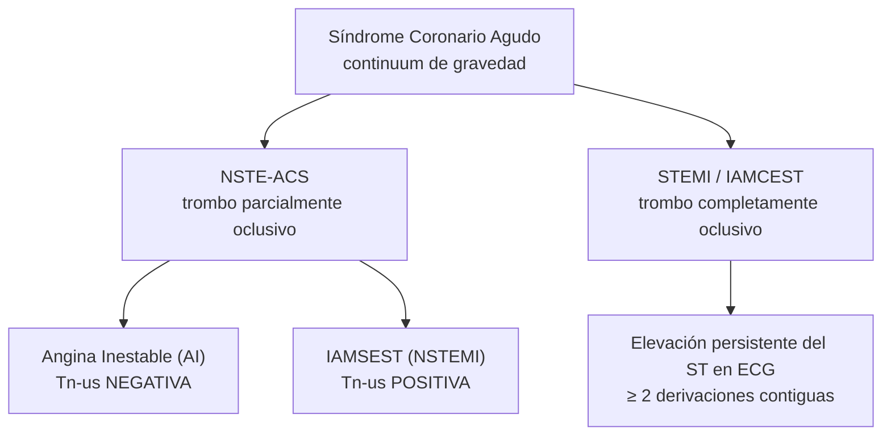
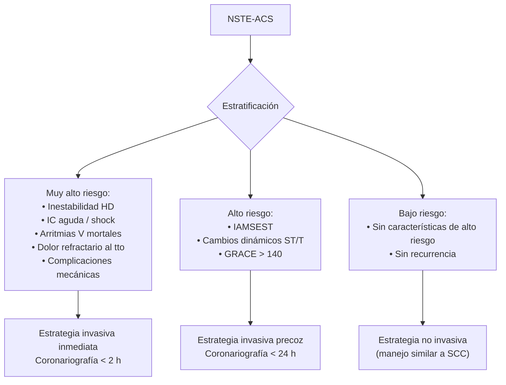

# Síndrome Coronario Agudo — Evaluación Inicial y Clasificación

> [!danger] RED FLAGS — actuar en < 10 min
> - **Dolor torácico + elevación persistente del ST** → **Código Infarto: avisar Hemodinámica** y activar la red de atención inmediata.
> - **Inestabilidad hemodinámica** (TAS < 90 mmHg, FC > 120 lpm, signos de hipoperfusión).
> - **Insuficiencia cardiaca aguda grave** o **shock cardiogénico**.
> - **Arritmia ventricular maligna** o parada cardiorrespiratoria recuperada.
> - **BRIHH nuevo o presumiblemente nuevo + clínica isquémica** → tratar como IAMCEST (ACC/AHA 2025; Manual 12).
> - **ECG con dolor torácico atípico** en ancianos / mujeres / diabéticos → **no descartar SCA por la atipicidad clínica**.

---

## Concepto y fisiopatología

El SCA representa la **fase de inestabilización** de la enfermedad arterial coronaria, producida por una **ulceración, fisura o erosión de la placa de ateroma** o por una **disección coronaria**. Esto activa la cascada de coagulación, formando un trombo intraluminal que reduce el flujo coronario.

> [!info] Tabla 4 — Tipos de IAM (Universal Definition of MI 2018, recogida en ACC/AHA 2025 y Manual 12)
> | Tipo | Mecanismo |
> |---|---|
> | **Tipo 1** | IAM por **aterotrombosis aguda**, normalmente por rotura/erosión de placa con trombosis intraluminal parcial o completa. Foco de las guías de SCA. |
> | **Tipo 2** | IAM por **desequilibrio aporte/demanda** sin aterotrombosis aguda (espasmo, anemia grave, taquiarritmia, hipotensión, hipoxemia). |
> | **Tipo 3** | Muerte cardiaca súbita con síntomas/ECG sugerentes de isquemia, sin biomarcadores disponibles antes del fallecimiento. |
> | **Tipo 4a** | IAM peri-ICP detectado ≤ 48 h tras el procedimiento. |
> | **Tipo 4b** | IAM por trombosis de stent. |
> | **Tipo 4c** | IAM por reestenosis de stent. |
> | **Tipo 5** | IAM peri-CABG detectado ≤ 48 h tras la cirugía. |

---

## Espectro clínico (Figura 2 ACC/AHA 2025)

| Forma | ECG típico | Troponina | Mecanismo |
|---|---|---|---|
| **AI** | Normal o cambios dinámicos no específicos | **Negativa** | Isquemia miocárdica transitoria sin necrosis significativa |
| **IAMSEST (NSTEMI)** | Sin elevación persistente del ST. Puede haber descenso ST, T negativa, ECG normal en ~30% | **Elevada (dinámica)** | Oclusión coronaria parcial / suboclusión / lesión culpable activa con embolización distal |
| **IAMCEST (STEMI)** | **Elevación persistente del ST > 20 min** ≥ 2 derivaciones contiguas (o equivalente STEMI) | Elevada (puede ser negativa si tiempo desde inicio < 1-2 h) | Oclusión coronaria total → isquemia transmural |

---

## Diagnóstico — Anamnesis y exploración

La presentación clínica del SCA es amplia: muerte súbita, inestabilidad hemodinámica con shock cardiogénico, insuficiencia cardiaca aguda o dolor torácico aislado. La definición clínica del dolor torácico anginoso típico/atípico se desarrolla en [[Cardiopatía Isquémica - Concepto y Clasificación]].

En la valoración inicial buscar:

- **Inestabilidad hemodinámica** (TAS, FC, perfusión periférica, nivel de consciencia).
- **Datos de insuficiencia cardiaca aguda** (crepitantes, ingurgitación yugular).
- **Soplos nuevos** que sugieran **complicación mecánica del infarto** (CIV, IM aguda).
- **Hasta el 80% de las presentaciones son atípicas** (sobre todo ancianos, mujeres, diabéticos): disnea aislada, síncope, epigastralgia, mareo, malestar inespecífico.

---

## ECG en < 10 min del primer contacto

> ACC/AHA 2025 §3.1.1 — **COR 1, LOE B-NR**: en pacientes con sospecha de SCA, debe obtenerse e interpretarse un ECG de 12 derivaciones **en los primeros 10 min del primer contacto médico** para identificar STEMI.
>
> Manual 12 cap. 17 §4.2.2 — además, deben incluirse las **derivaciones posteriores (V7-V9)** y **precordiales derechas (V3R-V4R)**. ECG seriado si persisten síntomas y dudas diagnósticas. Comparación con ECG previos cuando estén disponibles.

### Tabla 3 (ACC/AHA 2025) — Criterios ECG por categoría

| Categoría | Hallazgos típicos |
|---|---|
| **NSTE-ACS** | Depresión del ST horizontal o descendente **≥ 0,5 mm en ≥ 2 derivaciones contiguas** y/o inversión de la onda T **> 1 mm en ≥ 2 derivaciones contiguas** con onda R prominente o R/S > 1, o **elevación ST transitoria**. ECG normal **no descarta** SCA |
| **STEMI** | Elevación nueva o presumiblemente nueva del ST **≥ 1 mm en ≥ 2 derivaciones anatómicamente contiguas** (medida en el punto J) en cualquier territorio, EXCEPTO V2-V3 → **≥ 2 mm en hombres ≥ 40 años, ≥ 2,5 mm en hombres < 40 años, ≥ 1,5 mm en mujeres** |

### Tabla 10 (Manual 12) — Localización del IAM

| Alteración ECG | Área isquémica | Arteria responsable |
|---|---|---|
| Elevación ST V3-V6 | Septo y cara anterior | Descendente anterior (DA) |
| Elevación ST II, III y aVF | Cara inferior | Coronaria derecha / Circunfleja |
| Elevación ST V3R-V4R | **Ventrículo derecho** | Rama marginal de la CD |
| Elevación ST V7-V9 + descenso especular V1-V3 | Cara posterior | Circunfleja |
| Descenso ST generalizado + ascenso aVR | Isquemia extensa (tronco común izquierdo, multivaso) | Tronco común / multivaso |
| Ondas T negativas picudas precordiales (T de Wellens) | Septo y cara anterior | DA (estenosis crítica) |

### Equivalentes STEMI (manejo agudo igual que IAMCEST)

> [!warning] Equivalentes STEMI — manejo como IAMCEST si clínica isquémica
> - **BRIHH nuevo o presumiblemente nuevo** con clínica isquémica compatible. (BRIHH nuevo en asintomático **no** es equivalente STEMI, ACC/AHA 2025).
> - **Patrón de De Winter:** descenso ST ascendente desde el punto J + **ondas T hiperagudas en precordiales V1-V6**.
> - **Ondas T hiperagudas** en fase precoz.
> - **Descenso ST V1-V3 con onda R dominante** → sospecha de **IAM posterior** → confirmar con derivaciones V7-V9.
> - **Estimulación por marcapasos** con criterios isquémicos.
>
> En presencia de BRIHH (no necesariamente nuevo), se aplican los **criterios de Sgarbossa** para mayor especificidad:
> - Elevación ST **concordante ≥ 1 mm** en derivación con QRS positivo (5 puntos).
> - Descenso ST **concordante ≥ 1 mm** en V1-V3 con QRS negativo (3 puntos).
> - Elevación ST **discordante ≥ 5 mm** en derivación con QRS negativo (2 puntos).
> ≥ 3 puntos sugieren IAM agudo en BRIHH.

> [!info] Importante: el patrón de Wellens es SCASEST de alto riesgo (estenosis crítica DA), **no equivalente STEMI**.

---

## Troponina cardiaca de alta sensibilidad (hs-cTn)

> ACC/AHA 2025 §3.1.2 — **COR 1, LOE B-NR**: medir cTn lo antes posible, **preferiblemente alta sensibilidad (hs-cTn)**.
> **COR 1, LOE B-NR**: si la inicial es no diagnóstica, **repetir a 1-2 h con hs-cTn** o a **3-6 h con cTn convencional**.

| Algoritmo | Determinaciones |
|---|---|
| **0-1h con hs-cTn** | Llegada y +1 h. Validado para *rule-in / rule-out* rápido (puntos de corte específicos por test) |
| **0-3h** | Llegada y +3 h. Si el test 0-1h no está validado o el inicio del dolor < 1 h antes de la primera analítica |

> [!warning] Tabla 12 (Manual 12) — Causas no coronarias de elevación de troponinas
>
> **Cardiológicas:** taquiarritmias, [[Insuficiencia cardiaca aguda|IC aguda]], [[Hipertensión Pulmonar|HTP]], emergencia hipertensiva, miocarditis, **síndrome de tako-tsubo**, [[Valvulopatías]], contusión cardiaca, revascularización coronaria, ablación, cardioversión eléctrica, biopsia endomiocárdica, cirugía cardiaca, miocardiopatías infiltrativas, toxicidad farmacológica.
>
> **No cardiológicas:** sepsis, quemaduras, shock de otras etiologías, **disección aórtica**, [[TEP - Tromboembolismo Pulmonar|TEP]], **ERC**, evento neurológico agudo (ictus, hemorragia subaracnoidea), trastornos tiroideos, ejercicio físico intenso, rabdomiolisis.
>
> Una elevación de Tn aislada (sin clínica ni cambios ECG, sin movimiento dinámico ≥ 3 h ni anomalías segmentarias) se denomina **daño miocárdico**, no SCA.

NT-proBNP **no se recomienda** como biomarcador adicional rutinario, aunque puede considerarse por su **valor pronóstico**.

---

## Estratificación de riesgo en NSTE-ACS

La escala más validada para predecir mortalidad / MACE en SCA es la **GRACE Risk Score 2.0**.

> [!info] Tabla 5 ACC/AHA 2025 — Escalas de riesgo en SCA
>
> | | **GRACE Risk Score 2.0** | **TIMI Risk Score (UA/NSTEMI)** | **TIMI Risk Score (STEMI)** |
> |---|---|---|---|
> | Población | SCA (todo el espectro) | UA / NSTEMI | STEMI |
> | Outcome | Muerte / MACE intra-hospitalario, 6 m, 1 a, 3 a | Muerte total / IAM / revasc urgente a 14 d | Muerte total a 30 d |
> | Variables | Edad, Killip, TAS, FC, desviación ST, parada cardiaca al ingreso, creatinina sérica, biomarcadores cardiacos elevados | Edad ≥ 65, ≥ 3 FRCV, estenosis coronaria conocida ≥ 50%, desviación ST ≥ 0,5 mm, ≥ 2 episodios de angina en 24 h, AAS los últimos 7 días, biomarcadores elevados | Edad 65-74 (2 pts) o ≥ 75 (3 pts), Killip II-IV (2 pts), TAS < 100 (3 pts), FC > 100 (2 pts), elevación ST anterior o BRIHH (1 pt), DM/HTA/angina (1 pt), peso < 67 kg (1 pt), tiempo a tto > 4 h (1 pt) |

### Categorías de riesgo NSTE-ACS y manejo (Manual 12 Figura 3)

> [!info] ACC/AHA 2025 — recomendación clave (Top Take-Home Message #4)
> En NSTE-ACS de **riesgo intermedio o alto**, se recomienda **estrategia invasiva durante la hospitalización** para reducir MACE.
> En NSTE-ACS de **bajo riesgo**, una estrategia **invasiva rutinaria O selectiva** con estratificación adicional es razonable para identificar candidatos a revascularización.

---

## Killip-Kimball (clasificación funcional STEMI)

> [!info] Tabla 14 (Manual 12) — Clasificación de Killip-Kimball
> | Clase | Hallazgos |
> |---|---|
> | **I** | Sin insuficiencia cardiaca |
> | **II** | Congestión pulmonar leve-moderada (crepitantes, S3) |
> | **III** | Edema agudo de pulmón |
> | **IV** | **Shock cardiogénico** |

Esta clasificación se incluye en GRACE y TIMI-STEMI como variable pronóstica.

---

## Parada cardiorrespiratoria recuperada (post-ROSC)

> ACC/AHA 2025 §3.2 — recomendaciones:
> - **COR 1, LOE C-LD**: parada + STEMI → **traslado a centro con capacidad de PPCI**.
> - **COR 1, LOE B-NR**: parada recuperada + asintomático O comatoso con **factores pronósticos favorables** + STEMI → **PPCI** para mejorar supervivencia.
> - **COR 2b, LOE C-LD**: parada recuperada + comatoso + factores pronósticos **desfavorables** + STEMI → PPCI puede ser razonable tras **valoración individualizada**.
> - **COR 3 No Benefit, LOE A**: comatoso + estable eléctrica/hemodinámicamente + **SIN STEMI** → **angiografía coronaria inmediata NO recomendada**.

Factores pronósticos desfavorables: parada no presenciada, ausencia de RCP por testigo, ritmo no desfibrilable, RCP > 30 min, tiempo a ROSC > 30 min, pH arterial < 7,2, lactato > 7 mmol/L, edad > 85 a, ERC en diálisis.

---

## Notas hermanas

- [[SCA - Tratamiento Médico]] — antiagregación, anticoagulación, antianginosos, estatinas en fase aguda.
- [[SCA - Reperfusión y Revascularización]] — algoritmo STEMI vs NSTE-ACS invasivo.
- [[SCA - Complicaciones y Shock Cardiogénico]] — mecánicas, eléctricas, shock.
- [[SCA - Manejo Hospitalario y Prevención Secundaria]] — UCIC, GDMT, DAPT post-alta, rehabilitación.
- [[Cardiopatía Isquémica - Concepto y Clasificación]] — espectro CI y clínica anginosa.
- [[MOC - CARDIOLOGIA]] · [[MOC - Urgencias]]
