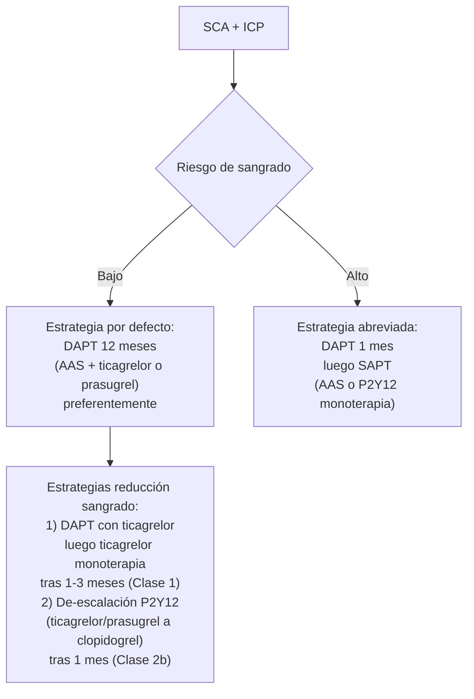

# Síndrome Coronario Agudo — Manejo Hospitalario y Prevención Secundaria

Tras la fase aguda (evaluación, antitrombóticos, reperfusión y manejo de complicaciones), el ingreso continúa con **monitorización en UCIC**, **inicio o titulación de GDMT** y **planificación del alta** con prevención secundaria estructurada. Para la fase aguda ver [[SCA - Tratamiento Médico]] y [[SCA - Reperfusión y Revascularización]].

---

## 1. Unidad de Cuidados Intensivos Cardíacos (UCIC)

> ACC/AHA 2025 §10.1 — **COR 1, LOE C-EO**: pacientes con SCA y **angina persistente, inestabilidad hemodinámica, arritmias incontroladas, reperfusión subóptima o shock cardiogénico** deben ingresar en una **UCIC**.

| Indicación de UCIC | Comentario |
|---|---|
| **Angina persistente o recurrente** | Riesgo de reinfarto |
| **Inestabilidad hemodinámica** | TAS < 90 mmHg, taquicardia compensatoria, hipoperfusión |
| **Arritmias no controladas** | TV/FV, FA con respuesta rápida no controlada, BAV alto grado |
| **Reperfusión subóptima** | ICP no completa, fallo de fibrinólisis, IAM extenso con isquemia residual |
| **Shock cardiogénico** | Ver [[SCA - Complicaciones y Shock Cardiogénico]] |
| **IAM extenso con IC** | Killip II-IV |

> Pacientes estables sin isquemia recurrente, sin arritmias significativas y sin congestión pulmonar pueden ingresar en **unidad de telemetría / cuidados intermedios** sin necesidad de UCIC.

### Score ACTION ICU para selección a UCIC

Variables que valora (al ingreso):
1. Signos / síntomas de IC.
2. Frecuencia cardíaca inicial.
3. TAS inicial.
4. Troponina inicial.
5. Creatinina sérica inicial.
6. Revascularización previa.
7. Enfermedad pulmonar crónica.
8. Depresión del ST.
9. Edad > 70 años.

Score más alto → mayor probabilidad de necesitar cuidados de UCIC.

---

## 2. Manejo de la anemia (ACC/AHA 2025 §10.2)

> **COR 2b, LOE B-R**: en pacientes con SCA + anemia (aguda o crónica), **transfusión para Hb ≥ 10 g/dL puede ser razonable** para reducir eventos cardiovasculares.

> [!info] Ensayo MINT (2024) — fundamento del cambio
> 3504 pacientes con STEMI/NSTEMI + anemia (Hb < 10 g/dL): estrategia liberal (transfundir si Hb < 10) vs restrictiva (transfundir si Hb < 7-8).
> - Endpoint primario (muerte / reinfarto a 30 d): 14,5% liberal vs 16,9% restrictiva (p=0,07, no significativo).
> - Muerte cardíaca: 3,2% liberal vs 5,5% restrictiva.
> - Sugiere beneficio clínico de la estrategia liberal en SCA, distinto del paciente médico general.

**Práctica recomendada:** valorar transfusión a Hb ~ 10 g/dL en SCA con anemia, considerando comorbilidad y riesgo de sobrecarga.

---

## 3. Telemetría y duración de la estancia (ACC/AHA 2025 §10.3)

> **COR 1, LOE C-LD**: **monitorización por telemetría** en pacientes con SCA. Duración determinada por riesgo cardíaco individual.

| Riesgo | Duración telemetría |
|---|---|
| **Bajo** | **≤ 24 h** o hasta revascularización (lo que ocurra primero) |
| **Intermedio-alto** | **> 24 h** en telemetría o cuidados intermedios |

### Estancia hospitalaria

- **STEMI bajo riesgo (Zwolle Score ≤ 3) tras PPCI exitosa:** alta a las **48-72 h** es seguro.
- **NSTEMI Tn-negativo tras ICP no complicada:** alta el mismo día puede ser apropiada en pacientes estables (~ 71% de casos en estudios retrospectivos).
- Asegurar acceso a medicación post-alta y seguimiento adecuado antes del alta precoz.

---

## 4. Imagen no invasiva pre-alta (ACC/AHA 2025 §10.4)

> **COR 1, LOE C-LD**: en pacientes con SCA, **valoración de la FEVI antes del alta** está recomendada para guiar terapia y estratificación de riesgo.

- **Ecocardiografía transtorácica** = modalidad preferida en STEMI (puede detectar trombo VI o complicaciones mecánicas).
- **RM cardíaca** = alternativa si la ecocardiografía no es diagnóstica.
- **Repetir eco a 6-12 semanas** si la FEVI inicial está reducida → guía la decisión sobre [[Desfibrilador Automático Implantable|DAI]] en prevención primaria.

---

## 5. Educación al alta (ACC/AHA 2025 Tabla 20)

Componentes esenciales:

> [!info] Educación al alta — checklist
> - **Razón del ingreso**: motivo, pruebas y resultados de los procedimientos.
> - **Modificaciones del estilo de vida** (AHA's *Life's Essential 8*).
> - **Medicación**: nombres, dosis, frecuencia, efectos adversos potenciales, instrucciones de recambio, importancia de la adherencia.
> - **Síntomas de alarma**: qué monitorizar y a quién contactar si recurren.
> - **Vuelta a la rutina**: cuándo retomar actividad física, sexual, laboral y viajes.
> - **Aspectos psicosociales**: preguntar abiertamente por síntomas de depresión y ansiedad.
> - **Cuidados de seguimiento**: citas con cardiología, rehabilitación cardíaca, pruebas pendientes.

### Vacunación

> [!info] ACC/AHA 2025 §11.5 — Top Take-Home Message:
> - **Vacuna antigripal anual** Clase I en SCA (especialmente en ancianos).
> - **Vacuna antineumocócica** y **COVID-19** según pauta nacional.

---

## 6. Rehabilitación cardíaca (ACC/AHA 2025 §10.5.3)

> **COR 1, LOE A**: **derivación a rehabilitación cardíaca ambulatoria** antes del alta para reducir muerte, IAM, reingresos y mejorar capacidad funcional y calidad de vida.
>
> **COR 2a, LOE B-R**: programas **domiciliarios** (home-based) son **alternativa razonable** a los presenciales.

### Componentes de la rehabilitación cardíaca (Figura 10 ACC/AHA 2025)

| Componente | Contenido |
|---|---|
| **Entrenamiento físico** | Programa estructurado y graduado |
| **Evaluación del paciente** | Estratificación de riesgo, comorbilidad |
| **Consejo nutricional** | Patrón mediterráneo, sodio, alcohol |
| **Manejo del peso** | IMC objetivo 20-25 |
| **Manejo de lípidos** | LDL objetivo (ver §7) |
| **Manejo de la diabetes** | HbA1c < 7%, iSGLT2 / agonistas GLP-1 |
| **Manejo de la PA** | Objetivo TAS < 130 mmHg |
| **Cese del tabaco** | Counseling + farmacología si necesario |
| **Manejo psicosocial** | Cribado y tratamiento de depresión / ansiedad |
| **Consejo de actividad física** | 150 min/semana de intensidad moderada |

> En ancianos, mujeres y minorías étnicas la utilización de rehabilitación cardíaca es **subóptima** — debe enfatizarse activamente la derivación.

---

## 7. Lípidos post-alta (ACC/AHA 2025 §11.2)

> **COR 1, LOE C-LD**: **perfil lipídico en ayunas a las 4-8 semanas** tras inicio o ajuste de hipolipemiantes, para evaluar respuesta y adherencia.

### Objetivos LDL en SCA (extrapolados de la Figura 5 ACC/AHA 2025 + Top Take-Home Message #3)

| Diana LDL | Acción |
|---|---|
| **< 55 mg/dL (1,4 mmol/L)** | Continuar estatina alta intensidad |
| **55-69 mg/dL** | Añadir terapia no-estatínica es **razonable** (ezetimibe, PCSK9i, inclisirán, ácido bempedoico) |
| **≥ 70 mg/dL** | **Añadir terapia no-estatínica** (Clase 1) |

> [!warning] No de-escalar el tratamiento si el paciente está tolerando estatinas
> Aunque el LDL alcance niveles muy bajos, **no se debe reducir la intensidad de la terapia hipolipemiante**: los datos actuales muestran beneficio sostenido sin nuevas señales de seguridad.

Detalles en [[SCA - Tratamiento Médico]] §Tratamiento hipolipemiante.

---

## 8. DAPT en los primeros 12 meses post-alta (ACC/AHA 2025 §11.1)

> **COR 1, LOE A**: en SCA sin alto riesgo de sangrado, **DAPT (AAS + P2Y12 oral) durante AL MENOS 12 MESES** para reducir MACE.

### Estrategias estándar y de reducción de sangrado (Figura 11 ACC/AHA 2025)

### Recomendaciones clave

| Recomendación | COR/LOE |
|---|---|
| SCA sin alto riesgo de sangrado: DAPT (AAS + P2Y12) **≥ 12 meses** | **COR 1, A** |
| SCA con DAPT con **ticagrelor** tolerada: transición a **monoterapia con ticagrelor ≥ 1 mes post-PCI** es razonable para reducir sangrado | **COR 1, A** |
| SCA + alto riesgo de sangrado gastrointestinal o anticoagulación oral concomitante: **IBP** recomendado en combinación con DAPT | **COR 1, A** |
| SCA + ICP: **de-escalación de DAPT** (ticagrelor/prasugrel → clopidogrel) tras **1 mes** puede ser razonable | **COR 2b, B-R** |
| SCA + ICP + alto riesgo de sangrado: **transición a monoterapia (AAS o P2Y12)** tras 1 mes puede ser razonable | **COR 2b, B-R** |

### Tabla 22 ACC/AHA 2025 — Criterios ARC-HBR de alto riesgo de sangrado tras ICP

> [!info] Diagnóstico de alto riesgo de sangrado: **≥ 1 criterio mayor** O **≥ 2 menores**
>
> **Criterios mayores:**
> - Anticoagulación oral crónica esperada
> - **ERC severa o terminal (eGFR < 30 mL/min)**
> - **Hb < 11 g/dL**
> - Sangrado espontáneo que requirió hospitalización o transfusión en los últimos 6 meses, o recurrente en cualquier momento
> - **Trombocitopenia moderada-severa basal (plaquetas < 100 × 10⁹/L)**
> - Diátesis hemorrágica crónica
> - Cirrosis hepática con HT portal
> - Cáncer activo (excepto cáncer de piel no melanoma) en los últimos 12 meses
> - **HIC espontánea previa** (en cualquier momento)
> - HIC traumática previa en los últimos 12 meses
> - Malformación AV cerebral
> - **Ictus isquémico moderado-severo en los últimos 6 meses**
> - Cirugía mayor no diferible mientras el paciente está con DAPT
> - Cirugía mayor reciente o trauma mayor en los 30 días previos a la ICP
>
> **Criterios menores:**
> - **Edad ≥ 75 años**
> - ERC moderada (eGFR 30-59 mL/min)
> - Hb 11-12,9 (varón) o 11-11,9 (mujer)
> - Sangrado espontáneo que requirió hospitalización o transfusión en los últimos 12 meses no clasificable como mayor
> - Uso crónico de **AINE o esteroides**
> - Cualquier ictus isquémico previo no clasificable como mayor

### Anticoagulación oral concomitante post-alta (ACC/AHA 2025 §11.1.1)

> **COR 1, LOE B-R**: en SCA con indicación de **ACOD/AVK** (ej. FA, prótesis mecánica), **AAS debe SUSPENDERSE 1-4 semanas tras ICP**, manteniendo:
> - **P2Y12 (preferentemente clopidogrel)** + anticoagulante oral durante el primer año.
> - Tras 1 año: anticoagulante oral en monoterapia.

> Manual 12 cap. 17 Tabla 19 concuerda: triple terapia ≤ 1 mes (alto riesgo isquémico hasta 6 m), luego doble terapia (clopidogrel + ACO), y a 12 m solo ACO.

> En la mayoría de pacientes el ACO de elección es un **DOAC** sobre AVK, por su mejor perfil de seguridad.

---

## 9. iSGLT2 y agonistas GLP-1 post-SCA (ACC/AHA 2025 §11.3)

- **iSGLT2 (dapagliflozina, empagliflozina)**: indicados en SCA con FEVI ≤ 40% post-IAM (mismas indicaciones que en IC con FEVI reducida — ver [[Insuficiencia cardiaca]]).
- **Agonistas GLP-1**: considerar en SCA + DM2 + alto riesgo CV (semaglutida, liraglutida — beneficio cardiovascular demostrado).

---

## 10. Colchicina crónica (ACC/AHA 2025 §11.4)

> Tras los ensayos COLCOT y LoDoCo2, la colchicina dosis baja (0,5 mg/día) puede considerarse para reducir MACE en pacientes con SCA seleccionados con perfil inflamatorio elevado (PCR alta sensibilidad ≥ 2 mg/L) y en ausencia de contraindicación (ERC severa, hepatopatía).
>
> El uso rutinario aún no está universalmente adoptado en guidelines españoles → decisión individualizada.

---

## 11. Resumen del paquete GDMT al alta tras SCA

> [!info] Checklist de medicación al alta tras SCA
> 1. **Antiagregación dual (DAPT)** — AAS 75-100 mg/d + P2Y12 (ticagrelor/prasugrel/clopidogrel) durante **≥ 12 m** salvo alto riesgo de sangrado.
> 2. **Estatina alta intensidad** — atorvastatina 40-80 mg o rosuvastatina 20-40 mg, objetivo LDL < 55 mg/dL.
> 3. **IECA o ARA-II** — en alto riesgo (FEVI ≤ 40%, HTA, DM, STEMI anterior). Razonable en el resto.
> 4. **Betabloqueante** — desde las primeras 24 h tras estabilización en todos los pacientes sin contraindicación (al menos los que tienen FEVI < 40%).
> 5. **Antagonista del receptor de mineralocorticoides (espironolactona/eplerenona)** — si **FEVI ≤ 40% + síntomas IC o DM**.
> 6. **iSGLT2** — si FEVI ≤ 40% post-IAM o DM2 con alto riesgo CV.
> 7. **IBP** — si DAPT + alto riesgo gastrointestinal o anticoagulación oral concomitante.
> 8. **NTG sublingual** — receta para emergencia.
> 9. **Vacunación antigripal anual** — Clase 1.
> 10. **Rehabilitación cardíaca** — derivación pre-alta.

---

## Notas hermanas

- [[SCA - Evaluación Inicial y Clasificación]] — diagnóstico, ECG, troponinas.
- [[SCA - Tratamiento Médico]] — antiagregación, anticoagulación, BB, IECA, MRA, hipolipemiantes en fase aguda.
- [[SCA - Reperfusión y Revascularización]] — algoritmo STEMI/NSTE-ACS.
- [[SCA - Complicaciones y Shock Cardiogénico]] — manejo de complicaciones agudas.
- [[Cardiopatía Isquémica - Concepto y Clasificación]] · [[SCC - Tratamiento]] — transición a fase crónica.
- [[Insuficiencia cardiaca]] — GDMT en FEVI reducida.
- [[Ticagrelor]] · [[Clopidogrel]] · [[AAS]] · [[Atorvastatina]] · [[Rosuvastatina]] · [[Espironolactona]] · [[Empagliflozina]] · [[Dapagliflozina]]
- [[MOC - CARDIOLOGIA]] · [[MOC - Urgencias]]
