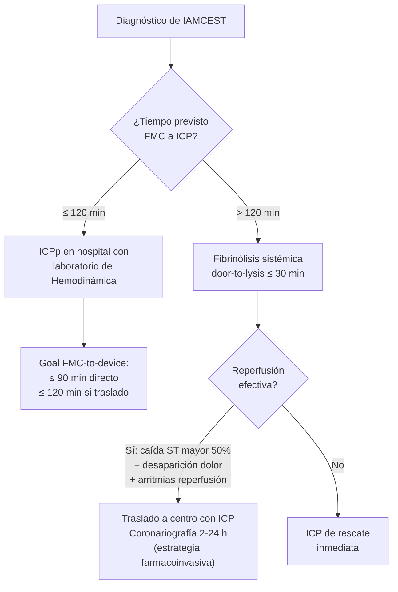
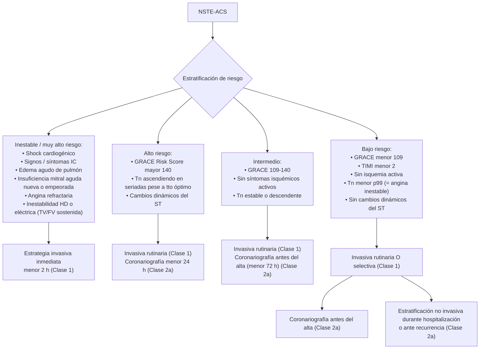
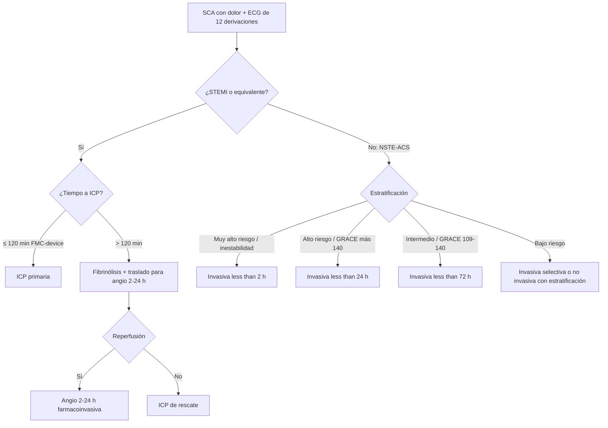

# Síndrome Coronario Agudo — Reperfusión y Revascularización

> [!danger] Regla de oro: tiempo es miocardio
> En IAMCEST, **cada 10 minutos de retraso desde el primer contacto médico hasta la apertura del vaso** se asocian con un aumento de mortalidad. La selección y el timing de la estrategia de reperfusión es la decisión más impactante en pronóstico.

---

## Estrategia de reperfusión en IAMCEST

> *FMC = first medical contact; ICPp = ICP primaria.*

### Recomendaciones clave para PPCI (ACC/AHA 2025 §5.2.1)

| Escenario | Recomendación | COR/LOE |
|---|---|---|
| STEMI con < 12 h de inicio síntomas | **PPCI** con **FMC-to-device ≤ 90 min** (directos) o **≤ 120 min** (traslados) | **COR 1, A** |
| ACS + shock cardiogénico o inestabilidad hemodinámica | **Revascularización urgente** (ICP o CABG) **independientemente del tiempo desde inicio síntomas** | **COR 1, B-R** |
| STEMI con 12-24 h de inicio síntomas | **PPCI razonable** | **COR 2a, B-NR** |
| STEMI > 24 h con isquemia activa, IC severa, arritmia maligna | PPCI razonable | **COR 2a, C-LD** |
| STEMI estable con arteria totalmente ocluida > 24 h **sin isquemia activa, IC ni arritmia** | **PPCI NO recomendada** | **COR 3 No Benefit, B-R** |

Manual 12 cap. 17 §4.3.2 — concuerda: STEMI > 48 h asintomático → tratamiento similar al SCC, **no se indica ICP primaria**.

### CABG urgente

> ACC/AHA 2025 §5.2.2 — **COR 2a, B-NR**: STEMI en el que la ICP no es factible/exitosa, con **gran área de miocardio en riesgo** → **CABG de emergencia o urgente puede ser efectiva**.

Indicaciones específicas en SCACEST en curso (Manual 12 §4.3.2):
- Arteria responsable abierta en el momento de la coronariografía y abordaje percutáneo no favorable.
- **Complicaciones mecánicas que requieran cirugía urgente** (ver [[SCA - Complicaciones y Shock Cardiogénico]]).

---

## Reperfusión en hospital sin ICP

> ACC/AHA 2025 §5.3:

| Escenario | Estrategia | COR/LOE |
|---|---|---|
| STEMI + tiempo estimado FMC-a-ICP ≤ 120 min, **o contraindicación a fibrinólisis** | **Traslado** a centro con ICP | **COR 1, A** |
| STEMI con < 12 h + retraso anticipado a ICP > 120 min desde FMC | **Fibrinólisis sin contraindicaciones** | **COR 1, A** |
| STEMI con 12-24 h | Traslado a centro con ICP razonable | **COR 2a, B-NR** |
| **Descenso del ST aislado** (excepto sospecha de IAM posterior verdadero) | **Fibrinólisis NO administrada** (riesgo de ictus hemorrágico y sangrado mayor) | **COR 3 Harm, B-R** |

### Tabla 13 ACC/AHA 2025 — Fibrinolíticos fibrina-específicos para STEMI

| Fármaco | Dosis |
|---|---|
| **Tenecteplasa (TNK-tPA)** | Bolo IV único ajustado por peso: - < 60 kg: **30 mg** - 60-69 kg: **35 mg** - 70-79 kg: **40 mg** - 80-89 kg: **45 mg** - ≥ 90 kg: **50 mg** **Reducir dosis a la mitad en ≥ 75 años** |
| **Reteplasa (rPA)** | **2 bolos IV de 10 UI** separados 30 min, cada uno administrado en 2 min |
| **Alteplasa (tPA)** | Infusión ponderada de 90 min **Adultos ≥ 67 kg:** 100 mg total — 15 mg IV bolo, 50 mg en 30 min, 35 mg en los siguientes 60 min **Adultos < 67 kg:** 15 mg IV bolo + 0,75 mg/kg en 30 min (máx 50 mg) + 0,5 mg/kg IV en 60 min (máx 35 mg) |

> Estreptocinasa ya **no está disponible** en EE. UU. y queda relegada en España; los fibrina-específicos (TNK-tPA preferentemente por su comodidad de bolo único) son los recomendados por mayor permeabilidad y menor inmunogenicidad.

### Tabla 14 ACC/AHA 2025 — Contraindicaciones para fibrinólisis en STEMI

> [!danger] Contraindicaciones ABSOLUTAS
> - **Cualquier hemorragia intracraneal previa**
> - **Lesión vascular cerebral estructural** conocida (ej. malformación arteriovenosa)
> - **Neoplasia intracraneal maligna** (primaria o metastásica)
> - **Ictus isquémico en los 3 meses previos** (excepto ictus isquémico agudo < 4,5 h de evolución)
> - **Sospecha de disección aórtica**
> - **Sangrado activo o diátesis hemorrágica** (excluida menstruación)
> - **Traumatismo cráneo-encefálico o facial cerrado significativo en los últimos 3 meses**
> - **Cirugía intracraneal o intraespinal en los últimos 2 meses**
> - **HTA severa no controlada** (TAS > 180 mmHg o TAD > 110 mmHg) que no responde a tratamiento

> [!warning] Contraindicaciones RELATIVAS
> - HTA crónica severa mal controlada
> - HTA en presentación: TAS > 180 mmHg o TAD > 110 mmHg
> - Ictus isquémico previo > 3 meses
> - Demencia
> - Patología intracraneal no contemplada en absolutas
> - **RCP traumática o prolongada > 10 min**
> - Cirugía mayor en las últimas 3 semanas
> - Sangrado interno reciente (2-4 semanas previas)
> - **Punciones vasculares no compresibles**
> - **Embarazo**
> - **Úlcera péptica activa**
> - **Tratamiento con anticoagulante oral**

### Coronariografía y ICP tras fibrinólisis (estrategia farmacoinvasiva)

> ACC/AHA 2025 §5.3.2:
> - **COR 1, A:** STEMI tras fibrinólisis → **traslado a centro con ICP inmediato**.
> - **COR 1, B-R:** STEMI con sospecha de **fallo de reperfusión** tras fibrinólisis → **angiografía inmediata + ICP de rescate**.
> - **COR 1, B-R:** STEMI tratado con fibrinólisis → angiografía coronaria de rutina **2-24 h** después con intención de ICP, para reducir muerte o reinfarto (estrategia farmacoinvasiva).

#### Signos de fallo de reperfusión

> No mejoría de los síntomas isquémicos, **persistencia de elevación del ST (< 50% de resolución en derivaciones anteriores o < 70% en derivaciones inferiores)**, o **inestabilidad hemodinámica/eléctrica**.

#### Signos de reperfusión exitosa

- **Caída del ST > 50%** en la derivación con mayor desviación basal.
- **Desaparición o mejoría significativa del dolor torácico**.
- **Arritmias de reperfusión** (ej. RIVA — ritmo idioventricular acelerado).

---

## Manejo de enfermedad multivaso en STEMI

> [!info] Top Take-Home Message #6 (ACC/AHA 2025)
> - **Estrategia de revascularización completa** está recomendada en STEMI (o NSTE-ACS) con enfermedad multivaso.
> - La ICP de las **estenosis no culpables** en STEMI puede realizarse en un **único procedimiento** o **escalonada**, con **preferencia por el procedimiento único**.
> - **CRÍTICO: en pacientes con ACS y SHOCK CARDIOGÉNICO, revascularización urgente solo del vaso culpable; la ICP rutinaria de arterias no infarto-relacionadas en el momento de la ICP índice NO está recomendada** (ensayo CULPRIT-SHOCK).

---

## Estrategia invasiva en NSTE-ACS

> ACC/AHA 2025 §6 — Figura 8 (recomendaciones por riesgo):

### Tabla 15 ACC/AHA 2025 — Contraindicaciones relativas para estrategia invasiva rutinaria

> [!warning]
> - Alto riesgo de sangrado en DAPT
> - **Trombocitopenia severa (< 50 × 10⁹/L)**
> - Enfermedad renal avanzada (no en diálisis)
> - Fallo renal agudo
> - **Esperanza de vida limitada (< 1-2 años)**
> - **Demencia avanzada**
> - Anatomía coronaria conocida que impide ICP y/o CABG
> - **Preferencia del paciente**

### Recomendaciones por riesgo (ACC/AHA 2025 §6.1)

| Recomendación | COR/LOE |
|---|---|
| NSTE-ACS de **riesgo intermedio o alto** + candidato a revascularización → **estrategia invasiva durante la hospitalización** para reducir MACE | **COR 1, A** |
| NSTE-ACS de **bajo riesgo** → invasiva rutinaria O **selectiva** | **COR 1, A** |
| NSTE-ACS con **angina refractaria, inestabilidad HD o eléctrica** → **invasiva inmediata** | **COR 1, C-LD** |
| NSTE-ACS de alto riesgo → **invasiva precoz < 24 h** razonable | **COR 2a, B-R** |
| NSTE-ACS no de alto riesgo + invasiva planificada → angiografía antes del alta | **COR 2a, B-R** |

> Manual 12 cap. 17 §4.3.1 concuerda: muy alto riesgo coronariografía < 2 h, alto riesgo < 24 h, bajo riesgo manejo similar al SCC.

---

## Acceso vascular para ICP

> ACC/AHA 2025 §7.1 — **COR 1, LOE A**: en pacientes con SCA sometidos a ICP, **el acceso radial es preferible al femoral** para reducir sangrado, complicaciones vasculares y mortalidad.

- Estudios de soporte: ensayos aleatorizados grandes (RIVAL, RIFLE-STEACS, MATRIX, SAFARI-STEMI).
- **Excepción:** acceso femoral preferible si se planifica **soporte mecánico circulatorio** (BCIA, Impella, ECMO V-A) o si la radial no es factible (calibre, anomalías, paciente con cirugía vascular previa).

---

## Stents y oclusiones complejas

- **Stents farmacoactivos (DES)** preferibles a stents convencionales en SCC y SCA (Manual 12 cap. 17 §3.6.3).
- En lesiones complejas: **imagen intracoronaria** (IVUS u OCT) recomendada para guiar la ICP — **Top Take-Home Message #5 ACC/AHA 2025**.
- En enfermedad multivaso: el orden sigue el escenario clínico (vaso culpable primero, no culpables en mismo procedimiento o staged).

---

## Resumen del flujo de decisión

---

## Notas hermanas

- [[SCA - Evaluación Inicial y Clasificación]] — diagnóstico ECG, troponinas, GRACE.
- [[SCA - Tratamiento Médico]] — DAPT, anticoagulación periprocedimiento.
- [[SCA - Complicaciones y Shock Cardiogénico]] — shock cardiogénico, complicaciones mecánicas (CABG urgente).
- [[SCA - Manejo Hospitalario y Prevención Secundaria]] — manejo post-revascularización.
- [[MOC - CARDIOLOGIA]] · [[MOC - Urgencias]]
