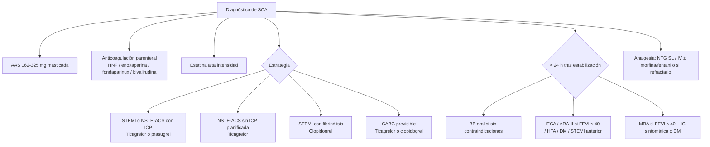

# Síndrome Coronario Agudo — Tratamiento Médico

Este es el bloque farmacológico inicial que se aplica **en paralelo** a la decisión de reperfusión / revascularización (ver [[SCA - Reperfusión y Revascularización]]). Para evaluación inicial, ECG y triage ver [[SCA - Evaluación Inicial y Clasificación]].

---

## Oxigenoterapia

> ACC/AHA 2025 §4.1
> - **COR 1, LOE C-LD:** ACS + hipoxia confirmada (**SpO₂ < 90%**) → O₂ suplementario para alcanzar SpO₂ ≥ 90%.
> - **COR 3 No Benefit, LOE A:** SCA + SpO₂ ≥ 90% → **O₂ rutinario NO recomendado** (no mejora outcomes y puede aumentar daño miocárdico por vasoconstricción / estrés oxidativo).

---

## Analgesia y nitratos

> [!info] Tabla 6 ACC/AHA 2025 — Opciones analgésicas en dolor torácico isquémico
>
> | Fármaco | Vía | Dosis | Consideraciones |
> |---|---|---|---|
> | **Nitroglicerina** | SL (comp/spray) | **0,3-0,4 mg cada 5 min** según necesidad, hasta **3 dosis** | Pacientes hemodinámicamente estables con **TAS ≥ 90 mmHg** |
> | **Nitroglicerina** | IV | Inicio **10 µg/min**, titular según dolor y tolerancia HD | Persistencia del dolor pese a NTG SL, HTA o edema pulmonar acompañante. **Evitar en infarto de VD, TAS < 90 mmHg o caída ≥ 30 mmHg**. Taquifilaxia ~ 24 h |
> | **Morfina** | IV | **2-4 mg**, repetir cada 5-15 min. Hasta 10 mg | Para dolor resistente al resto de antiisquémicos. **Puede retrasar el efecto de los P2Y12 orales**: monitorizar |
> | **Fentanilo** | IV | **25-50 µg**, repetir cada 5-15 min. Hasta 100 µg | Mismas consideraciones que morfina |

> [!warning] Nitratos tras inhibidores de PDE5
> No administrar nitratos en las siguientes ventanas:
> - **Avanafilo: 12 h.**
> - **Sildenafilo / vardenafilo: 24 h.**
> - **Tadalafilo: 48 h.**

> [!info] Importante (ACC/AHA 2025 §4.2)
> Los **AINE** (excepto el AAS) deben **evitarse** para el manejo del dolor isquémico durante el SCA, dado el aumento de MACE asociado.

---

## Antiagregación

### AAS

> ACC/AHA 2025 §4.3.1 — **COR 1, LOE A**: en pacientes con SCA sin contraindicación absoluta, dosis de carga oral de **AAS 162-325 mg** lo antes posible (independientemente de la estrategia final), seguida de mantenimiento de 75-100 mg/día.

| Fase | Dosis |
|---|---|
| **Carga** | **162-325 mg** v.o., **masticada cuando sea posible (NO con cubierta entérica)** para acelerar el inicio del efecto antiagregante |
| **Mantenimiento** | **75-100 mg/día** v.o. de forma indefinida |

> Continuar AAS a dosis altas (300-325 mg/día) más allá de los primeros días **NO es superior** al mantenimiento de bajas dosis y aumenta sangrado menor y digestivo. La dosis de mantenimiento ≤ 100 mg/día se debe usar siempre en combinación con ticagrelor (interacción farmacodinámica documentada en PLATO).
>
> En pacientes con antecedente de hipersensibilidad al AAS está indicada la **desensibilización**.

### Inhibidores P2Y12 — comparativa y elección

> [!info] Tabla 7 ACC/AHA 2025 — Dosificación de antiagregantes orales en SCA
>
> | Fármaco | Escenario | Carga | Mantenimiento |
> |---|---|---|---|
> | **AAS** | NSTE-ACS o STEMI | **162-325 mg** v.o. masticada | 75-100 mg/día |
> | **Clopidogrel** | NSTE-ACS o STEMI sin fibrinolítico | **300 o 600 mg** v.o. | 75 mg/día |
> | | STEMI con fibrinolítico | **300 mg si edad ≤ 75 a**; **75 mg sin carga si > 75 a** | 75 mg/día |
> | **Prasugrel** | NSTE-ACS o STEMI sin fibrinolítico **+ planeada ICP** | **60 mg** v.o. | 10 mg/día (≥ 60 kg y < 75 a)<br>**5 mg/día si < 60 kg o ≥ 75 a (con cautela)** |
> | **Ticagrelor** | NSTE-ACS o STEMI sin fibrinolítico | **180 mg** v.o. (bucodispersable) | 90 mg/12h |

#### Recomendaciones clave de elección

> ACC/AHA 2025 §4.3.2:
> - **COR 1, LOE A:** SCA → **AAS + P2Y12 oral** (todos los pacientes).
> - **COR 3 Harm, LOE B-R:** **antecedente de ictus o AIT → prasugrel está CONTRAINDICADO** (peor resultado clínico neto).
> - **COR 1, LOE B-R:** NSTE-ACS sometido a ICP → **prasugrel o ticagrelor** preferibles a clopidogrel.
> - **COR 1, LOE B-R:** NSTE-ACS sin estrategia invasiva planificada → **ticagrelor**.
> - **COR 1, LOE B-R:** clopidogrel cuando prasugrel/ticagrelor no estén disponibles, no se toleren o estén contraindicados.
> - **COR 2b, LOE B-NR:** NSTE-ACS con angiografía anticipada **> 24 h** → **pretratamiento upstream** con clopidogrel o ticagrelor **puede considerarse** para reducir MACE.
> - **COR 1, LOE B-R:** STEMI con PPCI → prasugrel o ticagrelor.
> - **COR 1, LOE C-LD:** STEMI con PPCI → clopidogrel si prasugrel/ticagrelor no disponibles, contraindicados o no tolerados.
> - **COR 1, LOE A:** STEMI con fibrinolítico → **clopidogrel concurrente**.

> [!info] Figura 4 ACC/AHA 2025 — Elección inicial de P2Y12 oral
> | Estrategia | P2Y12 de elección (Clase 1) |
> |---|---|
> | **ICP (NSTE-ACS o STEMI)** | **Ticagrelor o prasugrel** + AAS. Clopidogrel si no disponibles/intolerados |
> | **CABG** | **Ticagrelor o clopidogrel** + AAS. Continuar AAS durante CABG; iniciar P2Y12 cuando sea seguro tras la cirugía |
> | **Sin evaluación invasiva planificada** | **Ticagrelor** + AAS. Clopidogrel si no disponible |
> | **Fibrinolítico en STEMI** | **Clopidogrel** + AAS. P2Y12 alternativo puede considerarse en ICP posterior si procede |

#### Tabla 8 ACC/AHA 2025 — Manejo de P2Y12 antes de CABG

| Fármaco | CABG electiva | CABG urgente |
|---|---|---|
| **Clopidogrel** | Suspender **5 días antes** | Suspender **≥ 24 h** (idealmente). Proceder antes de 5 d puede ser razonable |
| **Prasugrel** | Suspender **7 días antes** | Suspender **≥ 24 h**. Proceder antes de 7 d puede ser razonable |
| **Ticagrelor** | Suspender **3-5 días antes** | Suspender **≥ 24 h**. Proceder antes de 5 d puede ser razonable |

Reanudar P2Y12 tras la cirugía cuando el riesgo de sangrado no sea excesivo (24-72 h).

### P2Y12 IV — cangrelor

> ACC/AHA 2025 §4.3.3 — **COR 2b, LOE B-R**: en pacientes con SCA sometidos a ICP que **no han recibido P2Y12 oral previo**, **cangrelor IV puede ser razonable** para reducir eventos isquémicos periprocedimiento.

- **Dosis:** bolo **30 µg/kg IV** + perfusión **4 µg/kg/min** durante la ICP (mínimo 2 h o duración del procedimiento).
- Recuperación de la función plaquetaria en **< 1 h** tras suspender.
- Útil cuando la absorción oral está comprometida (intubación, vómitos, shock) o cuando se anticipa CABG urgente y no se quiere comprometer al paciente con un P2Y12 oral de larga duración.

> [!info] Tabla 9 ACC/AHA 2025 — Transición de cangrelor IV a P2Y12 oral
> | P2Y12 oral | Carga | Timing |
> |---|---|---|
> | **Clopidogrel** | 600 mg | Inmediatamente al suspender cangrelor |
> | **Prasugrel** | 60 mg | Inmediatamente al suspender cangrelor |
> | **Ticagrelor** | 180 mg | En cualquier momento durante o inmediatamente al suspender cangrelor |

### Inhibidores GP IIb/IIIa (tirofibán, eptifibatida, abciximab)

> ACC/AHA 2025 §4.3.4:
> - **COR 2a, LOE C-LD:** ACS sometido a ICP con **gran carga trombótica, no-reflow, slow-flow o émbolo distal** → **GP IIb/IIIa IV o intracoronario es razonable** como rescate para mejorar el resultado del procedimiento y reducir el tamaño del infarto.
> - **COR 3 Harm, LOE B-R:** **uso rutinario NO recomendado** por aumento de sangrado sin beneficio isquémico claro en la era de P2Y12 potentes y stents farmacoactivos contemporáneos.

Limitar a indicaciones de **rescate** o **bailout**.

---

## Anticoagulación parenteral

> ACC/AHA 2025 §4.4 — la anticoagulación parenteral está recomendada en **todos** los pacientes con SCA, independientemente de la estrategia inicial, hasta la revascularización (o hasta 8 días en STEMI fibrinolizado no ICP).

### Recomendaciones por escenario

| Escenario | Recomendación (COR/LOE) | Anticoagulante de elección |
|---|---|---|
| NSTE-ACS upstream | **COR 1, B-R** | **HNF IV** |
| NSTE-ACS sin estrategia invasiva precoz | **COR 1, B-R** | **Enoxaparina o fondaparinux** son alternativas |
| ACS sometido a ICP | **COR 1, C-EO** | **HNF IV** |
| STEMI con PPCI | **COR 1, B-R** | **Bivalirudina** alternativa a HNF (reduce mortalidad y sangrado) |
| NSTE-ACS sometido a ICP | **COR 2b, B-R** | Bivalirudina razonable como alternativa a HNF (menor sangrado) |
| ACS sometido a ICP | **COR 2b, B-R** | Enoxaparina IV puede considerarse alternativa a HNF |
| STEMI con fibrinolítico, no estrategia invasiva | **COR 1, A** | **Enoxaparina** preferida sobre HNF |
| STEMI con fibrinolítico, no estrategia invasiva | **COR 1, B-R** | Fondaparinux es alternativa |
| **Cualquier ICP** | **COR 3 Harm, B-R** | **Fondaparinux NO debe usarse para soporte de ICP** (riesgo de trombosis en catéter — añadir HNF si se usa fonda upstream) |

### Tabla 10 ACC/AHA 2025 — Dosificación de anticoagulantes parenterales en SCA

| Fármaco | Dosificación |
|---|---|
| **HNF (UFH)** | **Inicio:** carga **60 UI/kg** (máx 4000 UI) + perfusión **12 UI/kg/h** (máx 1000 UI/h) ajustada a aPTT 60-80 s.<br>**Soporte ICP (sin anticoag previa):** bolo **70-100 UI/kg** IV para alcanzar ACT 250-300 s.<br>**Con fibrinólisis:** carga 60 UI/kg (máx 4000) + 12 UI/kg/h (máx 1000) targeting aPTT **50-70 s** |
| **Bivalirudina** | **Soporte ICP:** bolo **0,75 mg/kg** + perfusión **1,75 mg/kg/h** durante la ICP.<br>**Post-PPCI:** infusión **1,75 mg/kg/h durante 2-4 h post-ICP**.<br>**CrCl < 30 mL/min:** reducir infusión a **1 mg/kg/h** |
| **Enoxaparina** | **Inicio:** **1 mg/kg SC c/12h**. CrCl < 30 → **1 mg/kg SC c/24h**.<br>**Soporte ICP:** si última dosis SC 8-12 h previas o solo 1 dosis SC: **0,3 mg/kg IV adicional**. Si última > 8 h: no requiere refuerzo. Sin anticoag previa: **0,5-0,75 mg/kg IV** bolo.<br>**Con fibrinólisis < 75 a:** **30 mg IV bolo** + 1 mg/kg SC c/12h (máx 100 mg primeras 2 dosis).<br>**Con fibrinólisis ≥ 75 a:** sin bolo, **0,75 mg/kg SC c/12h** (máx 75 mg primeras 2 dosis). CrCl < 30 → 1 mg/kg SC c/24h |
| **Fondaparinux** | **Inicio:** **2,5 mg SC c/24h**. **Contraindicado si CrCl < 30 mL/min**.<br>**Con fibrinólisis:** 2,5 mg IV → 2,5 mg SC c/24h al día siguiente.<br>**No usar como anticoagulante único en ICP** |

### Heparina-induced thrombocytopenia (HIT)

Tanto HNF como HBPM pueden causar HIT. En este contexto, **bivalirudina o argatrobán** son inhibidores directos de trombina aceptables.

---

## Tratamiento hipolipemiante

> ACC/AHA 2025 §4.5

| Recomendación | COR/LOE |
|---|---|
| Estatina de **alta intensidad** en todos los pacientes con SCA | **COR 1, A** |
| Si ya en estatina máx tolerada con **LDL ≥ 70 mg/dL** → añadir terapia no-estatínica | **COR 1, A** |
| Si intolerancia a estatinas → terapia no-estatínica | **COR 1, B-R** |
| Si ya en estatina máx con **LDL 55-69 mg/dL** → añadir no-estatínica es razonable | **COR 2a, B-R** |
| Iniciar concurrentemente **ezetimibe + estatina** máxima tolerada puede considerarse | **COR 2b, B-R** |

> [!info] Figura 5 ACC/AHA 2025 — Manejo hipolipemiante post-SCA
>
> ```mermaid
> flowchart TD
>     A[Ingreso por SCA: perfil lipídico basal] --> B{Estado actual}
>     B --> C["Sin estatina o<br/>baja-moderada intensidad"]
>     B --> D["Ya en estatina<br/>máxima tolerada"]
>     B --> E["Intolerancia o<br/>rechazo a estatinas"]
>     C --> C1["Iniciar estatina alta intensidad (Clase 1)<br/>+ Considerar ezetimibe concomitante (Clase 2b)"]
>     D --> D1{LDL alcanzado}
>     D1 --> D2["LDL menor 55 mg/dL<br/>Continuar (Clase 1)"]
>     D1 --> D3["LDL 55-69 mg/dL<br/>Añadir no-estatínica razonable (Clase 2a)"]
>     D1 --> D4["LDL ≥ 70 mg/dL<br/>Añadir no-estatínica (Clase 1)"]
>     E --> E1["Añadir no-estatínica (Clase 1)"]
>     C1 --> F["Reevaluar perfil lipídico 4-8 semanas tras alta y ajustar"]
>     D2 --> F
>     D3 --> F
>     D4 --> F
>     E1 --> F
> ```

### Tabla 12 ACC/AHA 2025 — Clasificación de estatinas

| Intensidad | Reducción LDL esperada | Fármaco/dosis |
|---|---|---|
| **Alta** | **≥ 50%** | Atorvastatina 40-80 mg, Rosuvastatina 20-40 mg |
| Moderada | 30-49% | Atorvastatina 10-20, Rosuvastatina 5-10, Simvastatina 20-40, Pravastatina 40-80, Lovastatina 40, Fluvastatina XL 80 / 40 mg/12h, Pitavastatina 1-4 |
| Baja | < 30% | Simvastatina 10, Pravastatina 10-20, Lovastatina 20, Fluvastatina 20-40 |

### Tabla 11 ACC/AHA 2025 — Opciones no-estatínicas

| Fármaco | Mecanismo | Reducción LDL | Notas |
|---|---|---|---|
| **Ezetimibe** | Bloquea NPC1L1 (absorción intestinal) | 15-25% | Outcomes en ACS post < 10 d (IMPROVE-IT) |
| **Evolocumab** | Anticuerpo monoclonal anti-PCSK9 | ~ 60% | Outcomes ASCVD establecida (FOURIER) |
| **Alirocumab** | Anticuerpo monoclonal anti-PCSK9 | ~ 60% | Outcomes 1-12 m post-ACS (ODYSSEY OUTCOMES) |
| **Inclisiran** | siRNA anti-PCSK9 (cada 6 m tras dosis inicial) | ~ 50% | Outcomes en estudio |
| **Ácido bempedoico** | Inhibidor ATP-citrato liasa | ~ 20% | Útil en pacientes intolerantes a estatinas |

---

## Betabloqueantes

> ACC/AHA 2025 §4.6 — **COR 1, LOE A**: SCA sin contraindicaciones → inicio **precoz (< 24 h) de BB oral** para reducir reinfarto y arritmias ventriculares.

### Contraindicaciones para iniciar BB en fase aguda

> [!warning] No iniciar BB en SCA si:
> - **IC aguda** (Killip II-IV).
> - Datos de **bajo gasto** o riesgo aumentado de **shock cardiogénico**.
> - **PR > 0,24 ms** o BAV de 2.º o 3.er grado **sin marcapasos**.
> - **Bradicardia severa** o hipotensión sintomática.
> - **Broncoespasmo activo**.

Tras estabilización (24 h), reevaluar e iniciar BB si la contraindicación se ha resuelto.

**No usar BB IV de rutina antes de la reperfusión** (resultado heterogéneo en el tamaño del infarto y outcomes; mayor riesgo de shock en las primeras 24 h en ensayos clásicos como COMMIT).

---

## IECA / ARA-II / MRA

> ACC/AHA 2025 §4.7

| Recomendación | COR/LOE |
|---|---|
| SCA de alto riesgo (**FEVI ≤ 40%, HTA, DM, o STEMI anterior**) → **IECA o ARA-II** para reducir mortalidad y MACE | **COR 1, A** |
| SCA + **FEVI ≤ 40% + síntomas de IC o DM** → **antagonista del receptor de mineralocorticoides (espironolactona o eplerenona)** para reducir mortalidad y MACE | **COR 1, B-R** |
| SCA no de alto riesgo → IECA o ARA-II razonable | **COR 2a, A** |

> [!info] ARNI (sacubitril-valsartán)
> Los ensayos pivotales de ARNI excluyeron pacientes en los **3 meses posteriores al SCA**; sin embargo, si está indicado por IC con FEVI reducida, su inicio precoz tras IAM parece seguro (ensayo PARADISE-MI). Si se planifica ARNI por IC con FEVI reducida, iniciar el ARNI directamente tras el IAM es razonable.

> Evitar la combinación IECA + ARA-II por aumento de eventos adversos sin beneficio adicional.
> En pacientes con IECA y aldosterona/MRA, monitorizar **creatinina y K⁺** (excluir si Cr > 2,5 mg/dL o K⁺ > 5 mmol/L al inicio).

---

## Resumen de decisión farmacológica al ingreso por SCA



---

## Notas hermanas

- [[SCA - Evaluación Inicial y Clasificación]] — ECG, troponinas, GRACE, estratificación.
- [[SCA - Reperfusión y Revascularización]] — cuándo y cómo revascularizar.
- [[SCA - Complicaciones y Shock Cardiogénico]] — manejo de complicaciones.
- [[SCA - Manejo Hospitalario y Prevención Secundaria]] — DAPT al alta, GDMT crónica.
- [[Ticagrelor]] · [[Clopidogrel]] · [[Prasugrel]] · [[AAS]] · [[Enoxaparina]] · [[Fondaparinux]] · [[Bivalirudina]] · [[Atorvastatina]] · [[Rosuvastatina]]
- [[MOC - CARDIOLOGIA]] · [[MOC - Urgencias]]
