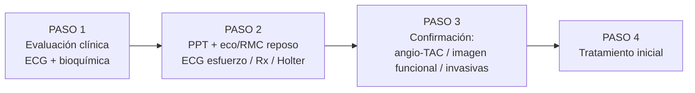

# Síndrome Coronario Crónico — Diagnóstico (estrategia paso a paso)

La guía **ESC 2024** organiza el abordaje del paciente con sospecha de SCC en **4 pasos**. La definición clínica de la angina y la diferenciación entre angina estable e inestable se desarrollan en [[Cardiopatía Isquémica - Concepto y Clasificación]].

---

## PASO 1 · Evaluación clínica general

### Historia clínica y factores de riesgo

Reconocer la **clínica anginosa** (entrada al algoritmo; orienta a SCC estable frente a [[SCA - Evaluación Inicial y Clasificación|SCA]] inestable) y valorar **equivalentes anginosos**: la guía recomienda considerar como tales el dolor torácico por estrés emocional, la **disnea**, el mareo de esfuerzo, el dolor en brazos / mandíbula / cuello / parte alta de la espalda y la fatiga (clase **IIa**).

> [!info] Comorbilidad y factores de riesgo a recoger en la anamnesis
>
> | Factores de riesgo | Comorbilidad | Situación funcional basal |
> |---|---|---|
> | Edad, tabaquismo, HTA, dislipemia, diabetes | Otra ECV: ictus, arteriopatía periférica, ERC | Dependencia para actividades básicas (Barthel) |
> | Obesidad, sedentarismo, dieta aterogénica | Cardiopatía previa, arritmias, insuficiencia cardiaca | Deterioro cognitivo |
> | Antecedentes familiares de ECV precoz | Hiperuricemia, estrés emocional | Enfermedad grave con pronóstico fatal a corto plazo |
> | Drogas simpaticomiméticas | | |

### ECG de 12 derivaciones en reposo

Aporta información sobre **infartos antiguos** (ondas Q), alteraciones de la repolarización y de la conducción (**BRIHH**, bloqueos AV).

> [!warning] Banderas
> - Si la clínica o el ECG sugieren **SCA** → derivación inmediata a urgencias + **troponina de alta sensibilidad** (clase I).
> - **No** usar el descenso del ST durante **taquiarritmias supraventriculares** como evidencia de EAC obstructiva (clase **III**).

### Análisis bioquímico

- **Perfil lipídico** con cLDL (clase **I A**) — basta una determinación.
- **Hemograma** (la anemia agrava/causa isquemia), **creatinina + filtrado glomerular**, **glucemia/HbA1c**, **función tiroidea** si se sospecha disfunción.
- **PCR de alta sensibilidad y fibrinógeno**: considerar para afinar la estratificación (clase **IIa**).
- **Troponinas de alta sensibilidad**: en SCC tienen **valor pronóstico, no diagnóstico** → solicitar **solo si se sospecha SCA**.
- **NT-proBNP**: ayuda a confirmar/descartar insuficiencia cardiaca.

---

## PASO 2 · Pruebas adicionales

### Probabilidad clínica pretest (PPT)

Estimar la **PPT de EAC obstructiva** con el modelo **RF-CL + score de calcio (CACS-CL)**. La PPT decide qué prueba sigue (o si no hacer ninguna). **Modelo completo, tablas y umbrales → [[SCC - Probabilidad Pretest (PPT)]].**

> Recordatorio rápido: **≤ 5 %** muy baja (no más pruebas) · **> 5–15 %** baja · **> 15–50 %** moderada · **> 50–85 %** alta · **> 85 %** muy alta.

### Ecocardiografía transtorácica (y RMC) en reposo

Recomendada para estratificar y guiar el tratamiento (clase **I**):

- **FEVI** — el predictor pronóstico más potente; FEVI < 50 % ya implica riesgo alto.
- **Alteraciones de la contractilidad regional** sugerentes de IM previo / isquemia.
- **Excluir otras causas** de dolor torácico (valvulopatías, miocardiopatías, pericarditis, HVI).
- **RMC** si la ecocardiografía no es concluyente (realce tardío de gadolinio → patrón isquémico/viabilidad).

### ECG de esfuerzo (ergometría)

Rendimiento diagnóstico **bajo** (sensibilidad ≈ 58 %, especificidad ≈ 62 %): hoy su papel es sobre todo **estratificación pronóstica**, evaluar **síntomas, tolerancia al ejercicio, arritmias y respuesta tensional**, y calcular la **puntuación de Duke (Duke Treadmill Score)**. Un ECG de esfuerzo **negativo** puede reclasificar una PPT baja a muy baja. **No interpretable** con BRIHH, ritmo de marcapasos, WPW, descenso del ST basal ≥ 0,1 mV o tratamiento digitálico.

### Radiografía de tórax

En sospecha de **insuficiencia cardiaca**, enfermedad pulmonar o dolor torácico atípico.

### Monitorización electrocardiográfica ambulatoria (Holter)

Considerar (clase **IIa**) en sospecha de **angina vasoespástica** (desviaciones del ST sin aumento de la frecuencia cardiaca).

---

## PASO 3 · Confirmación del diagnóstico

La elección de la prueba depende de la **PPT** (ver tabla en [[SCC - Probabilidad Pretest (PPT)]]) y de la disponibilidad/experiencia del centro.

### Imagen anatómica — Angio-TAC coronaria

Es la prueba **de primera línea para PPT baja-moderada (> 5–50 %)** (clase **I A**): visualiza directamente luz y pared coronaria con rendimiento similar a la coronariografía para detectar estenosis obstructivas, y estima el riesgo de MACE.

- Estenosis **moderadas (50–69 %)** no siempre son funcionalmente significativas → complementar con datos funcionales o **RFF-TC** (reserva fraccional de flujo derivada de la TC) cuando la repercusión hemodinámica condicione el tratamiento.
- Permite medir el **score de calcio (CACS)** y caracterizar la placa (la carga y las características adversas de placa tienen valor pronóstico).
- **No recomendada** (clase **III**) si: FG < 30 ml/min/1,73 m², IC descompensada, **calcificación coronaria extensa**, FC rápida/irregular, obesidad severa o incapacidad para la apnea.

### Imagen funcional (detección de isquemia)

Indicada en **PPT moderada-alta (> 15–85 %)** (clase **I**). El estrés puede ser **físico (ejercicio)** o **farmacológico (dobutamina, adenosina, dipiridamol, regadenosón)**.

> [!warning] Contraindicaciones del agente estresante (ficha técnica / Manual 12)
> Sospecha de SCA, asma/broncoespasmo, BAV de alto grado, estenosis aórtica grave o TAS < 90 mmHg. *(La ESC 2024 solo refiere genéricamente "contraindicación al agente estresante".)*

| Técnica | Qué detecta / clave |
|---|---|
| **Ecocardiografía de estrés** | Anomalías de contractilidad regional; mejora con contraste (microburbujas); permite valorar la reserva de velocidad de flujo coronario de la DA |
| **SPECT / PET de perfusión** | Defectos de perfusión; la **PET** cuantifica el flujo miocárdico y la reserva de flujo coronario (útil en disfunción microvascular) |
| **RMC de estrés** | Perfusión + contractilidad; gadolinio en reposo → viabilidad y patrón isquémico |

### Pruebas invasivas — Coronariografía

- **Vía radial** de elección (más segura; clase **I A**).
- **Evaluación funcional de estenosis intermedias** para guiar la revascularización: **RFF ≤ 0,80**, **iwFR ≤ 0,89**, **QFR ≤ 0,80** (clase **I**). **No** se recomienda medir la presión de forma sistemática en **todos** los vasos (clase **III A**).
- **Indicación directa** (1.ª prueba): síntomas de nueva aparición que aparecen con **bajo nivel de esfuerzo**, con vistas a revascularización (clase **I C**).

### Disfunción microvascular y vasoespasmo

Si hay isquemia/angina con **arterias coronarias sin obstrucción**, completar con **pruebas invasivas de función coronaria** (acetilcolina, reserva de flujo coronario, resistencia microvascular) → ver [[SCC - ANOCA e INOCA]].

---

## Estratificación del riesgo de eventos adversos

Tras confirmar EAC obstructiva o isquemia, estratificar el riesgo para identificar a quien se beneficiaría de **revascularización más allá del alivio sintomático**. Riesgo **alto** = mortalidad cardiaca **> 3 %/año**.

> [!info] Estratificación inicial (clase I B): edad, ECG, **umbral de angina**, diabetes, ERC, **FEVI**.

> [!danger] Criterios de **alto riesgo de eventos adversos**
> | Prueba | Criterio de alto riesgo |
> |---|---|
> | **ECG de esfuerzo** | Puntuación de **Duke < −10** |
> | **SPECT / PET** | Isquemia **≥ 10 %** del miocardio del VI |
> | **Eco de estrés** | Hipo/acinesia inducida en **≥ 3 de 16** segmentos |
> | **RMC de estrés** | Defectos de perfusión en **≥ 2 de 16** segmentos o **≥ 3 segmentos** disfuncionales con dobutamina |
> | **Angio-TAC** | Tronco común ≥ 50 % · 3 vasos ≥ 70 % · 2 vasos ≥ 70 % incluida **DA proximal** · 1 vaso en **DA proximal ≥ 70 % con RFF-TC ≤ 0,8** |

---

## PASO 4 · Tratamiento

Ver desarrollo completo en [[SCC - Tratamiento]] (estilo de vida, antianginosos, prevención de eventos y revascularización).

---

## Notas hermanas

- [[Cardiopatía Isquémica - Concepto y Clasificación]] — concepto, clínica de la angina, clasificación CCS.
- [[SCC - Probabilidad Pretest (PPT)]] — modelo RF-CL / CACS-CL y umbrales de decisión.
- [[SCC - ANOCA e INOCA]] — angina/isquemia sin obstrucción coronaria.
- [[SCC - Tratamiento]] — antianginosos, antitrombóticos, revascularización.
- [[SCA - Evaluación Inicial y Clasificación]] — algoritmo agudo.
- [[MOC - CARDIOLOGIA]]
