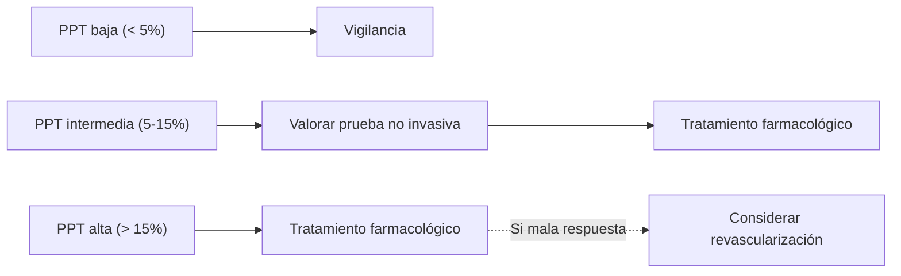
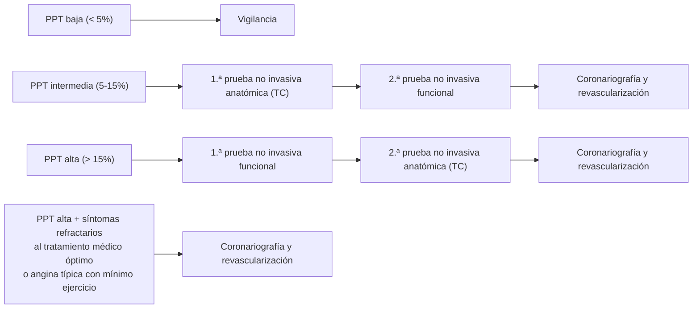

# Síndrome Coronario Crónico — Diagnóstico

En un paciente con sospecha de SCC se deben seguir los siguientes pasos para llegar al diagnóstico correcto y ofrecer la mejor opción terapéutica individualizada. La definición clínica de la angina y la diferenciación entre angina estable e inestable se desarrollan en [[Cardiopatía Isquémica - Concepto y Clasificación]].

---

## Paso 1 — Síntomas y signos

Reconocimiento de la **clínica anginosa** y clasificación en angina estable o inestable. Esta atribución sintomática es la entrada al algoritmo y orienta a SCC (estable) frente a [[SCA - Evaluación Inicial y Clasificación|SCA]] (inestable).

---

## Paso 2 — Comorbilidad y factores de riesgo

Las comorbilidades y factores de riesgo que hay que tener en cuenta se recogen en la siguiente tabla. Son útiles tanto para identificar a pacientes de riesgo como para tomar la decisión de adoptar **medidas invasivas o no**.

> [!info] Tabla 3 — Factores a valorar en la anamnesis ante sospecha de SCC
>
> | Factores de riesgo | Comorbilidad | Situación funcional basal |
> |---|---|---|
> | Edad > 65 años | Otros tipos de ECV: ictus, isquemia arterial periférica, ERC | Dependencia para actividades básicas de la vida diaria (índice de Barthel) |
> | Obesidad | Estrés emocional | Presencia de deterioro cognitivo |
> | HTA | Cardiopatía previa, arritmias e insuficiencia cardiaca | |
> | Diabetes mellitus | Hiperuricemia | |
> | Dislipemia | Enfermedad grave con pronóstico fatal a corto plazo | |
> | Sedentarismo | | |
> | Dieta rica en azúcares y ácidos grasos saturados y baja en fibra, vegetales y frutas | | |
> | Hábito tabáquico | | |
> | Drogas simpaticomiméticas | | |
> | Antecedentes familiares de ECV | | |

---

## Paso 3 — Pruebas complementarias básicas

### Análisis básico de sangre

- **Hemograma:** la **anemia** es causa de CI no obstructiva.
- **Glucemia basal y hemoglobina glucosilada (HbA1c).**
- **Perfil lipídico:** colesterol total, HDL, LDL y triglicéridos.
- **Perfil renal:** la ERC aumenta el riesgo cardiovascular.
- **Perfil tiroideo:** si existe sospecha de alteración funcional de la glándula tiroides.
- **Troponinas de alta sensibilidad:** en SCC pueden tener **valor pronóstico, pero no diagnóstico**. Se recomienda estudiarlas **solamente si existe sospecha de SCA**.

### Electrocardiograma de 12 derivaciones en reposo

Puede aportar información relevante sobre **infartos miocárdicos antiguos** (presencia de onda Q), alteraciones basales de la repolarización o alteraciones de la conducción (especialmente el **bloqueo completo de la rama izquierda y bloqueos auriculoventriculares**).

### Ecocardiografía

Se recomienda realizarla en todos los pacientes con sospecha de SCC. Aporta:

- Datos sobre **defectos en la contractilidad miocárdica** (localizados o hipocinesia generalizada) sugerentes de EAC.
- **Función sistólica del VI** (FEVI), de valor pronóstico y de estratificación del RCV.
- Ayuda a **excluir otras causas** de dolor torácico.

### Radiografía simple de tórax

Se debe realizar para completar el estudio en pacientes con angina atípica, clínica de **insuficiencia cardiaca** o sospecha de **enfermedad pulmonar**.

---

## Paso 4 — Calcular la probabilidad clínica de EAC (PPT)

La **probabilidad pretest (PPT)** ofrece una idea del riesgo real de que el paciente presente EAC y es **fundamental para decidir si se beneficiará de continuar el estudio**.

> [!info] Tabla 4 — Probabilidad pretest según las características clínicas
>
> | Edad (años) | Angina típica Hombre / Mujer | Angina atípica Hombre / Mujer | Clínica no anginosa Hombre / Mujer | Disnea Hombre / Mujer |
> |---|---|---|---|---|
> | 30-39 | 3% / 5% | 4% / 3% | 1% / 1% | 0% / 3% |
> | 40-49 | 22% / 10% | 10% / 6% | 3% / 2% | 12% / 3% |
> | 50-59 | 32% / 13% | 17% / 6% | 11% / 3% | 20% / 9% |
> | 60-69 | 44% / 16% | 26% / 11% | 22% / 6% | 27% / 14% |
> | > 70 | 52% / 27% | 34% / 19% | 24% / 10% | 32% / 12% |

Es importante tener en cuenta otros factores que **modifican la PPT**:

- Factores de riesgo cardiovascular (FRCV).
- Cambios en el ECG de reposo.
- **FEVI disminuida (< 55%).**
- Antecedentes de **prueba de esfuerzo positiva** o **calcio coronario** visualizado en prueba de imagen (TC coronaria).

Categorías de PPT:

| PPT | Categoría |
|---|---|
| **< 5%** | Baja |
| **5-15%** | Intermedia |
| **> 15%** | Alta |

---

## Paso 5 — Prueba diagnóstica definitiva

Una vez estimada la PPT y analizados sus modificadores, se decidirá si merece la pena continuar el estudio. Para ello se debe tener en cuenta la **situación basal del paciente** y su PPT, dándose dos escenarios.

### Escenario A — paciente que NO se beneficiaría de revascularización

Por superar los riesgos al potencial beneficio (alta comorbilidad / mala situación funcional basal):

### Escenario B — paciente CANDIDATO a revascularización

Buena situación basal y poca comorbilidad:

> Si los hallazgos de la 1.ª prueba sugieren ya estenosis o isquemia significativa, se pasa directo a coronariografía sin necesidad de la 2.ª prueba.

### Técnicas no invasivas

Indicadas en todo paciente con PPT intermedia o alta.

#### Anatómicas

- **TC coronaria con contraste yodado.** Permite visualizar tanto la **luz como las paredes de las arterias coronarias**. Sensibilidad similar a la arteriografía.
  - **Estenosis > 90%** → significativa para causar isquemia miocárdica → **indicación de revascularización**.
  - **Estenosis 50-90%** → confirmar mediante otro test no invasivo o coronariografía.
  - **Estenosis < 50%** → bajo riesgo isquémico, no justifica continuar el estudio.
  - **Limitaciones:** calcificación extensa, FC irregular, incapacidad para apnea/inspiración mantenida.

#### Funcionales

Detectan la isquemia al aumentar las demandas de oxígeno del miocardio (situación de estrés). El estrés puede ser **físico (ejercicio)** o **farmacológico (dobutamina, adenosina, dipiridamol o regadenosón)**.

> [!warning] Contraindicaciones del estrés farmacológico
> No se deben realizar pruebas de estrés farmacológico en caso de **sospecha de SCA, asma, BAV de alto grado, estenosis aórtica grave o TAS < 90 mmHg**.

| Técnica | Característica clave |
|---|---|
| **Ecocardiografía de estrés** | Detecta defectos en la contractilidad del VI (segmentarios o globales) |
| **RM cardíaca de estrés** | Defectos en contractilidad y perfusión miocárdica. Con gadolinio en reposo permite valorar **viabilidad miocárdica** (planteamiento de revascularización) y dx en disfunción VI de etiología no aclarada (patrones que orientan a etiología isquémica) |
| **SPECT / PET** | Alteraciones en perfusión miocárdica |
| **ECG de estrés (ergometría)** | Inversión de onda T y elevación o descenso de ST. Menor sensibilidad/especificidad que el resto. Recomendada **con fines pronósticos** o cuando no se disponga de otra prueba no invasiva |

### Técnicas invasivas — coronariografía arterial

Consiste en introducir contraste yodado en las arterias coronarias (acceso percutáneo radial o femoral) bajo radioscopia para visualizar el flujo coronario en tiempo real. La **vía radial es la más segura y, por tanto, de elección.**

Indicaciones:

- Diagnósticas: **PPT media-alta** con pruebas no invasivas no concluyentes o no realizables.
- Indicación directa de revascularización en escenario B.

> [!info] Significancia angiográfica vs funcional
> - **Estenosis ≥ 90%** angiográfica → considerada significativa.
> - **Estenosis 50-90%** o **enfermedad multivaso** → realizar evaluación funcional invasiva mediante **reserva fraccional de flujo (FFR)** para identificar lesiones funcionalmente significativas que se beneficien del intervencionismo.

---

## Paso 6 — Tratamiento

Ver desarrollo en [[SCC - Tratamiento]].

---

## Notas hermanas

- [[Cardiopatía Isquémica - Concepto y Clasificación]] — definición, clasificación, CCS.
- [[SCC - Tratamiento]] — antianginosos, antitrombóticos, revascularización electiva.
- [[SCA - Evaluación Inicial y Clasificación]] — algoritmo agudo.
- [[MOC - CARDIOLOGIA]]
