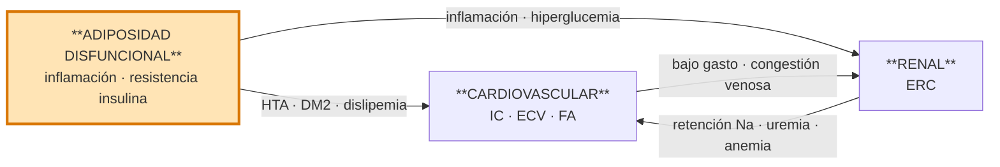

# Síndrome Cardiovascular-Renal-Metabólico (CRM)

## Definición

> *Entidad sistémica resultante de la interacción fisiopatológica multidireccional entre factores de riesgo metabólico, enfermedad renal crónica y sistema cardiovascular, que multiplican entre sí los riesgos de desarrollo y progresión de cada condición, además de aumentar el riesgo de eventos cardiovasculares y renales.*

Concepto definido por la **AHA 2023** y adaptado al SNS español en el consenso **Delphi CRM 2025**.

> [!warning] No confundir con Síndrome Cardiorrenal clásico (CRS)
> El **síndrome cardiorrenal** de Ronco (tipos 1-5) describe la interacción bidireccional corazón-riñón. El **CRM** es un concepto más amplio que añade la **esfera metabólica** (tejido adiposo disfuncional, prediabetes, DM2) como motor fisiopatológico inicial. Ambos coexisten — ver [[Síndrome Cardiorrenal]].

## Etiología (fisiopatología)

**Motor central**: el **exceso y/o disfuncionalidad del tejido adiposo** genera un estado proinflamatorio, pro-oxidativo y de resistencia a la insulina que acelera el daño metabólico, renal y cardiovascular.

La interacción es **multidireccional**: cada esfera acelera el deterioro de las otras dos, de modo que la carga combinada no es aditiva sino **multiplicativa**.

### Mecanismos obesidad → ERC

El tejido adiposo disfuncional (**visceral + ectópico**) daña el riñón por vías **hemodinámicas, metabólicas, inflamatorias y fibróticas** (AHA CKM Synopsis 2023 §Mechanisms). Los 7 mecanismos clave:

| # | Mecanismo | Efecto renal |
|---|---|---|
| 1 | **Hiperfiltración glomerular** | ↑ demanda metabólica + sobrecarga volumétrica → hipertensión glomerular → **daño podocitario** → glomerulosclerosis secundaria |
| 2 | **Activación del SRAA** | Adipocito produce angiotensinógeno; leptina → simpático → renina. Aldosterona → vasoconstricción eferente, **fibrosis tubulointersticial**, inflamación |
| 3 | **Hiperinsulinemia** | Retención tubular de Na⁺, estimulación del SRAA, proliferación vascular |
| 4 | **Resistencia a la insulina** | Disfunción endotelial, prediabetes → DM2 → nefropatía diabética superpuesta |
| 5 | **Citocinas proinflamatorias** (TNF-α, IL-6, MCP-1, leptina ↑ / adiponectina ↓) | Inflamación crónica de bajo grado → daño endotelial y podocitario |
| 6 | **Depósito ectópico de grasa** (hígado = MASLD, corazón, músculo, páncreas, **riñón**) | Lipotoxicidad local, compresión perirrenal, apoptosis tubular |
| 7 | **Estrés oxidativo + productos de glicación avanzada** (AGE, ROS, PKC, JAK-STAT) | Disfunción mitocondrial, apoptosis, inflamación sostenida ("memoria metabólica") |

Lesión histológica típica: **glomerulopatía asociada a obesidad** (ORG) — glomerulomegalia ± GSFS secundaria, proteinuria sub-nefrótica.

## Estadios AHA 0-4

| Estadio | Definición |
|---|---|
| **0** | Sin factores de riesgo CRM |
| **1** | Adiposidad en exceso y/o disfuncional |
| **2** | Factores de riesgo metabólicos y/o ERC de riesgo moderado-alto |
| **3** | ECV subclínica en paciente CRM |
| **4** | ECV clínica en paciente CRM |

El salto pronóstico mayor ocurre al pasar a **estadio 3** (ECV establecida).

## Diagnóstico

### Cribado — ¿a quién y cómo?

**A quién cribar**: a todo paciente con **≥ 1 factor de riesgo** asociado a cualquiera de las 3 condiciones CRM.

**Principio rector**: si existe **1 condición establecida**, investigar proactivamente las **otras 2**.

#### Las 4 pruebas básicas del cribado CRM

Núcleo del cribado CRM (AHA CKM 2023 Table 3 + Top-10 Highlight #9):

| Prueba | Finalidad | Eje |
|---|---|---|
| **CAC (cociente albúmina/creatinina en orina)** | **Daño renal precoz** + marcador independiente de riesgo CV. Indicado en ERC, diabetes, HTA y síndrome metabólico. Medido en muestra aislada, preferible primera orina matutina | 🫘 Renal |
| **TFGe (CKD-EPI ± cistatina C)** | **Función renal** y estadiaje KDIGO (G1-G5). Si dudas sobre masa muscular → cistatina C | 🫘 Renal |
| **NT-proBNP / BNP** | **Cribado IC subclínica** (estadio 3 CKM) — corte NT-proBNP ≥ 125 pg/mL en no agudo | ❤️ Cardíaco |
| **Ecocardiografía** | **Estructura y función cardíaca** — FEVI (fenotipado HFrEF/HFmrEF/HFpEF), función diastólica, HVI | ❤️ Cardíaco |

> [!note] CACO y TFGe no son equivalentes
> Se solicitan **ambas** — puedes tener TFGe normal con CACO alto (daño glomerular precoz: estadio G1-G2 A2-A3 en KDIGO, ya ERC) o al revés. Ambas imprescindibles.

Complementado con cribado metabólico: **HbA1c**, perfil lipídico, **FIB-4** (fibrosis hepática / MASLD), **IMC y perímetro abdominal**.

#### Resto de exploración y pruebas

**Exploración física básica**:
- Presión arterial — ver [[Medición de la Presión Arterial]]
- IMC
- Circunferencia abdominal
- Auscultación cardiopulmonar
- Edemas periféricos

**Analítica básica**:
- Glucosa en ayunas
- **HbA1c**
- Perfil lipídico (CT, cLDL, cHDL, TG)
- **FGe** (CKD-EPI)
- Albúmina en orina — **CAC** (cociente albúmina/creatinina)
- **FIB-4** (índice de fibrosis hepática, como marcador de MASLD)

**Pruebas cardiacas**:
- **ECG** en todos los pacientes
- **Ecocardioscopia** si disponible en el punto de atención

Ver también: [[Diagnóstico de Hipertensión y Causas Secundarias]].

### Criterios diagnósticos de cada condición

| Condición | Criterio |
|---|---|
| **Cardiovascular** | ECV aterosclerótica, enfermedad coronaria, IC, FA o eventos subclínicos |
| **Renal** | **FGe < 60 mL/min/1.73 m²** *o* **CAC > 30 mg/g**, mantenidos ≥ 3 meses |
| **Metabólica** | Sobrepeso/obesidad, obesidad abdominal o tejido adiposo disfuncional (incluye prediabetes) ± otros factores de riesgo metabólicos |

## Tratamiento

### Modelo asistencial integrado — por qué y cómo

El CRM **exige abordaje multidisciplinar coordinado**. Los estudios de AHA (Presidential Advisory 2023 §Value-based care + Highlights #5 y #10) identifican la **fragmentación asistencial** (cada especialidad trata su órgano en paralelo sin comunicación) como el principal obstáculo para mejorar los outcomes CRM: lleva a retraso diagnóstico, polifarmacia no optimizada, objetivos contradictorios entre especialistas y pérdida de la ventana terapéutica precoz.

**Solución**: modelo **value-based interdisciplinary care** con atención primaria como eje longitudinal.

#### Roles clave

| Profesional | Función principal | Cuándo |
|---|---|---|
| **Médico de familia** | **Coordinador longitudinal** del paciente CRM. Estadiaje CKM 0-4, cribado inicial, titulación farmacológica, educación, seguimiento. Derivación selectiva | Estadios 0-2 de forma autónoma; estadios 3-4 coordinando con especialistas |
| **Enfermería de AP / gestora de IC** | Educación estructurada (peso diario, dieta, flexi-diurético), monitorización telefónica, detección precoz de alarma | Periodo vulnerable post-alta; seguimiento crónico |
| **Cardiología** | Fenotipar IC, titulación avanzada, DAI/TRC, IC avanzada | Estadios 3-4 CKM, sobre todo con HFrEF |
| **Nefrología** | ERC progresiva, albuminuria persistente, indicación de finerenona, preparación TRR | TFGe < 30, CACO > 300, caída TFG > 5/año |
| **Endocrinología** | DM2 complicada, obesidad severa, cirugía bariátrica | IMC ≥ 35 con comorbilidades, DM mal controlada |
| **Farmacia** | Conciliación al alta, adherencia, interacciones (ARNI + iSGLT2 + ACOD…) | Cambio de tratamiento, polifarmacia |
| **Nutrición** | Dieta mediterránea/DASH, patrón antiinflamatorio, pérdida ponderal estructurada | Estadio 1+ y obesidad |

#### Principios operativos

- **Abordaje precoz e integral** desde la especialidad que recibe primero al paciente, independientemente del motivo de consulta o ingreso. *"Si existe 1 condición CRM establecida, investigar proactivamente las otras 2"*.
- **Circuitos integrados multiespecialidad** con respuesta ágil en interconsulta, evitando el peregrinaje del paciente.
- **Registro clínico único** accesible por todos los especialistas implicados — **historia clínica compartida**.
- **Telemedicina + telemonitorización**: auto-manejo, educación y comunicación bidireccional paciente-profesional. Detección precoz de descompensaciones (IC, HTA, glucemia).
- **Indicadores de calidad transversales**: % DM2 con CACO medido, % ERC A2-A3 con iSGLT2, % HFrEF con los 4 pilares, % IC post-alta con revisión ≤ 14 días.
- **Educación a múltiples niveles**: población general, pacientes, profesionales, gestores.
- **Prevención primordial**: evitar la aparición de factores de riesgo antes de su desarrollo (Life's Essential 8 de AHA).

### Intervenciones terapéuticas

**Prevención primordial**:
- Desde edades tempranas en individuos sanos.
- En pacientes con ≥ 1 FR, prevenir activamente los demás: sueño, salud mental, consumo de tabaco/alcohol/drogas, sedentarismo, patrón dietético.

**Abordaje integral intensivo**: se aplica **independientemente** de cuál condición CRM sea la manifiesta.

**Estilo de vida desde estadios tempranos**: actividad física, dieta cardiosaludable (mediterránea/DASH), reducción de sal, cese tabáquico.

**Pérdida ponderal intensiva**: indicada en **cualquier estadio**, incluso avanzados. Farmacoterapia + cirugía bariátrica cuando proceda.

**Farmacología**: según las guías de cada condición, priorizando fármacos con beneficio demostrado **CV + renal + metabólico**, desde estadios tempranos hasta avanzados y dentro de indicaciones autorizadas.

#### Un fármaco, tres ejes — terapias transversales CRM

Los pilares farmacológicos CRM actúan simultáneamente sobre los 3 ejes. Su priorización se basa en el fenotipo dominante (AHA CKM 2023 Highlight #8):

| Clase | Cardíaco | Renal | Metabólico | Ensayos pivote |
|---|---|---|---|---|
| **iSGLT2** | ↓ hospitalización IC, ↓ muerte CV | ↓ progresión ERC, ↓ albuminuria | ↓ HbA1c ~0,5-1 %, ↓ peso 2-3 kg | EMPA-REG, EMPEROR-Reduced/Preserved, DAPA-HF, DELIVER, EMPA-KIDNEY, DAPA-CKD, CREDENCE |
| **Finerenona** (ARM no esteroideo) | ↓ hospitalización IC | ↓ progresión ERC, ↓ albuminuria ~30 % | Neutro | FIDELIO-DKD, FIGARO-DKD, FIDELITY (meta) |
| **ar-GLP-1** | ↓ MACE | ↓ albuminuria (FLOW); ↓ progresión ERC | ↓ HbA1c ~1-1,5 %, **↓ peso 5-15 %** | LEADER, SUSTAIN-6, REWIND, FLOW |
| **IECA / ARA-II** | ↓ eventos CV en HTA/ERC/IC | ↓ progresión ERC, ↓ albuminuria | Neutro | HOPE, RENAAL, IDNT |
| **Sacubitrilo/Valsartán** (ARNI) | ↓ mortalidad y hospitalización IC en HFrEF | Protector modesto | Neutro | PARADIGM-HF, PARAGON-HF |
| **Estatinas de alta intensidad** | ↓ MACE, estabilización de placa | Neutro | Neutro | HPS, JUPITER |

**Priorización según fenotipo dominante (AHA CKM 2023):**

- **iSGLT2 primero** si ERC, IC clínica o alto riesgo de IC.
- **ar-GLP-1 primero** si hiperglucemia no controlada (HbA1c ≥ 9 %), dosis altas de insulina u obesidad severa (IMC ≥ 35).
- **Combinación iSGLT2 + ar-GLP-1** en pacientes con múltiples FR CRM + ECV (o riesgo alto predicho).
- **Finerenona** añadida sobre IECA/ARA-II + iSGLT2 en ERC-DM2 con albuminuria A2-A3 persistente, si K⁺ < 4,8 y TFGe > 25.

#### Fichas del vault

| Clase | Fichas |
|---|---|
| **iSGLT2** | [[Empagliflozina]], [[Dapagliflozina]] |
| **ar-GLP-1 / agonistas duales** | [[Liraglutida]], [[Semaglutida]], [[Tirzepatida]] |
| **Estatinas + hipolipemiantes** | [[Atorvastatina]], [[Rosuvastatina]], [[Ezetimiba]] |
| **IECA / ARA-II** | [[Enalapril]], [[Losartán]], [[Valsartán]] |
| **ARM** (esteroideos y no esteroideos) | [[Espironolactona]], [[Finerenona]] |
| **ARNI** | [[Sacubitrilo-Valsartan]] |

**Rehabilitación cardiaca**: indicada en **todos los pacientes CRM con evento CV**.

## Fuentes

- PDF local del consenso Delphi: [[DelphiCRM_interactivo_completo.pdf]]
- Marco conceptual: presidential advisory AHA 2023
- Guías relacionadas (índice completo en [[Guias_de_Referencia]]):
  - KDIGO 2024 (ERC)
  - ESC 2021 + Focused Update 2023 (IC)
  - SEMI 2023 (IC aguda)
  - ADA 2025 Standards of Care (DM2)
  - SEMI 2025 (DM2)

## Navegación

- [[000_INICIO]]
- [[MOC - CARDIOLOGIA]]
- [[MOC - NEFROLOGIA]]
- [[MOC - ENDOCRINO]]
- [[MOC - FARMACOS]]
- Ver también: [[Síndrome Cardiorrenal]] (CRS clásico de Ronco, concepto relacionado pero distinto)
