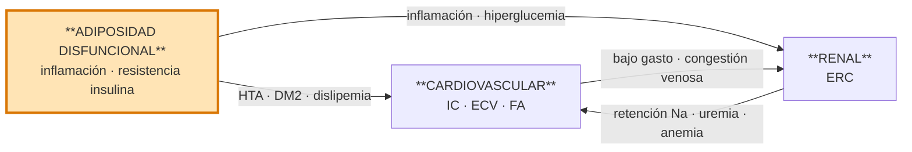

# Síndrome Cardiovascular-Renal-Metabólico (CKM)

> [!info] Novedad 2026 — de Advisory a GUÍA formal
> El **CKM pasa de "Presidential Advisory" (AHA 2023) a GUÍA con recomendaciones graduadas COR/LOE** (Guía AHA/ACC/ADA/ASN 2026, Ndumele et al). No crea una entidad nueva: aporta recomendaciones accionables sobre el mismo constructo. Cambios clave:
> - Usa el sistema estándar **ACC/AHA de COR (1, 2a, 2b, 3-Sin Beneficio, 3-Daño) y LOE (A, B-R, B-NR, C-LD, C-EO)** actualizado en dic-2024.
> - **Retira y reemplaza** la guía de obesidad "2013 AHA/ACC/TOS" → el manejo del peso se integra en el paradigma CKM (Guía CKM 2026, §1.5).
> - Incorpora a **ADA y ASN** en la autoría (de ahí el sello AHA/ACC/ADA/ASN), ampliando el comité multidisciplinar respecto a 2023 (solo AHA).
> - **NO da recomendaciones generales** sobre manejo de HTA, enfermedad coronaria crónica, dislipidemia, IC ni EAP: esos temas viven en sus propias guías AHA/ACC. Aquí se modulan en el contexto CKM y se **remite** a [[Tratamiento de la Dislipemia]], [[Insuficiencia cardiaca]], etc.
> - Las recomendaciones de TRATAMIENTO se limitan a adultos ≥18 (la farmacoterapia pediátrica queda para futuras guías), pero el ESTADIAJE (COR 1) se recomienda también en youth <18 años con umbrales pediátricos.

## Definición

> *Trastorno sistémico por interacción fisiopatológica multidireccional entre factores de riesgo metabólico, enfermedad renal crónica (ERC) y sistema cardiovascular, que abarca tanto a individuos EN RIESGO de ECV (por factores metabólicos y/o ERC) como a quienes ya tienen ERC o ECV establecidas relacionadas con esos factores.* (Guía CKM 2026, §2)

Concepto sentado por la **AHA 2023** (Presidential Advisory), **elevado a guía formal** por la AHA/ACC/ADA/ASN 2026, y adaptado al SNS español en el consenso **Delphi CRM 2025**.

> [!warning] No confundir con Síndrome Cardiorrenal clásico (CRS)
> El **síndrome cardiorrenal** de Ronco (tipos 1-5) describe la interacción bidireccional corazón-riñón. El **CKM/CRM** es un concepto más amplio que añade la **esfera metabólica** (tejido adiposo disfuncional, prediabetes, DM2) como motor fisiopatológico inicial. Ambos coexisten — ver [[Síndrome Cardiorrenal]].

## Top 10 Take-Home Messages (Guía CKM 2026)

Los 10 mensajes que estructuran el manejo (Guía CKM 2026, *Top Take-Home Messages*):

1. **Estadiaje CKM** — recomendado en youth y adultos para prevenir la progresión de estadio, personalizar la terapia según el riesgo absoluto y promover la regresión con estilo de vida y pérdida de peso.
2. **Cuantificar el riesgo con las ecuaciones PREVENT** — estimar riesgo a 10 y 30 años de ASCVD, IC y ECV total en estadios 0-3. **PREVENT-CVD ≥20% a 10 años = criterio de estadio 3**; **≥7,5% prioriza la farmacoterapia**.
3. **Cribado rutinario de factores de riesgo CKM** — evaluar factores metabólicos y función renal en todos los adultos; pre-IC, MASLD y SAOS en subgrupos seleccionados.
4. **Evaluar y abordar los determinantes sociales de salud (SDOH)** — componente clave del cuidado holístico.
5. **Cuidado interdisciplinar con una "persona de referencia/coordinación CKM" (point person)** — para implementar GDMT basada en evidencia.
6. **Evaluar y tratar el sobrepeso y la obesidad** — con **IMC Y perímetro de cintura** juntos. Estilo de vida + farmacoterapia de obesidad ± cirugía metabólico-bariátrica según necesidad.
7. **Antihiperglucemiantes cardioprotectores en DM2** — en DM2 con ECV o riesgo aumentado, usar **iSGLT2 y/o terapia basada en GLP-1**; elegir el agente según comorbilidad (ERC, ASCVD, IC, obesidad, hiperglucemia severa, MASLD).
8. **Cribar ERC con eGFR + UACR y usar nefroprotectores** — en ERC+DM2 o ERC+albuminuria: **RASi + iSGLT2 de primera línea**; si persiste albuminuria, añadir **MRA no esteroideo (finerenona) o GLP-1**.
9. **Abordar factores CKM en ASCVD** — tratamiento de la obesidad, antihiperglucemiantes cardioprotectores y nefroprotectores junto a la GDMT de ASCVD.
10. **Abordar factores CKM en la IC** — HFrEF: cuádruple terapia (RASi/ARNI + betabloqueante + MRA esteroideo + iSGLT2). HFmrEF/HFpEF: iSGLT2 1.ª línea, añadir GLP-1 si obesidad, considerar nsMRA si DM2+ERC.

## Etiología (fisiopatología)

**Motor central**: el **exceso y/o disfuncionalidad del tejido adiposo** genera un estado proinflamatorio, pro-oxidativo y de resistencia a la insulina que acelera el daño metabólico, renal y cardiovascular.

La interacción es **multidireccional**: cada esfera acelera el deterioro de las otras dos, de modo que la carga combinada no es aditiva sino **multiplicativa**.

> [!tip] Dato de impacto poblacional
> **90-95 % de los adultos en EE. UU. ya están en estadio CKM 1-4** (solo 5-10 % en estadio 0) (Guía CKM 2026, §5.2). El CKM no es una entidad rara: es la regla.

### Mecanismos obesidad → ERC

El tejido adiposo disfuncional (**visceral + ectópico**) daña el riñón por vías **hemodinámicas, metabólicas, inflamatorias y fibróticas** (AHA CKM Synopsis 2023 §Mechanisms). Los 7 mecanismos clave:

| # | Mecanismo | Efecto renal |
|---|---|---|
| 1 | **Hiperfiltración glomerular** | ↑ demanda metabólica + sobrecarga volumétrica → hipertensión glomerular → **daño podocitario** → glomerulosclerosis secundaria |
| 2 | **Activación del SRAA** | Adipocito produce angiotensinógeno; leptina → simpático → renina. Aldosterona → vasoconstricción eferente, **fibrosis tubulointersticial**, inflamación |
| 3 | **Hiperinsulinemia** | Retención tubular de Na⁺, estimulación del SRAA, proliferación vascular |
| 4 | **Resistencia a la insulina** | Disfunción endotelial, prediabetes → DM2 → nefropatía diabética superpuesta |
| 5 | **Citocinas proinflamatorias** (TNF-α, IL-6, MCP-1, leptina ↑ / adiponectina ↓) | Inflamación crónica de bajo grado → daño endotelial y podocitario |
| 6 | **Depósito ectópico de grasa** (hígado = MASLD, corazón, músculo, páncreas, **riñón**) | Lipotoxicidad local, compresión perirrenal, apoptosis tubular |
| 7 | **Estrés oxidativo + productos de glicación avanzada** (AGE, ROS, PKC, JAK-STAT) | Disfunción mitocondrial, apoptosis, inflamación sostenida ("memoria metabólica") |

Lesión histológica típica: **glomerulopatía asociada a obesidad** (ORG) — glomerulomegalia ± GSFS secundaria, proteinuria sub-nefrótica.

> [!note] Nota terminológica 2026
> El hígado graso pasa a llamarse **MASLD** (esteatosis hepática asociada a disfunción metabólica), que **reemplaza a NAFLD/EHGNA** (Guía CKM 2026, §1). Es el componente hepático del CKM. Ver [[MASLD - Esteatosis Hepática Metabólica]].

## Estadios CKM 0-4

> [!abstract] Recomendación de estadiaje (COR 1, LOE B-NR)
> En youth (<18 años) y adultos (≥18 años), la **estadificación CKM se recomienda** evaluando tres ejes (factores metabólicos, función renal con eGFR + UACR en estadio ≥2, estado CV), para prevenir la progresión de estadio, promover la regresión y personalizar el tratamiento según el riesgo CV absoluto y el beneficio neto esperado (Guía CKM 2026, §2-§3, **COR 1 LOE B-NR**).

| Estadio | Definición | Cortes operativos 2026 |
|---|---|---|
| **0** | Sin factores de riesgo CKM | Todo normal (solo 5-10 % de adultos) |
| **1** | **Adiposidad en exceso y/o disfuncional** | IMC ≥25 kg/m² (≥23 si ascendencia asiática) o cintura ≥88/102 cm M/H (≥80/90 si asiática); o adiposidad disfuncional = **prediabetes** (glucemia ayunas 100-125 mg/dL o HbA1c 5,7-6,4 %). SIN otros FR metabólicos, ERC ni ECV |
| **2** | **Factores de riesgo metabólicos y/o ERC de riesgo moderado-alto** | **HTA** ≥130/80 mmHg; **TG** ≥150 mg/dL; síndrome metabólico; **DM2** (glucemia ≥126 o HbA1c ≥6,5 %); **ERC moderado-alto riesgo KDIGO** |
| **3** | **ECV subclínica** en paciente CKM **O un equivalente de riesgo** | **CAC Agatston ≥100** (aterosclerosis coronaria subclínica); **pre-IC por biomarcadores** (NT-proBNP ≥125 pg/mL; hs-cTn elevada) o eco anormal; **ERC muy alto riesgo KDIGO** (G4-G5 o muy alto riesgo); o **PREVENT-CVD ≥20 % a 10 años** |
| **4** | **ECV clínica** (coronaria, IC, ictus, EAP, FA) sobre factores CKM | **4a: sin fallo renal** · **4b: fallo renal** (eGFR <15 mL/min/1,73 m² o necesidad de TRR crónica) |

(Definiciones y cortes: Guía CKM 2026, §2, Tablas de estadiaje.)

El salto pronóstico mayor ocurre al entrar en **estadio 3** (ECV subclínica / equivalente de alto riesgo). La **subdivisión 4a/4b es nueva en 2026** (antes el estadio 4 era único).

### ERC en el constructo CKM — mapa KDIGO

El diagnóstico de **ERC requiere eGFR <60 mL/min/1,73 m² *o* UACR ≥30 mg/g**, mantenidos ≥3 meses, en ≥2 mediciones (Guía CKM 2026, §2). El riesgo renal se clasifica con el **mapa de calor KDIGO** (categorías G × A):

| Riesgo KDIGO (→ estadio CKM) | Combinación G × A |
|---|---|
| **Moderado-alto** (estadio 2) | G1-G2 con A2-A3; G3a con A1-A2; G3b con A1 |
| **Muy alto** (estadio 3, equivalente) | G3a con A3; G3b con A2-A3; G4-G5 |

(Categorías albuminuria: A1 <30 · A2 30-<300 · A3 ≥300 mg/g.) El mapa completo G×A y el pronóstico detallado viven en [[ERC - Estratificación y Pronóstico]].

## PREVENT en el estadiaje CKM

> [!abstract] Recomendaciones de cuantificación de riesgo
> | COR | LOE | Recomendación |
> |---|---|---|
> | **1** | B-NR | En adultos **30-79 años SIN ECV**, calcular el riesgo de ECV total a **10 años** (con sus componentes ASCVD e IC) con **PREVENT** (Guía CKM 2026, §4) |
> | **2a** | B-NR | En adultos jóvenes, calcular además el riesgo a **30 años** para la decisión compartida (sobre todo consejo de estilo de vida) |
> | **2a** | B-NR | Usar los **risk enhancers CKM** (Tabla 9) para guiar la intensificación de la prevención |

**Cortes operativos PREVENT (cómo usarlos en consulta):**

- **PREVENT-CVD ≥20 % a 10 años** = define **estadio 3** (equivalente de riesgo, junto a ECV subclínica).
- **PREVENT-CVD ≥7,5 % a 10 años** = **prioriza la farmacoterapia** (iniciar GLP-1/iSGLT2 cuando indicado; antihipertensivos en HTA estadio 1).
- **PREVENT-ASCVD 3-<10 %** con decisión incierta → considerar **CAC** (ver cribado).
- **PREVENT-HF ≥5 % a 10 años** → considerar **biomarcadores cardiacos** para pre-IC.
- Aplicar a **30-79 años sin ECV**; **NO usar en estadio 4** (ECV ya establecida).

PREVENT incorpora en su ecuación base predictores propios del CKM (**IMC y eGFR**) ausentes en las Pooled Cohort Equations; modelos add-on añaden UACR, HbA1c e índice de privación social. **El detalle de la calculadora y las ecuaciones está en** [[Estratificación de Riesgo Cardiovascular (PREVENT-ASCVD)]].

## Diagnóstico y cribado

### Las 4 pruebas básicas del cribado CKM

Núcleo del cribado CKM (eje renal + eje cardíaco):

| Prueba | Finalidad | Eje |
|---|---|---|
| **UACR (cociente albúmina/creatinina en orina)** | **Daño renal precoz** + marcador independiente de riesgo CV. Se añade al eGFR de forma **dual desde estadio 2**. Muestra aislada, preferible primera orina matutina | 🫘 Renal |
| **eGFR (CKD-EPI ± cistatina C)** | **Función renal** y estadiaje KDIGO (G1-G5). La combinación creatinina+cistatina C es más exacta, pero su disponibilidad es limitada | 🫘 Renal |
| **NT-proBNP / BNP (pre-IC)** | **Cribado de IC subclínica** (estadio 3) — corte **NT-proBNP ≥125 pg/mL** (BNP ≥35 pg/mL); indicado si **PREVENT-HF ≥5 %** | ❤️ Cardíaco |
| **Ecocardiografía** | **Estructura/función cardíaca** — FEVI (fenotipado HFrEF/HFmrEF/HFpEF), función diastólica, HVI. Define pre-IC junto a biomarcadores | ❤️ Cardíaco |

> [!note] eGFR y UACR no son equivalentes
> Se solicitan **ambas** — puedes tener eGFR normal con UACR alto (daño glomerular precoz, ya ERC) o al revés. El diagnóstico de ERC se cumple con **cualquiera** de las dos (eGFR <60 *o* UACR ≥30).

Complemento metabólico: **HbA1c**, perfil lipídico, **FIB-4** (fibrosis hepática / MASLD → ver [[MASLD - Esteatosis Hepática Metabólica]]), **IMC y perímetro abdominal** (medir ambos, COR 1 LOE B-NR — al menos anualmente).

### Cronograma de seguimiento escalonado por estadio

> [!abstract] Frecuencia de reevaluación (todas COR 1, LOE B-NR — Guía CKM 2026, §3)
> | Estadio | Lípidos / glucemia / eGFR | PA | UACR |
> |---|---|---|---|
> | **0** | cada **5 años** | anual | — |
> | **1** | cada **2-3 años** | anual | — |
> | **≥2** | **anual** | anual | **anual (dual con eGFR)** |
> | **Antropometría** (IMC + cintura) | **al menos anual** en todos | | |
>
> En ERC avanzada puede considerarse eGFR+UACR **cada 3-6 meses** para reclasificar el riesgo KDIGO.

### CAC y biomarcadores para detectar estadio 3

> [!abstract] Detección de ECV subclínica (estadio 3)
> | COR | LOE | Recomendación |
> |---|---|---|
> | **2a** | B-NR | **CAC** (calcio coronario) en riesgo intermedio (**PREVENT-ASCVD 5-<10 %**) o borderline seleccionado (3-<5 %) con decisión incierta. Un **Agatston ≥100** define aterosclerosis coronaria subclínica = estadio 3 (Guía CKM 2026, §3, §5.6) |
> | **2a** | B-NR | **Biomarcadores cardiacos** (BNP/NT-proBNP, hs-cTn) para detectar **pre-IC** si **PREVENT-HF ≥5 %** |

Un **CAC = 0 NO descarta riesgo en pacientes CKM jóvenes** (desarrollo acelerado de CAC), a diferencia de la población general (Guía CKM 2026, §5.6).

### Cribado de determinantes sociales de salud (SDOH)

> [!abstract] (COR 1, LOE B-NR)
> Cribado rutinario de **SDOH con herramienta validada** en adultos con o en riesgo de CKM (Tabla 6), y de **sus cuidadores** en youth (Tabla 7), para informar una atención centrada en el paciente (Guía CKM 2026, §3).

## Modelo asistencial interdisciplinar

> [!abstract] Recomendaciones de cuidado interdisciplinar (Guía CKM 2026, §5.1)
> | COR | LOE | Recomendación |
> |---|---|---|
> | **1** | B-R | En CKM **estadio 2-4 con ≥2 condiciones** (diabetes, ERC y/o ECV), usar **equipos de cuidado interdisciplinar con un coordinador ("CKM coordination point person")** para facilitar el cuidado multisistémico y optimizar la GDMT |
> | **1** | C-EO | Priorizar la **mitigación del impacto clínico de los SDOH adversos** para optimizar el cuidado holístico CKM |

**Dos modelos de cuidado** (Guía CKM 2026, Fig. 5):
- **Value-based** (multimorbilidad intermedia): coordinador + equipo interdisciplinar virtual.
- **Volume-based** (máximo riesgo absoluto, p. ej. **DM2 de alto riesgo** [HbA1c ≥9 % o complicaciones microvasculares] o **ERC de muy alto riesgo** KDIGO): derivación a subespecialistas + coordinador como **navegador**.

> [!tip] El coordinador NO es un rol nuevo
> Puede ejercerlo un perfil existente — **educador en diabetes, enfermera o coordinador de IC**. El **médico de familia** es el *"Primary care clinician"* del equipo (Guía CKM 2026, Tabla 11). En el SNS español, AP actúa como eje longitudinal del paciente CKM.

#### Roles clave

| Profesional | Función principal | Cuándo |
|---|---|---|
| **Médico de familia** | **Coordinador longitudinal**. Estadiaje, cribado, titulación farmacológica, educación, seguimiento, derivación selectiva | Estadios 0-2 de forma autónoma; 3-4 coordinando |
| **Enfermería de AP / gestora de IC** | Educación estructurada (peso diario, dieta, flexi-diurético), monitorización, detección de alarma; puede ser el *point person* | Periodo vulnerable post-alta; seguimiento crónico |
| **Cardiología** | Fenotipar IC, titulación avanzada, DAI/TRC, IC avanzada | Estadios 3-4, sobre todo HFrEF |
| **Nefrología** | ERC progresiva, albuminuria persistente, indicación de finerenona, preparación TRR | eGFR <30, UACR >300, caída eGFR >5/año |
| **Endocrinología** | DM2 complicada, obesidad severa, cirugía bariátrica | IMC ≥35 con comorbilidades, DM mal controlada |
| **Farmacia** | Conciliación al alta, adherencia, interacciones (ARNI + iSGLT2 + ACOD…) | Cambio de tratamiento, polifarmacia |
| **Nutrición** | Dieta mediterránea/DASH, patrón antiinflamatorio, pérdida ponderal estructurada | Estadio 1+ y obesidad |

#### Principios operativos

- **Estadio 0 → prevención primordial** con **Life's Essential 8** (alimentación cardiosaludable, actividad física, evitar nicotina, sueño saludable, peso saludable + control de glucosa, lípidos y PA; la AHA añade manejo del estrés). El objetivo es **evitar que aparezcan los factores de riesgo** (Guía CKM 2026, §5.2; remite a la guía de prevención primaria ACC/AHA 2019).
- **Abordaje precoz e integral**: *"si existe 1 condición CKM establecida, investigar proactivamente las otras 2"*.
- **Registro clínico único / historia compartida** accesible por todos los especialistas.
- **Telemedicina + telemonitorización** para autocuidado y detección precoz de descompensaciones.
- **Indicadores de calidad transversales**: % DM2 con UACR medido, % ERC A2-A3 con iSGLT2, % HFrEF con los 4 pilares, % IC post-alta con revisión ≤14 días.

## Manejo por estadios (algoritmo 0→4 con COR/LOE)

> [!info] Este hub remite, no duplica
> Las cascadas detalladas viven en sus notas: la **nefroprotección** en [[ERC - Fármacos Modificadores de la Enfermedad]]; el **algoritmo glucémico** en [[Diabetes Mellitus tipo 2]]; los **pilares de IC** en [[Insuficiencia cardiaca]]; los **objetivos cLDL** en [[Tratamiento de la Dislipemia]]; el **manejo del peso** en [[Obesidad (manejo CKM)]]. Aquí van los **cortes CKM-específicos**.

### Estadio 1 — Obesidad / adiposidad disfuncional

Objetivo: **pérdida de peso ≥5-10 %** del peso basal (beneficio creciente a mayor pérdida). Estilo de vida primera línea (COR 1 A); GLP-1 si IMC ≥27 (COR 2a A); cirugía metabólico-bariátrica en estadios 1-3 (COR 2a A). **El "cómo" completo (dosis, % de pérdida, MBS, post-diabetes gestacional) está en** [[Obesidad (manejo CKM)]].

### Estadio 2 — Factores metabólicos y/o ERC moderado-alto

> [!abstract] DM2 — antihiperglucemiantes cardioprotectores (Guía CKM 2026, §5.5)
> | COR | LOE | Recomendación |
> |---|---|---|
> | **1** | A | En DM2 con **riesgo CV aumentado (PREVENT-CVD ≥7,5 %** o edad ≥50 + factores CKM), incluir **iSGLT2 o GLP-1** con beneficio probado, **independiente de HbA1c o metformina** |
> | **2a** | A | **Metformina coadyuvante** si HbA1c **0,5-1 % por encima** del objetivo, combinada con iSGLT2/GLP-1 |
> | **2b** | B-NR | **Combinación iSGLT2 + GLP-1** en alto riesgo CV o múltiples factores CKM |

**Elección de agente** (Guía CKM 2026, §5.5):
- **iSGLT2 primero** si **ERC y/o pre-IC**.
- **GLP-1 primero** si **obesidad clase ≥II, hiperglucemia severa (HbA1c ≥9 %) y/o MASLD**.

El algoritmo glucémico completo está en [[Diabetes Mellitus tipo 2]].

> [!abstract] ERC — cascada nefroprotectora guiada por UACR (Guía CKM 2026, §5.5)
> | COR | LOE | Fármaco | Umbral UACR | eGFR mínimo |
> |---|---|---|---|---|
> | **1** | B-R | **RASi** (IECA/ARA-II) a dosis máx. tolerada | **≥30** (o ERC+DM2) | **≥30** |
> | **1** | A | **iSGLT2** | **≥200** sin DM2 (o cualquier ERC+DM2) | **≥20** |
> | **2a** | B-R | **iSGLT2** | 30-199 sin DM2 | ≥20 |
> | **1** | A | **Finerenona** (nsMRA) sobre RASi + iSGLT2 | **≥30** persistente (ERC+DM2) | **≥25** |
> | **1** | B-R | **GLP-1** (semaglutida) sobre RASi + iSGLT2 | **≥100** persistente (ERC+DM2) | — |
>
> **Mnemónico de cortes UACR**: **30** → RASi/iSGLT2/finerenona; **100** → añadir GLP-1. **eGFR mínimo de inicio**: RASi ≥30, iSGLT2 ≥20, finerenona ≥25.

- **Finerenona**: solo se incluyeron pacientes con **K⁺ ≤4,8 mmol/L** basal en FIDELIO/FIGARO; más hiperpotasemia que placebo (Guía CKM 2026, §5.5).
- **Priorizar semaglutida sobre finerenona** si coexisten hiperglucemia no controlada, obesidad o MASLD (Guía CKM 2026, §5.5).

La cascada detallada (dosis, ajustes, monitorización) está en [[ERC - Fármacos Modificadores de la Enfermedad]].

**Objetivos en estadio 2** (Guía CKM 2026, §5.5; remite a guías específicas):
- **PA <130/80 mmHg**; iniciar antihipertensivo si PA media ≥140/90, o ≥130/80 con ECV, ictus previo, diabetes, ERC o PREVENT-CVD ≥7,5 %. Primera línea: RASi/tiazida/DHP-CCB de acción larga; **RASi preferido si ERC con albuminuria**.
- **HbA1c <7 %** (<8 % si esperanza de vida limitada).
- **Estatina de intensidad moderada-alta** (cLDL ≥50 % de reducción) en la mayoría de diabéticos ≥40 años; **ezetimiba** si mayor riesgo. **Hipertrigliceridemia** persistente: **icosapento de etilo** (texto de apoyo). Detalle en [[Tratamiento de la Dislipemia]].

### Estadio 3 — ECV subclínica (CAC) y pre-IC

> [!abstract] Manejo del estadio 3 (Guía CKM 2026, §5.6)
> | COR | LOE | Recomendación |
> |---|---|---|
> | **2a** | B-NR | **CAC >100** (o moderado-grave cualitativo): iniciar/intensificar las **terapias preventivas CKM** |
> | **1** | B-R | **Pre-IC**: estilo de vida + control intensivo de factores de riesgo |
> | **1** | B-NR | **Pre-IC con DM2 o ERC**: **iSGLT2 de PRIMERA LÍNEA** para prevenir IC |
> | **2a** | B-NR | **Pre-IC con DM + ERC + UACR ≥100**: añadir **GLP-1** al iSGLT2 |
> | **2a** | B-NR | **Pre-IC con DM + ERC + UACR ≥30**: añadir **finerenona** (nsMRA) al iSGLT2 |

Misma lógica de cortes UACR que en estadio 2 (≥30 finerenona, ≥100 GLP-1), pero ahora la indicación es **prevenir IC** sobre la base de iSGLT2.

### Estadio 4 — ECV clínica (GDMT estándar modulada por CKM)

La base es la **GDMT estándar de ASCVD/IC**, **modulada** por la comorbilidad CKM (obesidad / DM2 / ERC). El detalle de los pilares de IC está en [[Insuficiencia cardiaca]]; la FA en [[Fibrilación Auricular (FA)]].

> [!abstract] ASCVD + obesidad (Guía CKM 2026, §6)
> | COR | LOE | Recomendación |
> |---|---|---|
> | **1** | A | Intervención intensiva de **estilo de vida** (BMI ≥27) |
> | **1** | B-R | **Semaglutida 2,4 mg** (BMI ≥27 + ASCVD, sin DM2) para reducir eventos CV (SELECT: **↓20 % MACE**) |
> | **2a** | B-NR | **Cirugía bariátrica** (BMI ≥30) si no se alcanzan objetivos |
> | **3-Daño** | B-R | ⚠️ **Naltrexona/bupropión y agentes con fentermina** son potencialmente **DAÑINOS** (suben PA y FC) |

> [!abstract] IC + comorbilidad CKM (Guía CKM 2026, §6)
> | COR | LOE | Recomendación |
> |---|---|---|
> | **1** | A | **Obesidad + HFpEF sintomática**: **GLP-1** INDICADO (mejora síntomas, capacidad funcional y eventos; STEP-HFpEF, SUMMIT) |
> | **1** | A | **DM2 + IC**: **iSGLT2 de primera línea** (reduce muerte CV y hospitalización por IC) |
> | **2a** | B-R | **DM2 + HFpEF + factores CKM**: añadir GLP-1 al iSGLT2 |
> | **1** | A | **ERC + HFrEF** (eGFR ≥30): **ARNI** (o RASi) |
> | **1** | A | **ERC + IC de cualquier FE** (eGFR ≥20): **iSGLT2** |
> | **2a** | B-R | **ERC + DM2 + UACR ≥30 + HFmrEF/HFpEF** (eGFR ≥25): **finerenona** (FINEARTS-HF) |
> | **2b** | B-R | **HFrEF + ERC** (eGFR >30): quelantes de K⁺ (**patiromer**) para tolerar la inhibición del SRAA |

- **HFrEF**: cuádruple terapia (RASi/**ARNI** + betabloqueante + MRA esteroideo + iSGLT2); **ARNI preferido** sobre otros RASi. **Betabloqueantes NO recomendados en HFpEF** salvo indicación secundaria (FA, CHD sintomática).
- **ERC avanzada (G4/G5)** (COR 2a, B-R): **continuar las terapias nefroprotectoras por debajo del umbral de inicio de eGFR e incluso tras iniciar diálisis**, mientras se toleren con seguridad.
- **FA + obesidad mórbida** (BMI ≥40 sin cirugía bariátrica previa): **apixabán/rivaroxabán** son opciones de tromboprofilaxis. Detalle en [[Fibrilación Auricular (FA)]].

#### Un fármaco, tres ejes — terapias transversales CKM

Los pilares farmacológicos CKM actúan simultáneamente sobre los 3 ejes. Su priorización se basa en el fenotipo dominante:

| Clase | Cardíaco | Renal | Metabólico | Ensayos pivote |
|---|---|---|---|---|
| **iSGLT2** | ↓ hospitalización IC, ↓ muerte CV | ↓ progresión ERC, ↓ albuminuria | ↓ HbA1c ~0,5-1 %, ↓ peso 2-3 kg | EMPA-REG, EMPEROR-Reduced/Preserved, DAPA-HF, DELIVER, EMPA-KIDNEY, DAPA-CKD, CREDENCE |
| **Finerenona** (nsMRA) | ↓ hospitalización IC (FINEARTS-HF) | ↓ progresión ERC, ↓ albuminuria | Neutro | FIDELIO-DKD, FIGARO-DKD, FIDELITY, FINEARTS-HF |
| **GLP-1 / agonistas duales** | ↓ MACE (SELECT), mejora HFpEF | ↓ albuminuria, ↓ progresión ERC (FLOW) | ↓ HbA1c ~1-1,5 %, **↓ peso 5-21 %** | LEADER, SUSTAIN-6, SELECT, FLOW, STEP-HFpEF, SURMOUNT |
| **IECA / ARA-II** | ↓ eventos CV en HTA/ERC/IC | ↓ progresión ERC, ↓ albuminuria | Neutro | HOPE, RENAAL, IDNT |
| **Sacubitrilo/Valsartán** (ARNI) | ↓ mortalidad y hospitalización IC en HFrEF | Protector modesto | Neutro | PARADIGM-HF, PARAGON-HF |
| **Estatinas de alta intensidad** | ↓ MACE, estabilización de placa | Neutro | Neutro | HPS, JUPITER |

#### Fichas del vault

| Clase | Fichas |
|---|---|
| **iSGLT2** | [[Empagliflozina]], [[Dapagliflozina]] |
| **GLP-1 / agonistas duales** | [[Liraglutida]], [[Semaglutida]], [[Dulaglutida]], Tirzepatida (por crear) |
| **Estatinas + hipolipemiantes** | [[Atorvastatina]], [[Rosuvastatina]], Ezetimiba (por crear), Icosapento de etilo (por crear) |
| **IECA / ARA-II** | [[Enalapril]], [[Losartán]], [[Valsartán]] |
| **ARM** (esteroideos y no esteroideos) | [[Espironolactona]], [[Finerenona]] |
| **ARNI** | [[Sacubitrilo-Valsartan]] |
| **Quelantes de K⁺** | Patiromer (por crear) |

**Rehabilitación cardiaca**: indicada en **todos los pacientes CKM con evento CV**.

## Monitorización tras iniciar terapias

> [!danger] ⚡ 3 reglas para AP tras iniciar nefroprotectores/cardioprotectores (Guía CKM 2026, §8)
> | COR | LOE | Regla |
> |---|---|---|
> | **2a** | B-R | **RASi o MRA**: recalcular **eGFR + K⁺ a las 2-4 semanas**. Caída de eGFR **hasta 30 % es esperable y aceptable**; **K⁺ ≤5,5 mEq/L tolerable**. Si eGFR cae **>30 %** → buscar otra causa (depleción de volumen, AINE, interacciones) antes de retirar |
> | **2a** | B-R | **Albuminuria** (si UACR ≥30 al iniciar terapia renoprotectora): **remedir a los 3-6 meses**. Albuminuria residual = gatillo para añadir GLP-1 o finerenona |
> | **1** | A | **Glucemia** (DM2 ya en iSGLT2/GLP-1): HbA1c / glucemia / MCG **cada 3-6 meses** (más a menudo si no se alcanzan objetivos) |
> | **1** | B-NR | **GLP-1 para peso**: reevaluar respuesta a los **3-6 meses**; **<5 % = hiporespuesta** → escalar dosis / cambiar de agente / derivar a especialista en peso |

> [!tip] iSGLT2 y potasio
> Los **iSGLT2 reducen la hiperpotasemia inducida por RASi** y su caída inicial de eGFR (hasta 30 %) **no se asocia a malos desenlaces** — respaldan mantenerlos durante el ajuste de RASi/MRA (Guía CKM 2026, §8). **No combinar iDPP-4 con GLP-1** (sin beneficio glucémico añadido).

## Objetivos clave consolidados

| Parámetro | Objetivo | Fuente |
|---|---|---|
| **PA** | **<130/80 mmHg** (la mayoría) | Guía CKM 2026, §5.5 |
| **HbA1c** | **<7 %** (**<8 %** si esperanza de vida limitada o daño>beneficio) | Guía CKM 2026, §5.5 |
| **cLDL — estadio 4** (ASCVD, muy alto riesgo) | **<55 mg/dL** (estatina alta intensidad + ezetimiba ± iPCSK9/inclisirán/bempedoico) | Guía CKM 2026 §7.1 (vía Guía Dislipidemia ACC/AHA 2026) |
| **cLDL — CAC 100-999 UA** (estadio 3) | **<70 mg/dL** | Guía CKM 2026 §7.1 (vía Guía Dislipidemia ACC/AHA 2026) |
| **cLDL — CAC ≥1000 UA** | **<55 mg/dL** | Guía CKM 2026 §7.1 (vía Guía Dislipidemia ACC/AHA 2026) |
| **Pérdida de peso (estadio 1+)** | **≥5-10 %** (≥10 % para remisión de MASLD) | Guía CKM 2026, §5.4, §7 |

El detalle de objetivos lipídicos, no-HDL-C y apoB está en [[Tratamiento de la Dislipemia]] y [[Prevención Secundaria de ASCVD]].

## 🔗 Comorbilidades CKM (§7)

Cinco comorbilidades de alto rendimiento para AP (Guía CKM 2026, §7):

- **Obesidad** → manejo completo (estilo de vida, GLP-1, MBS, post-diabetes gestacional) en [[Obesidad (manejo CKM)]].
- **MASLD** (componente hepático): cribado de fibrosis con **FIB-4** (cada 1-2 años si DM2 o ≥2 FR cardiometabólicos, COR 1 B-NR) → [[MASLD - Esteatosis Hepática Metabólica]].
- **ETV** (estado protrombótico CKM): DOAC preferidos (**apixabán/rivaroxabán** en obesidad clase 3; **apixabán** en ERC G4-G5/diálisis). Ver [[Trombosis Venosa Profunda (TVP)]], [[TEP - Tromboembolismo Pulmonar]].
- **SAOS**: cribado anual si CKM + obesidad (Berlin/STOP-BANG/STOP, COR 2a C-LD); tratamiento = manejo de peso + **CPAP** (COR 1 B-R).
- **Embarazo CKM**: optimización preconcepcional integral (peso, función renal, glucemia, PA; **HbA1c <6,5 %** en diabetes); **revisar/sustituir IECA/ARA-II** (teratógenos); tras un evento adverso del embarazo (APO), cribar factores CKM en el primer año posparto y **transicionar a AP longitudinal**.

## 🔗 Enlaces del Vault

- [[000_INICIO]]
- [[Síndrome Cardiorrenal]] (CRS clásico de Ronco, concepto relacionado pero distinto)
- [[Obesidad (manejo CKM)]] · [[MASLD - Esteatosis Hepática Metabólica]]
- [[Estratificación de Riesgo Cardiovascular (PREVENT-ASCVD)]]
- [[Insuficiencia cardiaca]] · [[Insuficiencia cardiaca aguda]] · [[Fibrilación Auricular (FA)]]
- [[ERC - Estratificación y Pronóstico]] · [[ERC - Fármacos Modificadores de la Enfermedad]]
- [[Diabetes Mellitus tipo 2]]
- [[Tratamiento de la Dislipemia]] · [[Prevención Secundaria de ASCVD]]
- [[Trombosis Venosa Profunda (TVP)]] · [[TEP - Tromboembolismo Pulmonar]]
- [[MOC - CARDIOLOGIA]] · [[MOC - NEFROLOGIA]] · [[MOC - ENDOCRINO]] · [[MOC - FARMACOS]]

## 📚 Bibliografía

### Fuente principal — Guía CKM 2026

- **Guía AHA/ACC/ADA/ASN 2026:** Ndumele CE, Rodriguez F, Dixon DL, et al. **2026 AHA/ACC/ADA/ASN Guideline for the Prevention, Detection, Evaluation, and Management of Cardiovascular-Kidney-Metabolic Syndrome.** *Circulation.* 2026;153:e00-e00. DOI: [10.1161/CIR.0000000000001453](https://doi.org/10.1161/CIR.0000000000001453). Retira y reemplaza la guía de obesidad AHA/ACC/TOS 2013.

### Antecedente conceptual — Advisory CKM (AHA 2023)

- **Presidential Advisory:** Ndumele CE, Neeland IJ, Tuttle KR, et al. **Cardiovascular-Kidney-Metabolic Health: A Presidential Advisory From the American Heart Association.** *Circulation.* 2023;148(20):1606-1635. DOI: [10.1161/CIR.0000000000001184](https://doi.org/10.1161/CIR.0000000000001184).
- **Synopsis (Scientific Statement):** Ndumele CE, Rangaswami J, Chow SL, et al. **A Synopsis of the Evidence for the Science and Clinical Management of Cardiovascular-Kidney-Metabolic (CKM) Syndrome.** *Circulation.* 2023;148(20):1636-1664. DOI: [10.1161/CIR.0000000000001186](https://doi.org/10.1161/CIR.0000000000001186).

### Guías específicas de cada eje (manejo general — fuera del alcance de la guía CKM)

- **Renal:** Stevens PE, Ahmed SB, Carrero JJ, et al. **KDIGO 2024 Clinical Practice Guideline for the Evaluation and Management of Chronic Kidney Disease.** *Kidney Int.* 2024;105(4S):S117-S314. DOI: [10.1016/j.kint.2023.10.018](https://doi.org/10.1016/j.kint.2023.10.018).
- **Cardíaco — IC:** McDonagh TA, Metra M, Adamo M, et al. **2021 ESC Guidelines for the diagnosis and treatment of acute and chronic heart failure** + **2023 Focused Update.** *Eur Heart J.* 2021;42(36):3599-3726 / 2023;44(37):3627-3639. DOI: [10.1093/eurheartj/ehab368](https://doi.org/10.1093/eurheartj/ehab368), [10.1093/eurheartj/ehad195](https://doi.org/10.1093/eurheartj/ehad195).
- **Metabólico — DM:** American Diabetes Association. **Standards of Care in Diabetes — 2026.** *Diabetes Care.* 2026;49(Suppl 1):S1-S371.

### Consenso local (España)

- **Delphi CRM 2025** (consenso español) — PDF local: [[DelphiCRM_interactivo_completo.pdf]]. Ver índice ampliado en [[Guias_de_Referencia]].
