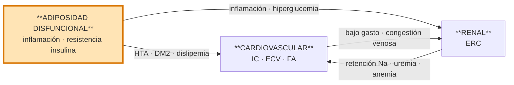

# Síndrome Cardiovascular-Renal-Metabólico (CRM)

## Definición

> *Entidad sistémica resultante de la interacción fisiopatológica multidireccional entre factores de riesgo metabólico, enfermedad renal crónica y sistema cardiovascular, que multiplican entre sí los riesgos de desarrollo y progresión de cada condición, además de aumentar el riesgo de eventos cardiovasculares y renales.*

Concepto definido por la **AHA 2023** y adaptado al SNS español en el consenso **Delphi CRM 2025**.

> [!warning] No confundir con Síndrome Cardiorrenal clásico (CRS)
> El **síndrome cardiorrenal** de Ronco (tipos 1-5) describe la interacción bidireccional corazón-riñón. El **CRM** es un concepto más amplio que añade la **esfera metabólica** (tejido adiposo disfuncional, prediabetes, DM2) como motor fisiopatológico inicial. Ambos coexisten — ver [[Síndrome Cardiorrenal]].

## Etiología (fisiopatología)

**Motor central**: el **exceso y/o disfuncionalidad del tejido adiposo** genera un estado proinflamatorio, pro-oxidativo y de resistencia a la insulina que acelera el daño metabólico, renal y cardiovascular.

La interacción es **multidireccional**: cada esfera acelera el deterioro de las otras dos, de modo que la carga combinada no es aditiva sino **multiplicativa**.

## Estadios AHA 0-4

| Estadio | Definición |
|---|---|
| **0** | Sin factores de riesgo CRM |
| **1** | Adiposidad en exceso y/o disfuncional |
| **2** | Factores de riesgo metabólicos y/o ERC de riesgo moderado-alto |
| **3** | ECV subclínica en paciente CRM |
| **4** | ECV clínica en paciente CRM |

El salto pronóstico mayor ocurre al pasar a **estadio 3** (ECV establecida).

## Diagnóstico

### Cribado — ¿a quién y cómo?

**A quién cribar**: a todo paciente con **≥ 1 factor de riesgo** asociado a cualquiera de las 3 condiciones CRM.

**Principio rector**: si existe **1 condición establecida**, investigar proactivamente las **otras 2**.

**Exploración física básica**:
- Presión arterial — ver [[Medición de la Presión Arterial]]
- IMC
- Circunferencia abdominal
- Auscultación cardiopulmonar
- Edemas periféricos

**Analítica básica**:
- Glucosa en ayunas
- **HbA1c**
- Perfil lipídico (CT, cLDL, cHDL, TG)
- **FGe** (CKD-EPI)
- Albúmina en orina — **CAC** (cociente albúmina/creatinina)
- **FIB-4** (índice de fibrosis hepática, como marcador de MASLD)

**Pruebas cardiacas**:
- **ECG** en todos los pacientes
- **Ecocardioscopia** si disponible en el punto de atención

Ver también: [[Diagnóstico de Hipertensión y Causas Secundarias]].

### Criterios diagnósticos de cada condición

| Condición | Criterio |
|---|---|
| **Cardiovascular** | ECV aterosclerótica, enfermedad coronaria, IC, FA o eventos subclínicos |
| **Renal** | **FGe < 60 mL/min/1.73 m²** *o* **CAC > 30 mg/g**, mantenidos ≥ 3 meses |
| **Metabólica** | Sobrepeso/obesidad, obesidad abdominal o tejido adiposo disfuncional (incluye prediabetes) ± otros factores de riesgo metabólicos |

## Tratamiento

### Manejo asistencial

- **Abordaje precoz e integral** desde la especialidad que recibe primero al paciente, independientemente del motivo de consulta o ingreso.
- **Objetivo global**: evitar progresión y retrasar complicaciones desde el inicio.
- **Circuitos integrados multiespecialidad** con respuesta ágil en interconsulta, evitando el peregrinaje del paciente.
- **Médico de familia**: **coordinador principal** entre niveles y especialidades.
- **Enfermería**: anamnesis, exploración básica, educación higiénico-dietética y seguimiento coordinado con el médico.
- **Telemedicina**: mejora el automanejo, la educación y la comunicación con el paciente.
- **Telemonitorización**: detección precoz de descompensaciones (IC, HTA, glucemia).
- **Registro clínico único** accesible por todos los especialistas implicados.
- **Educación** dirigida a población general, pacientes, profesionales y gestores. Concepto de **prevención primordial**: evitar que aparezcan los factores de riesgo antes de que se desarrollen.

### Intervenciones terapéuticas

**Prevención primordial**:
- Desde edades tempranas en individuos sanos.
- En pacientes con ≥ 1 FR, prevenir activamente los demás: sueño, salud mental, consumo de tabaco/alcohol/drogas, sedentarismo, patrón dietético.

**Abordaje integral intensivo**: se aplica **independientemente** de cuál condición CRM sea la manifiesta.

**Estilo de vida desde estadios tempranos**: actividad física, dieta cardiosaludable (mediterránea/DASH), reducción de sal, cese tabáquico.

**Pérdida ponderal intensiva**: indicada en **cualquier estadio**, incluso avanzados. Farmacoterapia + cirugía bariátrica cuando proceda.

**Farmacología**: según las guías de cada condición, priorizando fármacos con beneficio demostrado **CV + renal + metabólico**, desde estadios tempranos hasta avanzados y dentro de indicaciones autorizadas:

| Clase | Fichas del vault |
|---|---|
| **iSGLT2** | [[Empagliflozina]], [[Dapagliflozina]] |
| **arGLP-1 / agonistas duales** | [[Liraglutida]], [[Semaglutida]], [[Tirzepatida]] |
| **Estatinas + hipolipemiantes** | [[Atorvastatina]], [[Rosuvastatina]], [[Ezetimiba]] |
| **IECA / ARA-II** | [[Enalapril]], [[Losartán]], [[Valsartán]] |
| **ARM (antagonistas mineralocorticoides)** | [[Espironolactona]], [[Finerenona]] |

**Rehabilitación cardiaca**: indicada en **todos los pacientes CRM con evento CV**.

## Fuentes

- PDF local del consenso Delphi: [[DelphiCRM_interactivo_completo.pdf]]
- Marco conceptual: presidential advisory AHA 2023
- Guías relacionadas (índice completo en [[Guias_de_Referencia]]):
  - KDIGO 2024 (ERC)
  - ESC 2021 + Focused Update 2023 (IC)
  - SEMI 2023 (IC aguda)
  - ADA 2025 Standards of Care (DM2)
  - SEMI 2025 (DM2)

## Navegación

- [[000_INICIO]]
- [[MOC - CARDIOLOGIA]]
- [[MOC - NEFROLOGIA]]
- [[MOC - ENDOCRINO]]
- [[MOC - FARMACOS]]
- Ver también: [[Síndrome Cardiorrenal]] (CRS clásico de Ronco, concepto relacionado pero distinto)
