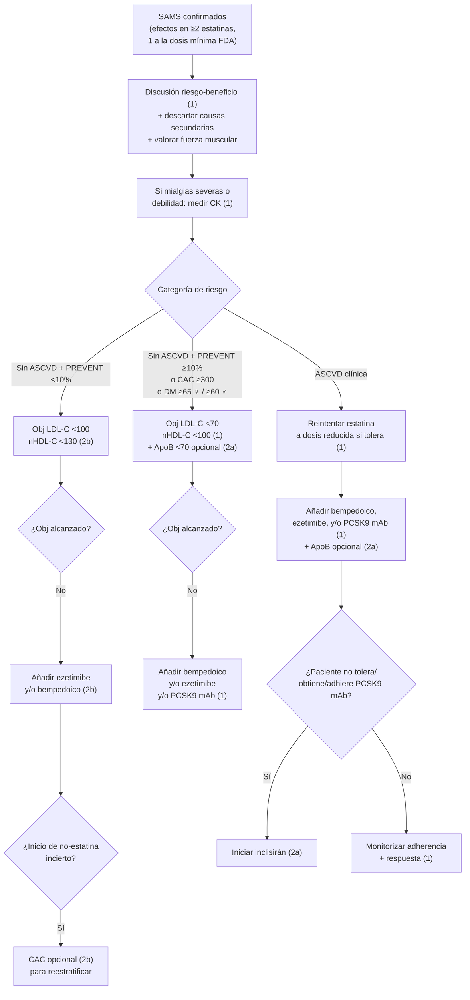

# Síntomas Musculares por Estatinas (SAMS)

**Concepto clave:** los **síntomas musculares atribuidos a estatinas (SAMS)** son la causa más frecuente de discontinuación de la LLT y de fallo en la prevención CV. La definición operativa AHA/ACC 2026 requiere **efectos adversos musculares con ≥2 estatinas, al menos 1 a la dosis mínima FDA-aprobada**. La etiología es heterogénea: estatina pura, **interacciones (DDI)**, ejercicio excesivo, miopatías primarias o metabólicas, y un componente significativo de **efecto nocebo / drucebo** (expectativa del paciente). El manejo se basa en **(1) confirmar SAMS verdadero** descartando causas secundarias, **(2) probar al menos 2 estatinas a dosis mínima** y **(3) reemplazar por o añadir** ezetimibe, ácido bempedoico, PCSK9 mAb o inclisirán según riesgo y objetivo LDL-C. La **rabdomiólisis** (CK >10× ULN + injuria renal) y la **miopatía necrotizante autoinmune (HMGCR Ab)** son raras pero requieren retirada permanente de la estatina.

---

## Definición y semiología

> [!info] Definición operativa AHA/ACC 2026
> Síntomas musculares (mialgia, debilidad, calambres) atribuidos a estatina con **≥2 estatinas distintas**, **al menos 1 a la dosis mínima FDA-aprobada**, **tras descartar causas secundarias** (Tabla 24).

### Características que sugieren etiología estatina-relacionada

| Característica | A favor de SAMS verdadero |
|---|---|
| **Patrón** | Bilateral, simétrico, proximal (muslos, hombros) |
| **Tipo** | Mialgia, calambres, debilidad |
| **Inicio** | Semanas tras inicio o aumento de dosis |
| **Resolución** | En semanas tras suspensión |
| **Recurrencia** | Reaparición al reintroducir la estatina |

### Clasificación de severidad

| Cuadro | CK | Hallazgos | Frecuencia |
|---|---|---|---|
| **Mialgia simple** | Normal | Dolor sin debilidad | **Frecuente** (~10% real-world) |
| **Miositis / miopatía** | >ULN, con síntomas | Mialgias + debilidad objetiva ± ↑ CK | Rara |
| **Rabdomiólisis** | **>10× ULN + injuria renal** | Debilidad severa + mioglobinuria + IRA | Muy rara (1/10.000-100.000) |
| **Miopatía necrotizante autoinmune** | Persistentemente alto | Debilidad + Ab anti-HMGCR + biopsia con necrosis | **Muy rara** |

> [!warning] Miopatía necrotizante autoinmune (HMGCR-mediada)
> Síndrome **distinto** al SAMS común: debilidad marcada + CK persistentemente alta **que NO se resuelve** al retirar la estatina, anticuerpos **anti-HMG-CoA reductasa**. Requiere **suspensión permanente de la estatina + inmunosupresión**. Sospechar si la miopatía persiste >2-4 sem tras discontinuación.

---

## Tabla 24 — Factores de riesgo de SAMS (AHA/ACC 2026 p 82)

| # | Factor |
|---|---|
| 1 | **Edad ≥65 años** |
| 2 | **IMC bajo** |
| 3 | **Sexo femenino** |
| 4 | Obesidad |
| 5 | **Hipotiroidismo** |
| 6 | **Diabetes** |
| 7 | Hepatopatía crónica |
| 8 | ERC |
| 9 | Consumo de alcohol |
| 10 | **Ejercicio vigoroso** (especialmente reciente) |
| 11 | **Estatina a dosis altas** dentro del rango aprobado |
| 12 | **Enfermedades asociadas a mialgia/debilidad**: fibromialgia, polimialgia reumática, polimiositis, miopatías primarias |
| 13 | **Fármacos que afectan al metabolismo de la estatina** — ver Tabla 8 en [[Tratamiento de la Dislipemia]] §Estatinas |
| 14 | **Variantes genéticas** (ej. **SLCO1B1** — ↑ exposición a simvastatina) |

> El riesgo se asocia a **dosis altas dentro del rango aprobado**, NO a la potencia inherente del fármaco — atorvastatina y rosuvastatina de alta intensidad NO tienen mayor riesgo intrínseco que las moderadas, pero las dosis máximas sí.

---

## Recomendaciones AHA/ACC 2026 (§4.2.11)

| # | Recomendación | COR/LOE |
|---|---|---|
| 1 | **Evaluación SAMS**: incluir descartar causas secundarias (Tabla 24); en mialgias severas o debilidad → **medir CK** | **COR 1, C-LD** |
| 2 | **Discusión riesgo-beneficio** acerca del riesgo CV de discontinuar la estatina + opciones alternativas para reducir ASCVD | **COR 1, B-R** |
| 3 | **ASCVD + SAMS** sin alcanzar objetivos: **estatina a dosis reducida (si tolerada)** + **bempedoico, ezetimibe y/o PCSK9 mAb** — solos o en combinación | **COR 1, B-R** |
| 4 | **Sin ASCVD + SAMS + alto riesgo** (PREVENT ≥10% **o** CAC ≥300 AU **o** ♀ ≥65 / ♂ ≥60 con DM): **bempedoico y/o ezetimibe** → LDL-C <70 / nHDL <100 | **COR 1, B-R** |
| 5 | **Sin ASCVD + SAMS + alto riesgo** (PREVENT ≥10% o CAC ≥300) sin alcanzar objetivos: **PCSK9 mAb** | **COR 1, B-R** |
| 6 | **ASCVD + SAMS** sin alcanzar objetivos con bempedoico ± ezetimibe: **inclisirán** razonable como alternativa a evolocumab/alirocumab si dosing menos frecuente o no tolera/obtiene/adhiere → LDL-C <55 / nHDL <85 | **COR 2a, B-NR** ⭐ Novedad 2026 |
| 7 | **Sin ASCVD + SAMS + borderline-intermedio** (PREVENT 3-<10%) con duda en el manejo + ezetimibe/bempedoico: **CAC scoring** razonable para reestratificar | **COR 2b, B-R** |
| 8 | **Sin ASCVD + SAMS + borderline-intermedio**: **ezetimibe y/o bempedoico** para LDL-C <100 / nHDL <130 | **COR 2b, B-NR** |

---

## Algoritmo SAMS (Fig 18 AHA/ACC 2026 p 84)

---

## Manejo práctico paso a paso

### 1. Antes de etiquetar como SAMS

> [!info] Pasos previos obligatorios
> 1. Descartar **ejercicio vigoroso reciente** o trauma muscular.
> 2. Descartar **enfermedades** que producen mialgia/debilidad (Tabla 24): hipotiroidismo, polimialgia reumática, fibromialgia, ERC, hepatopatía.
> 3. Revisar **DDI relevantes** (ver Tabla 8 [[Tratamiento de la Dislipemia]]): macrólidos, azoles, IP-VIH, amiodarona, diltiazem, verapamilo, ciclosporina, **gemfibrozilo (CONTRAINDICADO con cualquier estatina)**.
> 4. **Acknowledge concerns** del paciente — el efecto nocebo se reduce con explicación honesta del riesgo CV de discontinuación.

### 2. Probar al menos 2 estatinas a dosis mínima

> [!info] Estrategia secuencial
> - Probar **estatina A** a dosis mínima (ej. atorvastatina 10 mg).
> - Si síntomas: pausa 2-4 sem hasta resolución.
> - Probar **estatina B** distinta (ej. rosuvastatina 5 mg, pravastatina 40 mg, pitavastatina 1 mg — **menos interacciones CYP3A4**).
> - Considerar **dosing alterno** (rosuvastatina 5 mg LMV, etc.) si tolera mal a diario.
> - **Pitavastatina** y **pravastatina** son alternativas razonables por **mínimas interacciones CYP** y bajo riesgo de SAMS.

### 3. Si SAMS confirmado y no tolera ninguna estatina → reemplazo

| Categoría | Reemplazo |
|---|---|
| **ASCVD clínica** | **Bempedoico + ezetimibe** (combo CLEAR Outcomes ↓ LDL 38%, ↓ MACE) **+ PCSK9 mAb** si LDL-C aún ≥70 |
| **ASCVD + PCSK9 mAb no tolerado/obtenido/adhesión** | **Inclisirán** SC c/6 m (alternativa) |
| **Sin ASCVD + alto riesgo** (PREVENT ≥10%, CAC ≥300, DM ≥65/♂≥60) | **Bempedoico + ezetimibe** y, si no logra obj, **PCSK9 mAb** |
| **Sin ASCVD + bajo-borderline** (PREVENT <10%, sin enhancers) | **Ezetimibe ± bempedoico** + lifestyle |

### 4. Cuándo NO se recomienda discontinuar

> [!warning] Discontinuar estatina sin alternativa = decisión incorrecta
> - **No discontinuar la estatina sin plan terapéutico alternativo.**
> - El "drucebo effect" en RCTs sugiere que muchos pacientes mejoran al reintroducir la estatina con explicación del efecto nocebo.
> - **NO discontinuar** ante mialgias inespecíficas si el paciente es de alto riesgo CV.

---

## Suplementos y monitorización — qué NO hacer (§5.1)

> [!warning] COR 3 No Benefit
> 1. **Coenzima Q10 NO recomendada** para tratar/prevenir SAMS (sin evidencia, COR 3, B-R).
> 2. **Medición rutinaria de CK NO recomendada** en pacientes en estatina sin síntomas musculares severos (COR 3, A).
> 3. **Medición rutinaria de transaminasas NO recomendada** en pacientes en estatina sin síntomas sugestivos de hepatotoxicidad (COR 3, B-NR).

---

## Diabetes incidente y estatinas (§5.1)

> [!info] Riesgo conocido — no es indicación de discontinuar
> Las estatinas **↑ ligeramente el riesgo de progresión de prediabetes a DM2** en pacientes con factores predisponentes (especialmente con **estatina alta intensidad**). Cuantificación:
> - NND ≈ 33-100 (alta intensidad) por evento DM nuevo a 10 años.
> - **Beneficio CV supera al riesgo DM** en la inmensa mayoría de pacientes con indicación.
> - **NO discontinuar** la estatina por riesgo de DM en paciente con indicación clara.
> - DM inducida por estatina no parece tener peor curso CV que DM "natural".

---

## Tabla 25 — Seguridad por clase (resumen, AHA/ACC 2026 §5.1 p 86)

| Clase | Efectos comunes | Contraindicaciones | Punto clave |
|---|---|---|---|
| **Estatinas** | Mialgia (dosis-dependiente), CK ↑ leve | **Hepatopatía aguda descompensada**, embarazo, **lactancia** | Rabdomiólisis rara; **transaminitis >3× ULN rara**; cognición anecdótico postmarketing (no en RCTs); **embarazo es contraindicación** |
| **Ezetimibe** | Bien tolerado | Hipersensibilidad; **insuf. hepática moderada-severa** si combo con estatina | Transaminitis transitoria al combinar con estatina — monitorizar |
| **PCSK9 mAb** (Alirocumab, Evolocumab) | **Reacción local** sitio inyección | Hipersensibilidad al mAb | Hipersensibilidad/angioedema raros; **látex en envoltorio de algunas evolocumab dosis única** (alirocumab no contiene látex) |
| **Bempedoico** | Bien tolerado; ↑ ácido úrico, BUN, creatinina | Hipersensibilidad al fármaco/excipientes | **Monitorizar urato** si hiperuricemia preexistente |
| **Inclisirán** | Reacción sitio inyección | Hipersensibilidad | Hipersensibilidad / angioedema raros |
| **Resinas (BAS)** | **GI prominente**: dolor abdominal, distensión, diarrea, estreñimiento | **TG >500** (colesevelam), Hx pancreatitis HiperTG, obstrucción intestinal | Mala tolerancia + **DDI múltiples**; **↓ absorción de vitaminas liposolubles + folato**; **más segura en embarazo** |
| **Lomitapida** | GI (diarrea, vómitos), ↑ transaminasas, esteatosis hepática | **Embarazo**, CYP3A4 inhibidores, hepatopatía moderada-severa, transaminasas persistentemente alteradas | **REMS program** obligatorio; uso solo en HoFH |
| **Evinacumab** | Hipersensibilidad seria | Hx hipersensibilidad seria al fármaco | Embriotóxico; uso solo en HoFH; tasa de infusión ajustable |

---

## Educación al paciente — frases útiles

> [!info] Para reducir el efecto nocebo
> - "El dolor muscular puede no estar causado por la estatina — los estudios muestran que la mayoría tolera bien la estatina al reintroducirla con seguimiento."
> - "Los beneficios de prevenir un infarto/ictus superan claramente las molestias musculares pasajeras."
> - "Probemos otra estatina a dosis muy baja — si tolera, es muy probable que no sea SAMS verdadero."
> - "Si confirmamos SAMS, tenemos al menos 4 alternativas: ezetimibe, bempedoico, PCSK9 mAb e inclisirán — ningún paciente con riesgo CV tiene que renunciar al tratamiento."

---

## Notas hermanas

- [[Tratamiento de la Dislipemia]] — Tabla 8 interacciones farmacológicas.
- [[Dislipemia - Concepto y Cribado]] — definición, perfil lipídico.
- [[Estratificación de Riesgo Cardiovascular (PREVENT-ASCVD)]] — categorías de riesgo.
- [[Prevención Primaria de ASCVD]] — algoritmos por categoría de riesgo.
- [[Prevención Secundaria de ASCVD]] — diana <55 en very high risk.
- [[Hipertrigliceridemia y Lipoproteína(a)]]
- [[Atorvastatina]] · [[Rosuvastatina]] · [[Ezetimibe]] · [[Evolocumab]] · [[Inclisirán]]
- [[MOC - CARDIOLOGIA]]
