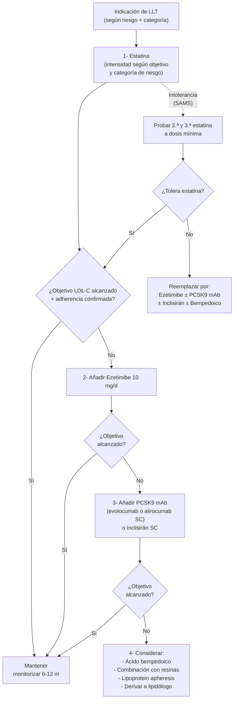

# Tratamiento de la Dislipemia

**Concepto clave:** el tratamiento de la dislipemia se construye sobre **2 pilares simultáneos**: (1) **estilo de vida** como base permanente (dieta, actividad física, peso, abstinencia de tabaco), y (2) **terapia hipolipemiante (LLT)** escalonada — **estatina como primera línea**, intensificada con **ezetimibe** si no se alcanzan objetivos LDL-C, después **PCSK9 mAb** o **inclisirán** (siRNA), y como alternativa **ácido bempedoico** o resinas. Para hipertrigliceridemia primaria con riesgo cardiovascular añadido, el agente que ha demostrado **reducción de eventos** es el **icosapent ethyl** (EPA puro). La **niacina** ha caído en desuso (CVOTs negativos). El **olezarsén** (ASO anti-apoC-III) es la novedad 2026 para FCS.

---

## Marco general — Lipoprotein Goals (Figure 1, AHA/ACC 2026 p 17)

> Los objetivos de **LDL-C, no-HDL-C y ApoB** se estratifican según la **categoría de riesgo del paciente**.

| Población | LDL-C / no-HDL-C / ApoB | Comentario |
|---|---|---|
| **Prevención primaria** PREVENT-ASCVD ≥10% | **<100 / <130 / <90 mg/dL** | Aplicar ApoB si TG 150-499 |
| Prevención primaria con clínica de mayor riesgo | <70 / <100 / <80 | |
| **Hipercolesterolemia severa** sin FH ni ASCVD | <100 / <130 / <90 | |
| **Hipercolesterolemia severa con FH, FRCV o aterosclerosis subclínica** | <70 / <100 / <80 | |
| **Hipercolesterolemia severa o HeFH con ASCVD clínica** | **<55 / <85 / <65** | |
| **DM sin modificadores de riesgo ASCVD** | <100 / <130 / <90 | |
| **DM con modificadores de riesgo ASCVD** | <70 / <100 / <80 | |
| **Aterosclerosis subclínica** CAC 1-99 (<p75) | <100 / <130 | |
| Aterosclerosis subclínica CAC 100-299 o ≥p75 (o 300-999) | <70 / <85 / <55 | |
| Aterosclerosis subclínica **CAC ≥1000** | **<55 / — / <55** | |
| **HiperTG <50 a sin enhancers** | (sin objetivo específico) | |
| HiperTG con ASCVD no muy alto riesgo | <70 / — / <70 | |
| HiperTG con ≥1 FRCV (40-75 a) | <70 | |
| HiperTG + ASCVD muy alto riesgo | **<55 / — / <55** | |
| **ASCVD clínica** no muy alto riesgo | **<70** (objetivo opcional <55 / <85 / <55) | |
| **ASCVD clínica muy alto riesgo** | **<55 / — / <55** | + ERC ⇒ todo |

> Ver detalle de prevención primaria en [[Prevención Primaria de ASCVD]] y secundaria en [[Prevención Secundaria de ASCVD]].

---

## Estilo de vida (§4.1)

### §4.1.1 Prevención primordial — niñez y vida adulta

> [!info] COR 1, A
> En niños y adultos sanos, **promover y reforzar de por vida hábitos saludables** (patrón dietético, actividad física, mantenimiento del peso, sueño, manejo del estrés y abstinencia de tabaco) para reducir el riesgo de dislipemia y ASCVD.

### §4.1.2 Patrón dietético para reducir LDL-C

> [!info] COR 1, B-R
> Dieta rica en **frutas, verduras, frutos secos, legumbres, granos integrales, fibra**, sustituyendo grasas **saturadas y trans** por **mono- y poliinsaturadas**.

| Patrón / componente | Reducción media de LDL-C |
|---|---|
| **Mediterránea** vs omnívora (16 sem) | ↓ 14,8 mg/dL |
| **Vegana / vegetariana** vs omnívora | ↓ 11,6 mg/dL |
| **Portfolio diet** (frutos secos + soja + fibra + esteroles) | ↓ 26 mg/dL |
| Frutos secos (1 ración/día) | ↓ 4,8 mg/dL |
| Avena (3 raciones/día = 28 g/d) | ↓ 5 mg/dL |

> Patrones sólidos: **Mediterránea, DASH, vegetariana / vegana**. Reducción adicional de saturadas y trans.

### §4.1.2.2 Estilo de vida en hipertrigliceridemia (Figura 2 AHA/ACC 2026 p 19)

| Parámetro | TG 150-499 | TG 500-999 | **TG ≥1000** |
|---|---|---|---|
| **Azúcares añadidos** (% calorías) | <6% | <5% | **Eliminar** |
| **Grasa total** (% calorías) | 30-35% | 20-25%‡ | **10-15%§** |
| **Alcohol** | Evitar | **Abstinencia completa** | **Abstinencia completa** |
| **Actividad física** | ≥150 min/sem moderada **+ 2 d/sem resistencia** | idem | idem |
| **Pérdida de peso** | 5-10% si sobrepeso/obesidad | idem | idem |

‡ Algunos pacientes con antecedente de pancreatitis pueden requerir 10-15%. § Limitación temporal hasta aclarar quilomicrones; suplementar vitaminas liposolubles y MCT.

> [!info] COR 1, B-NR (3 recomendaciones)
> 1. TG 500-999: dieta baja en azúcares + grasa moderada + sin alcohol — útil para reducir TG y prevenir pancreatitis.
> 2. TG ≥1000: dieta **muy baja en grasa** + sin azúcares simples + sin alcohol — reduce TG y prevención de pancreatitis.
> 3. TG ≥150 (no ayuno) o ≥175 (ayuno): pérdida de peso 5-10%, ejercicio aerobio + resistencia.

### §4.1.3 Peso

> [!info] COR 1, B-NR
> En sobrepeso u obesidad con dislipemia, **counseling y tratamiento para pérdida ≥5%**. Por kg perdido: TG ↓ ~4 mg/dL. Los **agonistas GLP-1** han mostrado efecto adicional sobre el perfil lipídico (más allá del peso), con beneficios CV en estudios CVOT.

### §4.1.4 Actividad física

> [!info] COR 1, B-R
> En dislipemia: **actividad aerobia moderada-vigorosa ≥150 min/sem** + **ejercicio de resistencia 2 d/sem**. Mejora HDL-C, ↓ TG, efecto modesto y variable sobre LDL-C.
> Meta-análisis 148 RCTs: HDL-C +2,1 mg/dL · LDL-C −7,2 mg/dL · TG −8,0 mg/dL.

### §4.1.5 Suplementos dietéticos

> [!warning] COR 3 No Benefit, B-R
> En dislipemia, los **suplementos dietéticos NO se recomiendan** para reducir LDL-C ni TG (datos limitados, beneficio inconsistente). Aceite de pescado **no prescripción**, ajo, cúrcuma, esteroles vegetales, levadura roja de arroz, berberina, canela: todos sin reducción significativa vs placebo. **Aceite de pescado en HiperTG: aumenta LDL-C** y riesgo de fibrilación auricular.
>
> Estudio SPORT: rosuvastatina 5 mg/d ↓ LDL-C 37,9% vs **0% para suplementos**.

### §4.1.6 Cuándo derivar a dietista (RDN)

| Recomendación | COR/LOE |
|---|---|
| TG ≥1000 mg/dL (11,3 mmol/L) → **terapia nutricional individualizada** por RDN | **COR 1, B-NR** |
| TG 500-999 mg/dL + síndrome CKM | **COR 2a, B-NR** |

---

## Farmacoterapia — Table 5 (resumen por clase)

### Hipolipemiantes LDL-C (§4.2.1.2)

| Clase | Mecanismo | Fármacos | Dosis | Vía / pauta | ↓ LDL-C esperada |
|---|---|---|---|---|---|
| **Estatinas** | Inhibe HMG-CoA reductasa → ↑ receptores LDL hepáticos | Atorva, Rosu, Sim, Prava, Lova, Fluva, Pitava | Ver Tabla 6 | Oral, 1×/d | **18-55%** según fármaco/dosis |
| **Inhibidor absorción** | Bloquea NPC1L1 (transportador esterol) intestinal y biliar | **Ezetimibe** | 10 mg | Oral, 1×/d | **18%** mono · **+25%** sumado a estatina |
| **PCSK9 mAb** | Anticuerpo monoclonal humano; bloquea PCSK9 circulante → ↓ degradación del receptor LDL | **Alirocumab** · **Evolocumab** | Aliro 75-150 mg c/2 sem o 300 mg c/4 sem · Evo 140 mg c/2 sem o 420 mg/mes | **SC** | **45-64%** (HoFH-LDLR variant: 21-31%) |
| **Inhibidor PCSK9 (siRNA)** | RNA interference → degrada mRNA PCSK9 hepático | **Inclisirán** | 284 mg | **SC** — inicio + 3 m + cada 6 m | **48-52%** (CVOT en curso) |
| **ATP-citrato liasa** | Inhibe la enzima upstream de HMG-CoA reductasa; **profármaco activado solo en hígado** (no efecto muscular) | **Ácido bempedoico** | 180 mg | Oral, 1×/d | **21-24%** mono · **+17-18%** con estatina |
| **Resinas** | Secuestran ác. biliares, ↑ conversión hepática colesterol→ác. biliares, ↑ receptor LDL | Colestiramina · Colesevelam · Colestipol | Cole 8-16 g · Coleseve 3,75 g · Coles 2-16 g | Oral, 1-2×/d | **10-27%** — limitadas por GI; ↑ TG (evitar si TG ≥300) |

### Hipolipemiantes LDL-C aprobados solo en HoFH

| Fármaco | Mecanismo | Dosis | Vía | ↓ LDL-C |
|---|---|---|---|---|
| **Lomitapida** | Inhibe MTP (microsomal TG transfer protein) → ↓ ensamblaje VLDL/quilomicrones con apoB | 5-60 mg/d | Oral | 40-50% |
| **Evinacumab-dgnb** | mAb anti-ANGPTL3 → ↑ aclaramiento VLDL remnants vía LDLR-independiente | 15 mg/kg cada 4 sem | **IV** | 49% |

### Hipolipemiantes triglicéridos (§4.2.1.3)

| Clase | Fármacos | Dosis | ↓ TG | Comentario |
|---|---|---|---|---|
| **Fibratos** (PPAR-α) | **Fenofibrato** 40-200 mg · **Fenofíbrico** 35-135 mg · **Gemfibrozilo** 600 mg | Oral 1-2×/d | **30-50%** | Primera línea en HiperTG severa (≥500). **Gemfibrozilo NO con estatina** (rabdomiólisis). Reducir dosis en ERC, evitar en ERC severa |
| **Omega-3 ác. grasos** | **Icosapent ethyl** 4 g · **Omega-3 ethyl esters (DHA+EPA)** 4 g | Oral con comida 1-2×/d | **15-61%** | **Icosapent ethyl** reduce eventos CV (REDUCE-IT, en DM2 + estatina con TG 150-499); EPA puro · **DHA puede ↑ LDL-C** (no apoB) |
| **Niacina** | ER 500-2000 mg · IR 250-6000 mg | Oral 1-3×/d | ER 10-30% · IR 20-50% | **CVOTs no muestran reducción de eventos** sumada a estatina. Última línea. Resistencia insulínica, flushing, hepatotoxicidad |
| **ASO anti-apoC-III** | **Olezarsén** | 80 mg | **SC mensual** | TG ↓ 30% (placebo-corrected 42,5%) | **Aprobado solo para FCS** ⭐ Novedad 2026 |

> Ver disponibilidad y dosificación local en las fichas de fármaco: [[Atorvastatina]] · [[Rosuvastatina]] · [[Ezetimibe]] · [[Evolocumab]] · [[Inclisirán]].

---

## Estatinas (§4.2.1.1)

### Tabla 6 — Intensidad de la estatina (AHA/ACC 2026 p 27)

| Intensidad | ↓ LDL-C esperada | Estatinas preferidas | Otras |
|---|---|---|---|
| **Alta** | **≥50%** | **Atorvastatina (40 mg) 80 mg** · **Rosuvastatina 20 mg (40 mg)** | — |
| **Moderada** | **30-49%** | Atorva 10 mg (20 mg) · Rosu (5 mg) 10 mg | Fluvastatina XL 80 mg, Fluvastatina 40 BID, Lovastatina 40 (80) mg, Pitavastatina 1-4 mg, Pravastatina 40 (80) mg, **Simvastatina 20-40 mg**‡ |
| **Baja** | **<30%** | — | Fluvastatina 20-40 mg, Lovastatina 20 mg, Pravastatina 10-20 mg, Simvastatina 10 mg |

‡ Simvastatina 80 mg: evaluada en RCT pero **NO recomendada por la FDA** (riesgo aumentado de miopatía y rabdomiólisis).

### Tabla 7 — Farmacocinética (resumen, AHA/ACC 2026 p 28)

| Estatina | Biodisp. % | t½ (h) | CYP | % renal | Lipofílica | Comentario clínico |
|---|---|---|---|---|---|---|
| **Atorvastatina** | 14 | 14 | 3A4 | <2 | Sí | Cualquier hora del día (vida media larga) — interacciones con macrólidos, azoles, IP-VIH |
| **Rosuvastatina** | 20 | 19 | 2C9 mínimo | 10 | No | Cualquier hora — **ajustar si CrCl <30** o cirrosis avanzada |
| **Pitavastatina** | 43-51 | 12 | 2C9, 2C8 | 15 | Sí | Mínimas interacciones (no 3A4); 1-4 mg |
| Pravastatina | 17 | 1,8 | Sin CYP | 20 | No | Buena en politerapia con CYP3A4 |
| Simvastatina | <5 | 2 | 3A4 | 13 | Sí | Múltiples interacciones; **80 mg fuera de uso** |
| Lovastatina | <5 | 2-3 | 3A4 | 10 | Sí | |
| Fluvastatina | 24 | 3 | 2C9 | 5 | Sí | |

### Tabla 8 — Interacciones farmacológicas relevantes (resumen)

> [!warning] Evitar con CUALQUIER estatina
> - **Gemfibrozilo** — combinación con cualquier estatina aumenta riesgo de rabdomiólisis.

> [!info] Estrategias de mitigación con estatina (cambio de estatina, dosis menor, monitorización)
> - **Macrólidos:** claritromicina, eritromicina, telitromicina
> - **Azoles antifúngicos:** ketoconazol, itraconazol, fluconazol, posaconazol, voriconazol
> - **IP-VIH y antivirales:** atazanavir/ritonavir, darunavir/ritonavir, lopinavir/ritonavir, saquinavir/ritonavir, tipranavir/ritonavir, fosamprenavir, nelfinavir, **nirmatrelvir/ritonavir (Paxlovid)**, boceprevir, telaprevir, cobicistat
> - **Antiarrítmicos:** amiodarona, dronedarona, ranolazina
> - **Antagonistas Ca:** **diltiazem, verapamilo, amlodipino**
> - **Inmunosupresores:** ciclosporina, danazol
> - **Otros:** colchicina, niacina ≥1 g/d, fenofibrato, fenofíbrico, lomitapida, nefazodona, rifampicina, warfarina

> Ascendencia este-asiática → mayor susceptibilidad a efectos adversos de estatinas (especialmente rosuvastatina): **iniciar a la mitad de dosis**.

> Ver [[Síntomas Musculares por Estatinas (SAMS)]] para manejo de mialgias / intolerancia.

---

## Algoritmo escalonado en LDL-C primaria (§4.2.1.2)

> Detalle por categoría de riesgo en [[Prevención Primaria de ASCVD]] y [[Prevención Secundaria de ASCVD]].

---

## Hipertrigliceridemia y FCS (§4.2.1.3 + Capítulo 4.2.6)

> Ver desarrollo completo en [[Hipertrigliceridemia y Lipoproteína(a)]].

**Esquema rápido por nivel de TG:**

| TG (mg/dL) | Estrategia | Fármacos clave |
|---|---|---|
| **150-499** | LLT-objetivo si ASCVD/DM2; **estatina** primero (↓ TG 10-30%) | Si ASCVD + TG 150-499 + LDL óptimo: **icosapent ethyl** 4 g/d (REDUCE-IT) |
| **500-999** | Reducir riesgo de pancreatitis + intensificar lifestyle | **Fenofibrato/fenofíbrico** o **omega-3 prescripción** |
| **≥1000** | **Riesgo pancreatitis agudo** — ingreso si síntomas; lifestyle muy restrictivo | **Fibratos + omega-3**; valorar **olezarsén** si FCS confirmado |
| **FCS** (LPL deficiency) | Crónico, reducción dietética estricta | **Olezarsén 80 mg SC mensual** ⭐ Novedad 2026; insuficiencia LPL hace fibratos/omega-3 menos eficaces |

---

## Cuándo derivar al lipidólogo (Tabla 9, AHA/ACC 2026 p 28)

> [!info] Considerar derivación si...
> - **HF (familiar) sospechada o confirmada** — HoFH siempre, HeFH si no logra objetivo en estatina máxima + no-estatina, HeFH con SAMS en ≥2 estatinas.
> - **ASCVD prematura** (<40 a) o muy alto riesgo no controlado.
> - **Lp(a) ≥200 nmol/L o ≥75 mg/dL**.
> - **<40 a + DM + dislipemia**.
> - **Régimen farmacológico complejo** (oncológico, VIH, postransplante).
> - **Embarazo / lactancia / planificación**.
> - **HiperTG ≥400 mg/dL** persistente.
> - **Hipertrigliceridemia severa/extrema** primaria sin causa secundaria.
> - Candidatos a **evinacumab, lomitapida, olezarsén, lipoprotein apheresis**.
> - Pacientes que requieren **test genético** para diagnóstico.

---

## Monitorización y seguimiento

> **COR 1, A**: perfil lipídico **4-12 sem post-inicio o cambio de LLT**, después **cada 6-12 meses**.
>
> Si no alcanza objetivos: revisar adherencia → intensificar dosis → añadir agente no-estatina (ezetimibe → PCSK9 mAb / inclisirán → bempedoico).

> [!info] Inercia terapéutica
> El **fallo en intensificar la LLT** cuando está indicada es la barrera más prevalente para alcanzar objetivos LDL-C. La medición regular del perfil lipídico es la mejor herramienta para combatirla.

---

## Causas secundarias modificables (descartar antes de "fallo de LLT")

- Endocrinas: hipotiroidismo (clásica), DM2 mal controlada, Cushing.
- Renales: ERC (sobre todo SN), síndrome nefrótico.
- Hepáticas: colestasis, MASLD/MASH.
- Fármacos: corticoides, anabolizantes, antirretrovirales (IP), inmunosupresores, tiazidas a dosis altas, retinoides, antipsicóticos atípicos.
- Estilo de vida: alcohol (TG↑), obesidad, dieta rica en saturadas/azúcares.

> Ver detalle en [[Dislipemia - Concepto y Cribado]].

---

## Notas hermanas

- [[Dislipemia - Concepto y Cribado]] — definición, cribado, perfil lipídico, ApoB, Lp(a).
- [[Estratificación de Riesgo Cardiovascular (PREVENT-ASCVD)]] — riesgo a 10/30 años, risk enhancers, CAC.
- [[Prevención Primaria de ASCVD]] — algoritmo §4.2.3.7.
- [[Prevención Secundaria de ASCVD]] — diana LDL-C <55, very high risk.
- [[Hipertrigliceridemia y Lipoproteína(a)]] — TG ≥150 / Lp(a) ≥125 nmol/L.
- [[Síntomas Musculares por Estatinas (SAMS)]] — algoritmo de intolerancia.
- [[SCA - Manejo Hospitalario y Prevención Secundaria]] — LLT post-SCA.
- [[Síndrome Cardiovascular-Renal-Metabólico]]
- [[Atorvastatina]] · [[Rosuvastatina]] · [[Ezetimibe]] · [[Evolocumab]] · [[Inclisirán]]
- [[MOC - CARDIOLOGIA]] · [[MOC - FARMACOS]]
