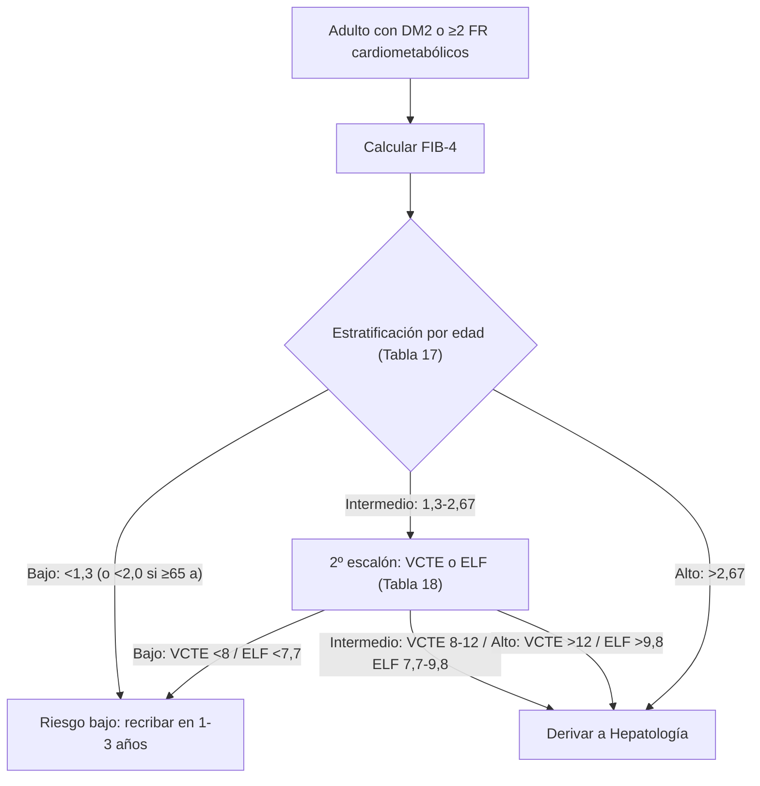

> [!info] Terminología
> **MASLD** (Metabolic dysfunction-Associated Steatotic Liver Disease) reemplaza los términos antiguos **NAFLD/EHGNA** ("hígado graso no alcohólico"). **MASH** (Metabolic dysfunction-Associated Steatohepatitis, antes NASH) es la forma grave con inflamación y daño hepatocelular.

> [!danger] ⚡ Guardia
> - **A quién cribar:** todo paciente con DM2 o con ≥2 factores de riesgo cardiometabólico → calcular **FIB-4**.
> - **Fórmula FIB-4:** $\frac{\text{Edad} \times \text{AST}}{\text{Plaquetas} \times \sqrt{\text{ALT}}}$ (edad en años, transaminasas en U/L, plaquetas en ×10⁹/L).
> - **Lo que predice el desenlace es el estadio de fibrosis**, no la esteatosis en sí.
> - **Tratamiento base:** pérdida de peso **≥10 %** (la del estilo de vida ± fármacos GLP-1 / cirugía metabólica).

## 1. Concepto

La **MASLD** es el componente hepático del [[Síndrome Cardiovascular-Renal-Metabólico]] (CKM): el depósito ectópico de grasa en el hígado asociado a disfunción metabólica (obesidad, resistencia a la insulina, DM2, dislipemia, HTA).

- Es un **factor de riesgo cardiovascular independiente**, no solo un marcador.
- El pronóstico hepático y cardiovascular se relaciona con el **estadio de fibrosis**, que es el predictor de desenlaces (cirrosis, descompensación, eventos CV), no con el grado de esteatosis.

## 2. Cribado: FIB-4

El cribado se hace con el índice **FIB-4**, calculado a partir de datos rutinarios (edad, AST, ALT, plaquetas):

$$\text{FIB-4} = \frac{\text{Edad (años)} \times \text{AST (U/L)}}{\text{Plaquetas (×10}^9\text{/L)} \times \sqrt{\text{ALT (U/L)}}}$$

**Limitaciones:** no es fiable en procesos agudos (hepatitis aguda, etc.) ni en menores de 35 años.

### Recomendaciones de cribado

| Recomendación | COR | LOE |
|---|---|---|
| Calcular FIB-4 cada 1-2 años en adultos con DM2 o con ≥2 factores de riesgo cardiometabólico | 1 | B-NR |
| Considerar FIB-4 cada 2-3 años en adultos con prediabetes | 2a | C-LD |

### Interpretación del FIB-4 por edad (Tabla 17)

| Edad | Bajo riesgo | Indeterminado | Alto riesgo |
|---|---|---|---|
| < 65 años | < 1,3 | 1,3 – 2,67 | > 2,67 |
| ≥ 65 años | < 2,0 | 2,0 – 2,67 | > 2,67 |

### Segundo escalón si FIB-4 indeterminado o alto (Tabla 18)

| Prueba | Bajo riesgo | Intermedio | Alto riesgo |
|---|---|---|---|
| **VCTE** (elastografía, kPa) | < 8 | 8 – 12 | > 12 |
| **ELF** (Enhanced Liver Fibrosis) | < 7,7 | 7,7 – 9,8 | > 9,8 |

> [!note] Caveats del 2º escalón
> - La **VCTE** pierde fiabilidad con **IMC ≥ 40** kg/m².
> - Requiere **ayuno ≥ 3 h** antes de la elastografía.

### Algoritmo de cribado

## 3. Tratamiento

La base es la **pérdida de peso**: una reducción **≥10 %** del peso corporal mejora la histología hepática (esteatosis, inflamación y fibrosis). Pérdidas más modestas del **3-5 %** ya reducen la esteatosis, pero el objetivo para impactar en inflamación/fibrosis es ≥10 %.

| Recomendación | COR | LOE |
|---|---|---|
| Pérdida de peso ≥10 % mediante estilo de vida ± fármacos para tratar la MASLD/MASH | 1 | B-R |
| Estatinas son seguras en MASLD/MASH (incluso con transaminasas elevadas) y deben usarse según riesgo CV | 1 | B-R |

### Escalones terapéuticos

1. **Estilo de vida:** dieta hipocalórica + ejercicio, objetivo de pérdida ponderal ≥10 % (3-5 % ya reduce esteatosis).
2. **Fármacos GLP-1:** la [[Semaglutida]] ha mostrado beneficio en **MASH con fibrosis F2-F3**.
3. **Cirugía metabólica (MBS):** opción en obesidad con MASLD/MASH que cumple criterios.
4. **Resmetirom:** agonista selectivo del receptor tiroideo β, aprobado para **MASH con fibrosis F2-F3**. → *Por crear: [[Resmetirom]]*.
5. **Estatinas:** seguras en MASLD/MASH; usar según riesgo CV ([[Atorvastatina]], [[Rosuvastatina]]). No suspender por transaminasas elevadas atribuibles a la esteatosis.

## Enlaces del Vault

- [[Síndrome Cardiovascular-Renal-Metabólico]]
- [[Hipertransaminasemia]]
- [[Diabetes Mellitus tipo 2]]
- [[Obesidad (manejo CKM)]]
- [[Semaglutida]]
- [[Atorvastatina]]
- [[Rosuvastatina]]
- [[000_INICIO]]
- [[MOC - DIGESTIVO]]

## Bibliografía

Ndumele CE, Rodriguez F, Dixon DL, et al. **2026 AHA/ACC/ADA/ASN Guideline for the Prevention, Detection, Evaluation, and Management of Cardiovascular-Kidney-Metabolic Syndrome.** *Circulation*. 2026;153:e00-e00. DOI: 10.1161/CIR.0000000000001453
