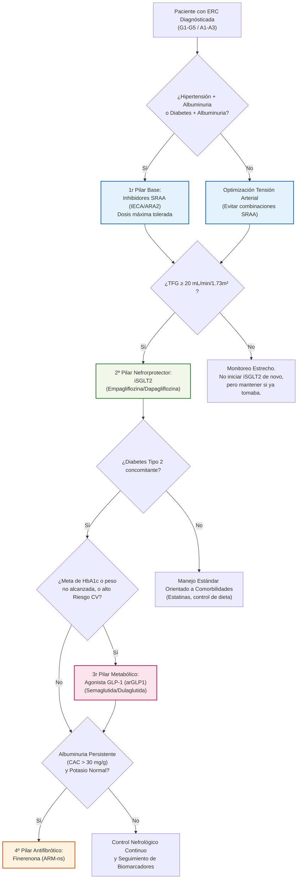

# ERC: Fármacos Modificadores de la Enfermedad (Los "4 Pilares" Nefrorprotectores)

**Basado en:** *Novedades Estrella Guía KDIGO 2024*

La nueva guía revoluciona el manejo al establecer terapias específicas que ralentizan drásticamente la caída del filtrado glomerular (TFG) e impiden la entrada en diálisis, independientemente del control de la presión arterial u otras metas glucométricas. Se basa en una terapia de capas múltiples.

## 💊 1. Inhibidores del SRAA (IECA / ARA-II)
El eslabón clásico de base. Reducen la presión intraglomerular dilatando la arteriola eferente (bajando la proteinuria).
- **Indicación Absoluta:** Pacientes con ERC + HTA + **Albuminuria moderada-grave (G1-G4, A3 o A2 con diabetes)**.
- **Contraindicación:** Nunca combinar IECA + ARA-II entre ellos.
- **Precauciones:** Es esperable un descenso inicial de la TFG (hasta un 15-30%) de forma funcional. **Solo retirar si** hay [[Hiperpotasemia]] incontrolable o la caída en TFG es sostenida o mayor del 30% en 4 semanas (descartar Estenosis Bilateral Arterias Renales). Se debe subir a la dosis máxima tolerada del prospecto, ¡no a las dosis estándar!

## 🌟 2. iSGLT2 (Inhibidores del Cotransportador Sodio-Glucosa tipo 2)
Son el cambio de paradigma principal de la última década neurológica. (Ej. *Dapagliflozina, Empagliflozina*). Restauran el *feed-back tubuloglomerular*, disminuyen fuertemente el trabajo de la nefrona e inducen balance negativo de oxígeno/energía.
- **Indicación KDIGO 2024:**
  - **Recomendación fuerte:** En ERC e Insuficiencia Cardíaca (IC), o en paciente diabético tipo 2 con ERC asociado (TFG ≥ 20).
  - **Recomendación fuerte:** En ERC **SIN diabetes** pero con excreción de albúmina elevada (CAC/ACR ≥ 200 mg/g) y TFG ≥ 20 mL/min/1,73m².
- **Instrucción de Mantenimiento:** Una vez iniciados (si TFG era > 20), **no deben suspenderse** aunque la TFG caiga por debajo de 20 a lo largo del paso de los años, el paciente debe seguir tomándolo hasta iniciar terapia renal sustitutiva o dialisis.
- **Efecto adverso a vigilar:** Infecciones micóticas genitales, Cetoacidosis Normoglucémica (pausar en situaciones de estrés físico agudo, cirugía o ayuno prolongado).

## 🩺 3. arGLP-1 (Agonistas del Receptor de GLP-1)
Además del brutal control de peso y glucémico, los arGLP-1 (Ej. *Semaglutida, Liraglutida, Dulaglutida*) han demostrado reducir los eventos cardiovasculares mayores (MACE) de forma masiva en pacientes renales y proteger frente a la caída del filtrado.

> [!tip] Novedad Top-Tier: Ensayo FLOW (NEJM Mayo 2024)
> El macroensayo clínico FLOW demostró por primera vez que la **Semaglutida** reduce específicamente el riesgo de progresión de la enfermedad renal o muerte (CV/Renal) en un **24%** en pacientes diabéticos tipo 2 con ERC. Lo consolida como un potente *nefroprotector primario directo* más allá de su simple efecto adelgazante o metabólico.

- **Indicación:** Pacientes con ERC y **Diabetes Tipo 2** que no alcanzan objetivos glucémicos a pesar de metformina e iSGLT2, o para aquellos para los que estos están contraindicados. 
- Múltiples formulaciones inyectables semanales. Promueven gran pérdida de peso y pueden llegar hasta TFG bajas (algunos hasta TFG de 15).

## 🧫 4. ARM-ns (Antagonistas del Receptor Mineralocorticoide No Esteroideos)
La **Finerenona** emerge como un potente antiinflamatorio renal y anti-fibrótico. Al contrario que la Espironolactona (esteroideo), su acción no desencadena altas tasas críticas funcionales ni hormonales severas, siendo más específico el bloqueo sobre la sobreactivación mineralocorticoide perjudicial en la ERC diabética.
- **Indicación KDIGO 2024:**
  - Pacientes adultos con **Diabetes Tipo 2**, **TFG > 25** y **Albuminuria persistente** (A2/A3, CAC > 30 mg/g) a pesar del tratamiento con dosis máximas de RASi.
  - El uso de iSGLT2 simultáneo y previo a ARMns reduce el modesto riesgo de [[Hiperpotasemia]] asociado con la Finerenona, confirmando su rol como "tercer pilar aditivo".

### 💡 Algoritmo Visual: Pilares de Tratamiento ERC (KDIGO 2024)

> **Nota Clínica de Escalado**: El algoritmo no es secuencial excluyente tras el Pilar 2. Los cuatro fármacos muestran beneficios **aditivos y sinérgicos**. El uso de iSGLT2 protege contra el principal efecto adverso de la finerenona (la [[Hiperpotasemia]]), por lo que combinarlos es ideal en pacientes diabéticos proteinúricos refractarios. 
> *Actualización Consenso ADA/KDIGO 2024:* Ya **no se recomienda esperar meses** para escalar ciegamente de un pilar a otro (step-care obsoleto). Si el paciente tiene alto riesgo o albuminuria franca (A3), el consenso exige abogar por arrancar directamente con una **Doble Terapia simultánea** (IECA/ARAII + iSGLT2) o escalar rápidamente a la **Triple Terapia** sumando Finerenona temprana para abortar la caída irreversible de nefronas.

## 📊 5. Ensayos Pivote en Nefroprotección

Tabla resumen de los macroensayos que sustentan la jerarquía terapéutica KDIGO 2024:

| Ensayo | Población (n) | Fármaco | Outcome primario | **HR (IC 95%)** | DOI |
|---|---|---|---|---|---|
| **CREDENCE** (2019) | DM2 + ERC + macroalbuminuria (n=4.401) | Canagliflozina 100 mg | Progresión renal + muerte CV/renal | **0,70 (0,59-0,82)** | `10.1056/NEJMoa1811744` |
| **DAPA-CKD** (2020) | ERC ± DM2, TFGe 25-75 (n=4.304) | Dapagliflozina 10 mg | Progresión renal + muerte CV/renal | **0,61 (0,51-0,72)** | `10.1056/NEJMoa2024816` |
| **EMPA-KIDNEY** (2023) | ERC ± DM2, TFGe 20-45 o 45-90 + ACR ≥200 (n=6.609) | Empagliflozina 10 mg | Progresión renal + muerte CV | **0,72 (0,64-0,82)** | `10.1056/NEJMoa2204233` |
| **FIDELIO-DKD** (2020) | DM2 + ERC A2-A3, TFGe 25-75 (n=5.734) | Finerenona | Progresión renal + muerte renal | **0,82 (0,73-0,93)** | `10.1056/NEJMoa2025845` |
| **FIGARO-DKD** (2021) | DM2 + ERC (TFGe hasta 60+A3) (n=7.437) | Finerenona | Muerte CV + eventos CV no fatales | **0,87 (0,76-0,98)** | `10.1056/NEJMoa2110956` |
| **FIDELITY** (meta 2022) | FIDELIO+FIGARO combinados (n=13.026) | Finerenona | Progresión renal + muerte CV | **0,77 (0,67-0,88)** | `10.1093/eurheartj/ehab777` |
| **FLOW** (2024) | DM2 + ERC A2-A3 (n=3.533) | Semaglutida 1 mg/sem SC | Progresión renal + muerte CV/renal | **0,76 (0,66-0,88)** | `10.1056/NEJMoa2403347` |

**Lectura transversal:**
- **RRR típica de iSGLT2:** 28-39 % (DAPA-CKD el más potente, EMPA-KIDNEY el más amplio).
- **RRR de finerenona:** 18-23 % (modesta pero **aditiva** sobre iSGLT2).
- **RRR de GLP-1 (FLOW):** 24 % — primer GLP-1 con endpoint renal primario positivo.
- **Efecto de clase iSGLT2** validado **con y sin DM**, con TFGe tan bajo como 20 (EMPA-KIDNEY) o 25 (DAPA-CKD).

## 🧂 6. Quelantes de K⁺ — preservar terapias pronósticas en hiperK crónica

La **hiperpotasemia** limita el uso óptimo de IECA/ARA-II, ARM y finerenona — pilares pronósticos en ERC. Los quelantes modernos permiten **mantener esas terapias** en lugar de suspenderlas.

> [!tip] Principio operativo (ensayo DIAMOND 2022)
> Patiromer permite titular y mantener ARM/ARNI en HF+ERC sin hiperK limitante. **Suspender el pilar pronóstico ante K⁺ 5,5-5,9 mmol/L es error clásico** — el paso correcto es añadir quelante crónico si la hiperK persiste pese a dieta + optimización diurética.

| Quelante | Mecanismo | Dosis | Inicio de acción | Vía/uso | Pros | Contras |
|---|---|---|---|---|---|---|
| **Resinsodio / Resincalcio** (polisulfonato de poliestireno) | Intercambia K⁺ por Na⁺ o Ca²⁺ en colon | 15-60 g vo / día | 4-6 h (crónico) | Agudo y crónico | Barato, disponible | Estreñimiento grave, raramente necrosis colónica (especialmente con sorbitol), sobrecarga de Na⁺/Ca²⁺, palatabilidad mala |
| **Patiromer** (Veltassa®) | Intercambia K⁺ por **Ca²⁺** en tracto GI distal | 8,4-25,2 g vo / día (polvo) | ~7 h (no para hiperK aguda) | **Crónico** | Permite mantener ARNI/ARM (ensayos OPAL-HK, AMBER, DIAMOND). No aumenta Na⁺ | Puede ↓ Mg²⁺. Interacciones con fármacos GI: separar ≥ 3 h |
| **Ciclosilicato de zirconio** (Lokelma®) | Cristal inorgánico que atrapa K⁺ selectivamente a cambio de Na⁺ y H⁺ | 5-10 g vo / día (mantenimiento) | **1-2 h** (el más rápido oral) | Agudo-crónico | Rapidez y selectividad. Útil en hiperK leve-moderada urgente | Aporta **~400 mg Na⁺** por dosis de 10 g → riesgo edema/IC descompensada. Edema en ~2-6 % |

### Indicaciones prácticas

| Escenario | Estrategia |
|---|---|
| **K⁺ 5,5 agudo sin cambios ECG en paciente con ARNI/iSGLT2/finerenona** | Revisar causas (dieta, AINE, KCl, acidosis, deshidratación). Optimizar diurético. Añadir quelante crónico (patiromer o ZS-9). Mantener pilares pronósticos. |
| **K⁺ ≥ 6 con cambios ECG (hiperK aguda grave)** | Tratamiento agudo (calcio IV + insulina-glucosa + β2 + bicarbonato si acidosis) + **ciclosilicato Zr** oral en dosis de ataque. Considerar diálisis si refractario. Retirar temporalmente iSRAA/ARM. |
| **K⁺ 4,9 en paciente ERC A3 con DM2 candidato a finerenona** | Iniciar finerenona con vigilancia (K⁺ a 2 y 4 semanas). iSGLT2 previo protege del ↑K⁺ por finerenona. |
| **Estreñimiento severo o intolerancia a resinas clásicas** | Cambiar a patiromer o ZS-9. |
| **IC descompensada con congestión + hiperK** | **Evitar ciclosilicato Zr** (carga de Na⁺); preferir patiromer. |

> [!warning] Nunca solo el quelante
> El quelante **trata la consecuencia, no la causa**. Siempre buscar y corregir: dieta alta en K⁺ (plátano, frutos secos, chocolate, sal de régimen con KCl), AINE ocultos, trimetoprim, suplementos, deshidratación, estreñimiento, acidosis metabólica, hipoaldosteronismo, rabdomiólisis.
