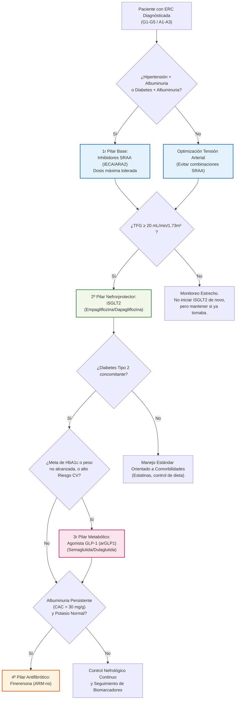

# ERC: Fármacos Modificadores de la Enfermedad (Los "4 Pilares" Nefrorprotectores)

**Basado en:** *Novedades Estrella Guía KDIGO 2024*

La nueva guía revoluciona el manejo al establecer terapias específicas que ralentizan drásticamente la caída del filtrado glomerular (TFG) e impiden la entrada en diálisis, independientemente del control de la presión arterial u otras metas glucométricas. Se basa en una terapia de capas múltiples.

## 💊 1. Inhibidores del SRAA (IECA / ARA-II)
El eslabón clásico de base. Reducen la presión intraglomerular dilatando la arteriola eferente (bajando la proteinuria).
- **Indicación Absoluta:** Pacientes con ERC + HTA + **Albuminuria moderada-grave (G1-G4, A3 o A2 con diabetes)**.
- **Contraindicación:** Nunca combinar IECA + ARA-II entre ellos.
- **Precauciones:** Es esperable un descenso inicial de la TFG (hasta un 15-30%) de forma funcional. **Solo retirar si** hay [[Hiperpotasemia]] incontrolable o la caída en TFG es sostenida o mayor del 30% en 4 semanas (descartar Estenosis Bilateral Arterias Renales). Se debe subir a la dosis máxima tolerada del prospecto, ¡no a las dosis estándar!

## 🌟 2. iSGLT2 (Inhibidores del Cotransportador Sodio-Glucosa tipo 2)
Son el cambio de paradigma principal de la última década neurológica. (Ej. *Dapagliflozina, Empagliflozina*). Restauran el *feed-back tubuloglomerular*, disminuyen fuertemente el trabajo de la nefrona e inducen balance negativo de oxígeno/energía.
- **Indicación KDIGO 2024:**
  - **Recomendación fuerte:** En ERC e Insuficiencia Cardíaca (IC), o en paciente diabético tipo 2 con ERC asociado (TFG ≥ 20).
  - **Recomendación fuerte:** En ERC **SIN diabetes** pero con excreción de albúmina elevada (CAC/ACR ≥ 200 mg/g) y TFG ≥ 20 mL/min/1,73m².
- **Instrucción de Mantenimiento:** Una vez iniciados (si TFG era > 20), **no deben suspenderse** aunque la TFG caiga por debajo de 20 a lo largo del paso de los años, el paciente debe seguir tomándolo hasta iniciar terapia renal sustitutiva o dialisis.
- **Efecto adverso a vigilar:** Infecciones micóticas genitales, Cetoacidosis Normoglucémica (pausar en situaciones de estrés físico agudo, cirugía o ayuno prolongado).

## 🩺 3. arGLP-1 (Agonistas del Receptor de GLP-1)
Además del brutal control de peso y glucémico, los arGLP-1 (Ej. *Semaglutida, Liraglutida, Dulaglutida*) han demostrado reducir los eventos cardiovasculares mayores (MACE) de forma masiva en pacientes renales y proteger frente a la caída del filtrado.

> [!tip] Novedad Top-Tier: Ensayo FLOW (NEJM Mayo 2024)
> El macroensayo clínico FLOW demostró por primera vez que la **Semaglutida** reduce específicamente el riesgo de progresión de la enfermedad renal o muerte (CV/Renal) en un **24%** en pacientes diabéticos tipo 2 con ERC. Lo consolida como un potente *nefroprotector primario directo* más allá de su simple efecto adelgazante o metabólico.

- **Indicación:** Pacientes con ERC y **Diabetes Tipo 2** que no alcanzan objetivos glucémicos a pesar de metformina e iSGLT2, o para aquellos para los que estos están contraindicados. 
- Múltiples formulaciones inyectables semanales. Promueven gran pérdida de peso y pueden llegar hasta TFG bajas (algunos hasta TFG de 15).

## 🧫 4. ARM-ns (Antagonistas del Receptor Mineralocorticoide No Esteroideos)
La **Finerenona** emerge como un potente antiinflamatorio renal y anti-fibrótico. Al contrario que la Espironolactona (esteroideo), su acción no desencadena altas tasas críticas funcionales ni hormonales severas, siendo más específico el bloqueo sobre la sobreactivación mineralocorticoide perjudicial en la ERC diabética.
- **Indicación KDIGO 2024:**
  - Pacientes adultos con **Diabetes Tipo 2**, **TFG > 25** y **Albuminuria persistente** (A2/A3, CAC > 30 mg/g) a pesar del tratamiento con dosis máximas de RASi.
  - El uso de iSGLT2 simultáneo y previo a ARMns reduce el modesto riesgo de [[Hiperpotasemia]] asociado con la Finerenona, confirmando su rol como "tercer pilar aditivo".

### 💡 Algoritmo Visual: Pilares de Tratamiento ERC (KDIGO 2024)

> **Nota Clínica de Escalado**: El algoritmo no es secuencial excluyente tras el Pilar 2. Los cuatro fármacos muestran beneficios **aditivos y sinérgicos**. El uso de iSGLT2 protege contra el principal efecto adverso de la finerenona (la [[Hiperpotasemia]]), por lo que combinarlos es ideal en pacientes diabéticos proteinúricos refractarios. 
> *Actualización Consenso ADA/KDIGO 2024:* Ya **no se recomienda esperar meses** para escalar ciegamente de un pilar a otro (step-care obsoleto). Si el paciente tiene alto riesgo o albuminuria franca (A3), el consenso exige abogar por arrancar directamente con una **Doble Terapia simultánea** (IECA/ARAII + iSGLT2) o escalar rápidamente a la **Triple Terapia** sumando Finerenona temprana para abortar la caída irreversible de nefronas.
