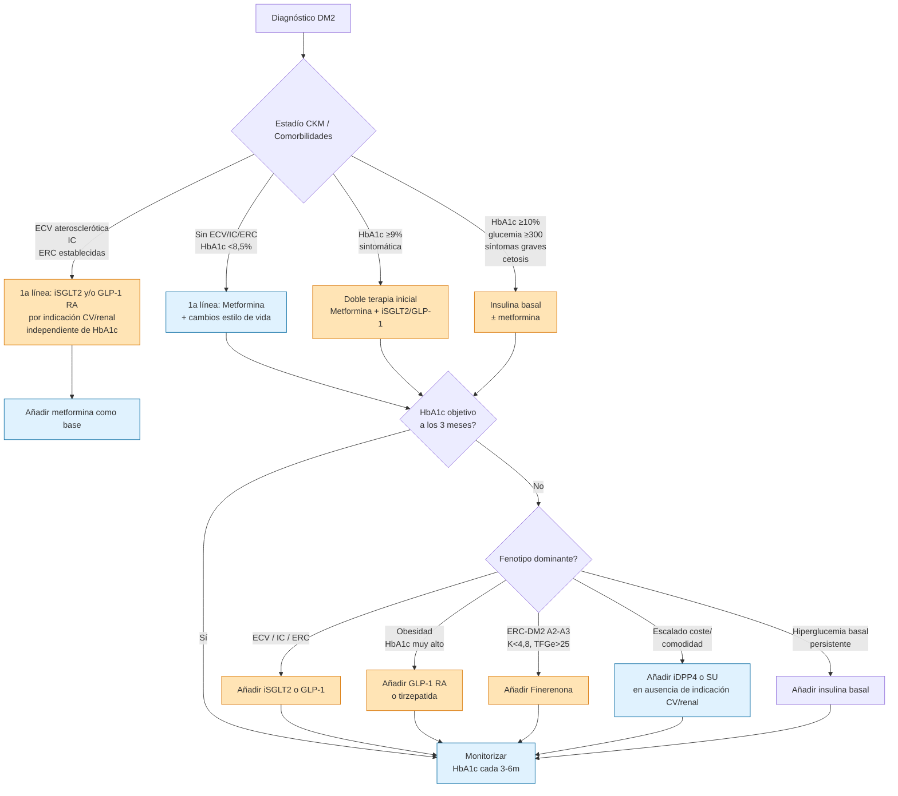

# Diabetes Mellitus tipo 2 (DM2)

**Concepto clave:** Trastorno metabólico crónico caracterizado por **hiperglucemia** secundaria a **resistencia periférica a la insulina** + **disfunción progresiva de la célula β pancreática**. Representa el **90-95 %** de todos los casos de diabetes. Se asocia fuertemente con obesidad visceral, síndrome metabólico y [[Síndrome Cardiovascular-Renal-Metabólico]].

## 1. Criterios Diagnósticos

Se requiere **UNO** de los siguientes criterios. En ausencia de hiperglucemia inequívoca con síntomas cardinales, **repetir el test** en día distinto para confirmar — o bien obtener **dos criterios diferentes** en la misma muestra.

| # | Criterio | Valor |
|---|---|---|
| 1 | **HbA1c** | **≥ 6,5 %** (≥ 48 mmol/mol) |
| 2 | **Glucemia plasmática en ayunas** (≥ 8 h) | **≥ 126 mg/dL** (7,0 mmol/L) |
| 3 | **Glucemia plasmática a las 2 h tras SOG con 75 g** | **≥ 200 mg/dL** (11,1 mmol/L) |
| 4 | **Glucemia plasmática aleatoria + síntomas cardinales** (poliuria, polidipsia, pérdida de peso) | **≥ 200 mg/dL** (11,1 mmol/L) — **diagnóstica sin repetir** |

> [!warning] Glucemia capilar NO sirve para diagnóstico
> Sólo para autocontrol o cribado oportunista. Variabilidad ±15 % frente a plasma venosa. Si elevada → **confirmar con venosa**.

### Cuando la HbA1c pierde validez

La HbA1c refleja el promedio de glucemia de los ~3 meses previos (vida media eritrocitaria). **Deja de ser fiable** en:

- Anemias (ferropénica, hemolíticas).
- Hemoglobinopatías (talasemia, HbS).
- Transfusión reciente.
- ERC avanzada / diálisis.
- Embarazo.
- Medicamentos que alteran la hematopoyesis.

→ En estos casos **diagnosticar con glucemia** (ayunas o SOG).

## 2. Prediabetes (ADA 2026)

Estado de alto riesgo para progresión a DM2 (~5-10 % por año). **Reversible** con intervención.

| Categoría | Criterio |
|---|---|
| **Glucemia basal alterada (GBA)** | Glucemia ayunas **100 – 125 mg/dL** |
| **Intolerancia a glucosa (ITG)** | Glucemia 2 h post-SOG **140 – 199 mg/dL** |
| **HbA1c en rango prediabetes** | **5,7 – 6,4 %** |

**Intervención en prediabetes:**
- **Dieta + ejercicio** estructurado (meta pérdida ponderal 7 %) → programa DPP demostró ↓ 58 % progresión.
- **[[Metformina]]** (off-label) considerar si: edad < 60 años, IMC ≥ 35 kg/m², antecedente de **DM gestacional** o HbA1c progresiva.
- Cribado de DM2 **anual**.

## 3. Clasificación de Diabetes (ADA 2026)

| Tipo | Mecanismo | Pistas clínicas |
|---|---|---|
| **DM1** | Destrucción autoinmune de célula β → deficiencia absoluta de insulina | Inicio juvenil (pero puede debutar a cualquier edad), cetoacidosis frecuente, anticuerpos positivos (GAD, IA-2, anti-insulina, ZnT8), **péptido C bajo** |
| **DM2** | Resistencia insulínica + disfunción β progresiva | Adulto, sobrepeso/obesidad, inicio insidioso, acantosis nigricans, FR metabólicos, péptido C normal o alto al inicio |
| **DM gestacional** | Intolerancia que debuta o se reconoce en el embarazo | Cribado 24-28 semanas con SOG 75 g (un paso IADPSG) o 50+100 g (dos pasos Carpenter-Coustan) |
| **Otros tipos específicos** | MODY, LADA, pancreatopatías, endocrinopatías (Cushing, acromegalia), fármacos (corticoides, antiretrovirales), genéticos | Clínica atípica; panel genético y anticuerpos si dudas |

### LADA (Latent Autoimmune Diabetes in Adults)
DM autoinmune de **inicio tardío** (> 30 años) con curso inicial **indolente** (pseudo-DM2). Diferenciar con:
- **Anticuerpos anti-GAD positivos**.
- **Péptido C basal bajo** o en caída.
- Fracaso precoz de antidiabéticos orales (requiere insulina en 1-3 años).

## 4. Cribado

### A quién cribar (ADA 2026)

- **Adultos ≥ 35 años asintomáticos** (cribado universal).
- **Adultos < 35 años** con IMC ≥ 25 kg/m² (≥ 23 si asiáticos) **y al menos uno** de:
  - Familiar de primer grado con DM.
  - Etnia alto riesgo (afroamericana, latina, asiática, indígena).
  - Antecedente de ECV, HTA ≥ 140/90, dislipemia (HDL < 35 o TG > 250).
  - Inactividad física, SOP, acantosis nigricans.
  - Antecedente de **DM gestacional** o macrosomía fetal.
  - Prediabetes previa.
- **Niños / adolescentes** con sobrepeso + FR desde la pubertad.
- **Todo paciente con ECV aterosclerótica establecida, IC o ERC** → cribar DM2 por alta prevalencia.

### Cómo cribar

Cualquiera de las 3 pruebas diagnósticas (HbA1c, glucemia ayunas, SOG 75 g). Repetir cada **3 años** si resultado normal; **anualmente** si prediabetes.

## 5. Evaluación Integral al Diagnóstico

Al diagnóstico de DM2, valoración completa para estadiar riesgo y complicaciones:

| Dominio | Pruebas |
|---|---|
| **Metabólico** | HbA1c, glucemia basal, perfil lipídico completo (CT, LDL, HDL, TG), función hepática (ALT, AST — MASLD frecuente) |
| **Renal** | Creatinina + TFGe (CKD-EPI), **cociente albúmina/creatinina en orina (CACO)** — estadiaje KDIGO G × A |
| **Cardiovascular** | TA (idealmente AMPA/MAPA), ECG 12 derivaciones, **NT-proBNP** en pacientes con riesgo (CKM ≥ 2), ecocardiograma si clínica |
| **Oftalmológico** | Fondo de ojo con dilatación o retinografía (retinopatía diabética) — **anual** |
| **Neurológico** | Monofilamento de 10 g + diapasón 128 Hz en MMII (neuropatía periférica). Preguntar disfunción autonómica (hipotensión ortostática, gastroparesia, DE) |
| **Podológico** | Inspección, pulsos, ITB si > 50 años |
| **Psicosocial** | Cribado de depresión (PHQ-2/PHQ-9), barreras socioeconómicas, soporte familiar, alfabetización sanitaria |
| **Vacunal** | Antigripal anual, antineumocócica, hepatitis B si no vacunado, SARS-CoV-2, herpes zóster ≥ 50 años |

## 6. Objetivos de Control (individualizados)

### HbA1c

| Perfil | Objetivo |
|---|---|
| **Adulto general** (esperanza de vida > 10 años, sin comorbilidad avanzada) | **< 7 %** |
| **Joven sin comorbilidades**, corta evolución, sin eventos CV | **< 6,5 %** (si se logra sin hipoglucemias) |
| **Anciano frágil / comorbilidad avanzada / hipoglucemias graves / esperanza de vida corta** | **< 8 %** |
| **Muy frágil / terminal** | Evitar síntomas; ≤ 8,5 %, priorizar confort |

### Presión arterial

- **Objetivo general**: **< 130/80 mmHg** (ADA 2026 + ESC 2024).
- **Con ERC A2-A3 o ECV establecida**: < 130/80 con IECA/ARA-II de elección.
- Si **muy frágil / caídas**: < 140/90 aceptable.

### Lípidos

| Perfil | Objetivo LDL |
|---|---|
| DM sin FR adicionales, < 40 años | No objetivo estricto; considerar estatina si FR |
| DM con ≥ 1 FR adicional (adulto) | **< 100 mg/dL** |
| DM con ECV establecida o muy alto riesgo (CKD A3, múltiples FR) | **< 55 mg/dL** + reducción ≥ 50 % del basal |
| Riesgo alto (DM + ≥ 1 FR mayor) | < 70 mg/dL |

Estatinas de alta intensidad ± ezetimiba ± iPCSK9 según respuesta.

### Peso

- **Objetivo pérdida**: **5-10 % del peso inicial** en 6-12 meses si IMC ≥ 27 con DM (mayor aún en IMC ≥ 35).
- Farmacoterapia: **[[Semaglutida]] / [[Liraglutida]]** o tirzepatida como opciones prioritarias.
- Cirugía bariátrica: considerar si IMC ≥ 35 (≥ 30 si asiático) con DM mal controlada.

## 7. Algoritmo de Tratamiento DM2 (ADA 2026)

### Pilares farmacológicos del DM2 — resumen

| Clase | Fármacos | Cuándo priorizar |
|---|---|---|
| **Biguanida** | [[Metformina]] | Base en casi todos los pacientes; 1ª línea si sin ECV/IC/ERC |
| **iSGLT2** | [[Empagliflozina]], [[Dapagliflozina]] | **ECV / IC / ERC** (incluso sin DM); también como 2ª línea general |
| **ar-GLP-1** | [[Semaglutida]], [[Liraglutida]], [[Dulaglutida]], tirzepatida | **Obesidad severa** (IMC ≥ 35), HbA1c ≥ 9 %, ECV aterosclerótica, prioridad en pérdida ponderal |
| **Finerenona** (ARM-ns) | [[Finerenona]] | ERC-DM2 **A2-A3** persistente + K⁺ < 4,8 + TFGe > 25 |
| **iDPP4** | [[iDPP4]] (clase: sita, lina, saxa, vilda) | 2ª-3ª línea sin indicación CV/renal. **Saxa evitar en IC** |
| **Sulfonilureas** | Glimepirida, gliclazida | Barato, eficaz, pero **hipoglucemias y ganancia ponderal** — relegadas |
| **Tiazolidinedionas** | Pioglitazona | Uso limitado por edemas/IC/fracturas |
| **Insulina** | Análogos basales (glargina, detemir, degludec) y prandiales | HbA1c ≥ 10 %, glucemia ≥ 300, sintomática, cetosis, fallo de múltiples OAD |

### Regla de oro ADA 2026 en CKM

> **La indicación de iSGLT2 / GLP-1 RA / finerenona en pacientes con DM2 y ECV/IC/ERC es INDEPENDIENTE del control glucémico**. No esperar a que falle metformina: iniciarlos **con** o **antes** según el fenotipo dominante.

## 8. Complicaciones

### 8.1 Agudas

- [[Cetoacidosis Diabética (CAD)]] — característica DM1 pero también DM2 (especialmente con iSGLT2).
- [[Síndrome Hiperglucémico Hiperosmolar (SHH)]] — casi exclusivo DM2 avanzado.
- [[Hiperglucemia Simple]] — sin descompensación metabólica grave.
- **Hipoglucemia** — especialmente con insulina y sulfonilureas.

### 8.2 Crónicas — Microvasculares

- **Retinopatía diabética**: fondo de ojo anual (no proliferativa → proliferativa → edema macular). Control estricto HbA1c + TA.
- **Nefropatía diabética**: CACO + TFGe anual. Estadiaje KDIGO G × A. [[ERC - Estratificación y Pronóstico]].
- **Neuropatía diabética**:
  - Periférica simétrica distal ("calcetines y guantes") — monofilamento + diapasón.
  - Autonómica: gastroparesia, hipotensión ortostática, disfunción eréctil, vejiga neurógena.
  - Mononeuropatías (III par, peroneo).

### 8.3 Crónicas — Macrovasculares

- **Cardiopatía isquémica** — principal causa de mortalidad. A menudo silente (neuropatía autonómica).
- **Ictus isquémico**.
- **Enfermedad arterial periférica** — pie diabético, úlceras, amputaciones.

### 8.4 Otras

- **Pie diabético** — revisión anual (pulsos, sensibilidad, deformidades, piel).
- **MASLD** (esteatosis hepática metabólica) — cribado con **FIB-4** al diagnóstico y periódicamente.
- **Infecciones** — candidiasis, ITU, celulitis, TB.
- **Cognitivas** — mayor riesgo de deterioro cognitivo y demencia.
- **Psicológicas** — depresión, ansiedad, "burnout" diabético.

## 9. Seguimiento Clínico Recomendado

| Parámetro | Frecuencia |
|---|---|
| **HbA1c** | Cada 3 meses si no en objetivo; cada 6 meses si estable en objetivo |
| **Glucemias capilares** (si insulinizado) | Según pauta (basal 1/día - múltiples si bolo-basal) |
| **TA, peso, IMC, perímetro abdominal** | Cada visita |
| **Perfil lipídico** | Anual; semestral si ajustando |
| **Creatinina + TFGe + CACO** | **Anual** (cada 6 meses si A2-A3 o G3+) |
| **Fondo de ojo** | Anual (bienal si sin retinopatía tras 2 controles estables) |
| **Exploración de pies** | Anual (trimestral si ulceración previa) |
| **ECG** | Anual si > 40 años o con FR adicionales |
| **Vacunas** | Antigripal (anual), neumocócica, hepatitis B, SARS-CoV-2, herpes zóster ≥ 50 años |
| **Vitamina B12** | Anual si metformina crónica |
| **FIB-4** (MASLD) | Anual en DM2 con sobrepeso/obesidad |

## 10. Educación Diabetológica

Pilar **irrenunciable** del tratamiento. Programas estructurados (DAFNE, DESMOND, redGDPS):

- Comprensión de la enfermedad y su cronicidad.
- Autocontrol glucémico y manejo de resultados.
- **Alimentación**: patrón mediterráneo, control de hidratos, etiquetado.
- Ejercicio adaptado (150 min/semana aeróbico + 2-3 sesiones fuerza).
- **Signos de alarma**: hiperglucemia (polidipsia, poliuria, pérdida peso, cetosis), hipoglucemia (sudoración, temblor, mareo, confusión).
- Manejo de días de enfermedad.
- Cuidado de pies.
- Adherencia farmacológica y revisión de técnicas de inyección si insulina.

## 🔗 Enlaces del Vault

### Complicaciones y temas ligados
- [[Cetoacidosis Diabética (CAD)]]
- [[Síndrome Hiperglucémico Hiperosmolar (SHH)]]
- [[Hiperglucemia Simple]]
- [[ERC - Estratificación y Pronóstico]] (nefropatía diabética)
- [[ERC - Fármacos Modificadores de la Enfermedad]]
- [[Síndrome Cardiovascular-Renal-Metabólico]]
- [[Insuficiencia cardiaca]]
- [[Cardiopatía isquémica]]

### Fármacos
- [[Metformina]]
- [[Empagliflozina]] / [[Dapagliflozina]]
- [[Semaglutida]] / [[Liraglutida]] / [[Dulaglutida]]
- [[Finerenona]]
- [[iDPP4]]
- [[Insulina]]

### Navegación
- [[MOC - ENDOCRINO]]
- [[MOC - FARMACOS]]

## 📚 Bibliografía

- **Guía principal:** American Diabetes Association Professional Practice Committee. **Standards of Care in Diabetes — 2026.** *Diabetes Care.* 2026;49(Suppl 1):S1-S371. URL: [diabetesjournals.org/care](https://diabetesjournals.org/care).
- **Consenso ADA/EASD:** Davies MJ, Aroda VR, Collins BS, et al. **Management of Hyperglycemia in Type 2 Diabetes, 2022. A Consensus Report by the American Diabetes Association (ADA) and the European Association for the Study of Diabetes (EASD).** *Diabetes Care.* 2022;45(11):2753-2786. DOI: [10.2337/dci22-0034](https://doi.org/10.2337/dci22-0034).
- **UKPDS 34 (histórico — metformina en DM2):** UK Prospective Diabetes Study (UKPDS) Group. **Effect of intensive blood-glucose control with metformin on complications in overweight patients with type 2 diabetes (UKPDS 34).** *Lancet.* 1998;352(9131):854-865. DOI: [10.1016/S0140-6736(98)07037-8](https://doi.org/10.1016/S0140-6736(98)07037-8).
- **redGDPS-España** — algoritmos de manejo DM2 en atención primaria. URL: [redgdps.org](https://www.redgdps.org).
- **Manual local:** *Manual de diagnóstico y terapéutica médica Hospital 12 de Octubre*, 9ª ed. 2022 (capítulos de endocrino).
